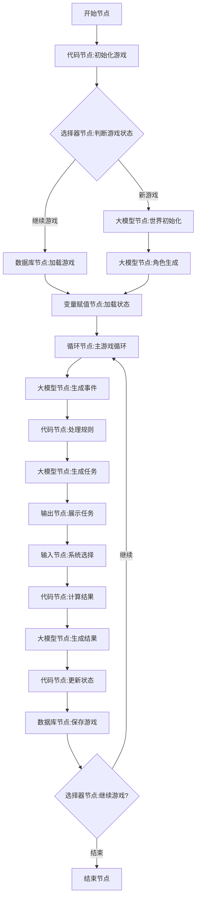

# 修仙游戏系统设计文档

## 目录
- [1. 系统概述](#1-系统概述)
  - [1.1 设计目标](#11-设计目标)
  - [1.2 系统架构](#12-系统架构)
  - [1.3 技术栈](#13-技术栈)
- [2. 工作流程设计](#2-工作流程设计)
  - [2.1 流程图](#21-流程图)
  - [2.2 节点详细设计](#22-节点详细设计)
- [3. 数据模型](#3-数据模型)
  - [3.1 应用变量](#31-应用变量)
  - [3.2 数据库设计](#32-数据库设计)
- [4. 系统实现](#4-系统实现)
  - [4.1 核心功能](#41-核心功能)
  - [4.2 业务逻辑](#42-业务逻辑)
- [5. 附录](#5-附录)
  - [5.1 错误处理](#51-错误处理)
  - [5.2 性能优化](#52-性能优化)

## 1. 系统概述

### 1.1 设计目标

本系统旨在实现一个基于Coze平台的修仙文字游戏，通过工作流节点的组合实现复杂的游戏逻辑。主要目标包括：

1. 构建完整的修仙世界观
2. 实现丰富的游戏机制
3. 提供沉浸式的用户体验
4. 确保系统的可扩展性
5. 维护数据的一致性

### 1.2 系统架构

系统采用模块化设计，主要包含以下核心组件：

- 工作流引擎：处理游戏逻辑流转
- 大模型服务：生成游戏内容
- 数据持久层：管理游戏状态
- 规则引擎：处理游戏规则
- 用户交互层：处理输入输出

### 1.3 技术栈

- 平台：Coze
- 数据库：关系型数据库
- 编程语言：JavaScript
- 工作流引擎：自定义实现
- AI模型：大语言模型

## 2. 工作流程设计

### 2.1 流程图



### 2.2 节点详细设计

#### 2.2.1 开始节点

**功能描述**：系统入口点，接收用户初始指令

**输入参数**：
```typescript
interface StartNodeInput {
    BOT_USER_INPUT: string;
    game_state: "new" | "continue";
    system_type?: string;
    custom_system?: string;
}
```

**输出参数**：

- `is_new_game`：Boolean 类型，是否为新游戏
- `system_info`：Object 类型，系统信息
  - `type`：String 类型，系统类型
  - `description`：String 类型，系统描述
  - `abilities`：Array<String>类型，系统能力列表

**代码内容**：

```javascript
async function main({ params }) {
  const gameState = params.game_state || "new";
  const systemType = params.system_type || "修炼系统";
  const customSystem = params.custom_system || "";
  const userId = params.user_id || "default_user";

  let systemInfo = {
    type: systemType,
    description: customSystem || "作为修炼系统，您将引导主角提升修为，突破境界，获取功法与机缘",
    abilities: ["派送任务", "评价表现", "指导修炼", "提供机缘", "分配奖励"]
  };

  return {
    is_new_game: gameState === "new",
    system_info: systemInfo
  };
}
```

#### 2.2.2 代码节点：初始化游戏

**内容**：处理游戏初始化逻辑，检查游戏状态，准备必要的变量

**输入参数**：

- `game_state`：String 类型，从开始节点获取
- `system_type`：String 类型，从开始节点获取
- `custom_system`：String 类型，从开始节点获取
- `user_id`：String 类型，用户标识

**输出参数**：

- `is_new_game`：Boolean 类型，是否为新游戏
- `system_info`：Object 类型，系统信息
  - `type`：String 类型，系统类型
  - `description`：String 类型，系统描述
  - `abilities`：Array<String>类型，系统能力列表

**代码内容**：

```javascript
async function main({ params }) {
  const gameState = params.game_state || "new";
  const systemType = params.system_type || "修炼系统";
  const customSystem = params.custom_system || "";
  const userId = params.user_id || "default_user";

  let systemInfo = {
    type: systemType,
    description: customSystem || "作为修炼系统，您将引导主角提升修为，突破境界，获取功法与机缘",
    abilities: ["派送任务", "评价表现", "指导修炼", "提供机缘", "分配奖励"]
  };

  return {
    is_new_game: gameState === "new",
    system_info: systemInfo
  };
}
```

#### 2.2.3 选择器节点：判断游戏状态

**内容**：根据是否为新游戏决定后续流程

**输入参数**：

- `is_new_game`：Boolean 类型，从代码节点获取

**条件设置**：

- 如果 `is_new_game` 为 true，则走新游戏流程
- 否则走继续游戏流程

#### 2.2.4 大模型节点：世界初始化

**内容**：生成游戏世界的背景、设定和规则

**输入参数**：

- `system_info`：Object 类型，从代码节点获取

**输出参数**：

- `world`：Object 类型，世界信息
  - `name`：String 类型，世界名称
  - `age`：Integer 类型，当前世界年代
  - `month`：Integer 类型，当前月份
  - `day`：Integer 类型，当前日期
  - `realms`：Array<Object>类型，修炼境界列表
    - `name`：String 类型，境界名称
    - `description`：String 类型，境界描述
    - `lifespan`：Integer 类型，该境界寿命
  - `major_events`：Array<Object>类型，重大事件列表
    - `name`：String 类型，事件名称
    - `description`：String 类型，事件描述
    - `date`：Object 类型，事件日期
      - `year`：Integer 类型，年
      - `month`：Integer 类型，月
      - `day`：Integer 类型，日

**提示词**：

```
你是一个专业的修仙世界构建者，需要创建一个完整的修仙世界。你需要精通《凡人修仙传》《仙逆》《遮天》《完美世界》《斗破苍穹》《伏天氏》《绝世武神》《武极天下》《武动乾坤》《真武世界》《三寸人间》《一念永恒》《我欲封天》等经典修仙小说的世界观和设定。

请创建一个有深度的修仙世界，包含以下元素：
1. 世界名称：给这个世界一个独特而富有韵味的名字，体现修仙世界的特色
2. 当前时间：年、月、日（使用该世界的历法）
3. 修炼境界体系：创建6-12个大境界，每个大境界内有细分的小境界，确保境界间有清晰的实力差距和特征
4. 修炼资源：灵气、丹药、法宝、功法等资源的种类和品阶
5. 主要势力：宗门、世家、帝国等，及其之间的关系
6. 世界地理：主要地区、危险区域、秘境等
7. 重大事件：近期或即将发生的事件，如宗门大比、秘境开启等

要求：
- 境界设定需要合理，实力差距明确
- 为每个境界设定寿命上限
- 世界设定需要有内在逻辑，不要有明显矛盾
- 确保设定能支撑长期的故事发展
- 为后续角色冒险提供丰富的背景和可能性

返回格式必须是严格的JSON格式，包含name(世界名称)、age(当前年代)、month(当前月份)、day(当前日期)、realms(修炼境界数组)和major_events(重大事件数组)字段。其中realms数组的每个元素包含name(境界名称)、description(境界描述)和lifespan(该境界寿命)字段；major_events数组的每个元素包含name(事件名称)、description(事件描述)和date(事件日期对象，包含year、month、day字段)。

```

#### 2.2.5 数据库节点：加载游戏
**内容**：从数据库中加载已保存的游戏状态

**输入参数**：

- `user_id`：String 类型，用户标识

**数据表配置**：
表名：game_data
字段：

- id：Integer 类型，主键
- sys_platform：String 类型，数据产生渠道
- uuid：String 类型，用户标识
- bstudio_create_time：Time 类型，数据创建时间
- character_data：String 类型，角色数据(JSON 格式字符串)
- world_data：String 类型，世界数据(JSON 格式字符串)
- game_progress：Integer 类型，游戏进度
- game_day：Integer 类型，游戏内天数
- last_save_time：Time 类型，最后保存时间

**SQL 语句**：

```sql
SELECT character_data, world_data, game_progress, game_day
FROM game_data
WHERE uuid = '{{user_id}}'
ORDER BY last_save_time DESC
LIMIT 1
```

**输出参数**：

- `character_data`：String 类型，角色数据 JSON 字符串
- `world_data`：String 类型，世界数据 JSON 字符串
- `game_progress`：Integer 类型，游戏进度
- `game_day`：Integer 类型，游戏内天数

#### 2.2.6 代码节点：解析游戏数据

**内容**：将从数据库读取的字符串数据解析为对象

**输入参数**：
- `character_data`：String类型，从数据库节点获取
- `world_data`：String类型，从数据库节点获取
- `game_progress`：Integer类型，从数据库节点获取
- `game_day`：Integer类型，从数据库节点获取

**输出参数**：
- `parsed_character`：Object类型，解析后的角色数据
- `parsed_world`：Object类型，解析后的世界数据
- `system_log`：Array<String>类型，系统日志数组
- `npcs`：Array<Object>类型，NPC列表
- `completed_tasks`：Array<Object>类型，已完成任务列表

**代码内容**：
```javascript
async function main({ params }) {
  // 从字符串解析JSON对象
  let parsedCharacter = {};
  let parsedWorld = {};
  let systemLog = [];
  let npcs = [];
  let completedTasks = [];
  
  try {
    // 尝试解析角色数据
    if (params.character_data) {
      parsedCharacter = JSON.parse(params.character_data);
      
      // 尝试从角色数据中提取其他信息（如果有存储）
      if (parsedCharacter.system_log) {
        systemLog = parsedCharacter.system_log;
      }
      
      if (parsedCharacter.npcs) {
        npcs = parsedCharacter.npcs;
      }
      
      if (parsedCharacter.completed_tasks) {
        completedTasks = parsedCharacter.completed_tasks;
      }
    }
    
    // 尝试解析世界数据
    if (params.world_data) {
      parsedWorld = JSON.parse(params.world_data);
    }
  } catch (error) {
    // 解析错误时使用默认值
    console.error("解析数据时出错:", error);
    
    // 创建基本的角色数据结构
    parsedCharacter = {
      name: "未知修士",
      age: 16,
      lifespan: 100,
      background: "数据损坏，无法读取背景故事。",
      realm: "练气期",
      realm_progress: 100,
      techniques: [],
      attributes: {
        strength: 10,
        agility: 10,
        intelligence: 10,
        spirit: 10,
        luck: 10
      },
      items: []
    };
    
    // 添加一条系统日志
    systemLog.push("【系统警告】检测到数据损坏，部分信息已重置。");
  }
  
  // 如果系统日志为空，添加一条继续游戏的记录
  if (systemLog.length === 0) {
    systemLog.push(`【继续游戏】系统重新连接到${parsedCharacter.name || "未知修士"}的修炼之旅。`);
  }
  
  return {
    parsed_character: parsedCharacter,
    parsed_world: parsedWorld,
    system_log: systemLog,
    npcs: npcs,
    completed_tasks: completedTasks
  };
}
```

#### 2.2.7 大模型节点：角色生成

**内容**：生成游戏主角的初始信息

**输入参数**：

- `world`：Object 类型，从世界初始化节点获取
- `system_info`：Object 类型，从代码节点获取

**输出参数**：

- `character`：Object 类型，角色信息
  - `name`：String 类型，角色名称
  - `age`：Integer 类型，角色年龄
  - `lifespan`：Integer 类型，寿命上限
  - `background`：String 类型，背景故事
  - `realm`：String 类型，当前境界
  - `realm_progress`：Integer 类型，境界进度(0-1000)
  - `techniques`：Array<Object>类型，已学功法
    - `name`：String 类型，功法名称
    - `level`：Integer 类型，功法等级
    - `description`：String 类型，功法描述
  - `attributes`：Object 类型，属性面板
    - `strength`：Integer 类型，力量
    - `agility`：Integer 类型，敏捷
    - `intelligence`：Integer 类型，智力
    - `spirit`：Integer 类型，精神
    - `luck`：Integer 类型，幸运

**提示词**：

```
你是一个专业的修仙小说角色创作者。请根据提供的修仙世界设定，创建一个合理且有成长潜力的主角。

世界信息：{{world}}

请为这个世界创建一个初始主角，他将由用户扮演的系统引导修炼。主角应该:
1. 有适合修仙小说的名字和背景
2. 初始境界应该是最低级的，处于修炼起步阶段
3. 有明确的性格特点和鲜明的形象
4. 具备一定的成长潜力和独特之处
5. 初始能力和资质中等偏上，但不应过于逆天
6. 拥有简单的初始功法
7. 有合理的年龄设定（通常为青少年或青年）

要求：
- 角色设定需合理，符合修仙世界观
- 设定境界进度为0-1000之间的数值，初始一般在100-300之间
- 为角色设定基础属性值(力量、敏捷、智力、精神、幸运)，数值范围为1-100
- 创建1-2个初始功法，等级和品质较低
- 设定合理的背景故事，但不要过于复杂
- 所有数值必须遵循世界设定的合理性

返回格式必须是严格的JSON格式，包含name(角色名称)、age(年龄)、lifespan(寿命上限)、background(背景故事)、realm(当前境界)、realm_progress(境界进度，0-1000的整数)、techniques(已学功法数组)和attributes(属性面板对象)字段。其中techniques数组的每个元素包含name(功法名称)、level(功法等级)和description(功法描述)字段；attributes对象包含strength(力量)、agility(敏捷)、intelligence(智力)、spirit(精神)和luck(幸运)字段，这些属性值应为1-100的整数。
```

#### 2.2.8 变量赋值节点：新游戏状态初始化

**内容**：根据新生成的角色和世界数据，设置游戏初始状态变量

**输入参数**：
- `character`：Object类型，从角色生成节点获取
- `world`：Object类型，从世界初始化节点获取

**变量赋值**：
以下是应用变量：
- `current_character`：Object类型，当前角色信息，赋值为character
- `current_world`：Object类型，当前世界信息，赋值为world
- `game_day`：Integer类型，游戏内天数，赋值为1
- `system_log`：Array<String>类型，系统日志，初始化为包含一条记录：`["【第1天】系统首次降临于${character.name}身上，开始引导修炼之旅。"]`
- `npcs`：Array<Object>类型，NPC列表，初始化为空数组`[]`
- `completed_tasks`：Array<Object>类型，已完成任务，初始化为空数组`[]`
- `available_tasks`：Array<Object>类型，可用任务，初始化为空数组`[]`

#### 2.2.9 变量赋值节点：加载已有游戏状态

**内容**：根据解析后的数据，恢复游戏状态变量

**输入参数**：
- `parsed_character`：Object类型，从代码节点获取
- `parsed_world`：Object类型，从代码节点获取
- `system_log`：Array<String>类型，从代码节点获取
- `npcs`：Array<Object>类型，从代码节点获取
- `completed_tasks`：Array<Object>类型，从代码节点获取
- `game_day`：Integer类型，从数据库节点获取

**变量赋值**：
以下是应用变量：
- `current_character`：Object类型，当前角色信息，赋值为parsed_character
- `current_world`：Object类型，当前世界信息，赋值为parsed_world
- `game_day`：Integer类型，游戏内天数，赋值为game_day
- `system_log`：Array<String>类型，系统日志，赋值为system_log
- `npcs`：Array<Object>类型，NPC列表，赋值为npcs
- `completed_tasks`：Array<Object>类型，已完成任务，赋值为completed_tasks
- `available_tasks`：Array<Object>类型，可用任务，初始化为空数组`[]`

#### 2.2.10 循环节点：主游戏循环

**内容**：管理游戏的主要循环，每次循环代表游戏中的一天

**循环类型**：指定循环次数或无限循环

**循环设置**：

- 如果设定固定游戏天数，则使用"指定循环次数"，次数为预设天数
- 如果是无限游戏，则使用"无限循环"，配合选择器节点控制退出

**中间变量**：

- `current_day_log`：String 类型，当天记录
- `last_event`：Object 类型，上一个事件

#### 2.2.11 大模型节点：生成事件

**内容**：根据游戏状态生成当日随机事件

**输入参数**：

- `current_character`：Object 类型，当前角色信息
- `current_world`：Object 类型，当前世界信息
- `game_day`：Integer 类型，游戏内天数
- `system_log`：Array<String>类型，系统日志
- `last_event`：Object 类型，上一个事件

**输出参数**：

- `daily_event`：Object 类型，当日事件
  - `type`：String 类型，事件类型
  - `title`：String 类型，事件标题
  - `description`：String 类型，事件描述
  - `difficulty`：Integer 类型，事件难度(1-100)
  - `potential_rewards`：Array<String>类型，潜在奖励
  - `potential_penalties`：Array<String>类型，潜在惩罚

**提示词**：

```
你是一个修仙世界的事件生成器，负责创建主角遭遇的各种事件。请根据主角当前状态、世界背景和历史记录，生成今日的随机事件。

角色信息：{{current_character}}
世界信息：{{current_world}}
游戏天数：{{game_day}}
系统日志：{{system_log}}
上次事件：{{last_event}}

请生成一个合理的修仙世界事件，该事件应当：
1. 符合修仙世界的特色和气质
2. 与主角当前境界相匹配，难度适中（既有挑战又不会过于致命）
3. 包含清晰的风险和潜在收益
4. 考虑主角的背景和特长
5. 与世界背景和前序事件有一定连续性
6. 必须包含详细描述，让读者能够身临其境

事件类型可以包括但不限于：
- 偶遇奇遇（发现宝物、秘境）
- 遭遇危险（妖兽、邪修、天灾）
- 修炼契机（感悟、瓶颈）
- NPC互动（长老指点、同门切磋）
- 宗门活动（比试、任务）

难度设定：
- 1-20：适合初学者，基本无危险
- 21-40：有一定挑战，但风险可控
- 41-60：中等难度，需谨慎应对
- 61-80：较高难度，需全力以赴
- 81-100：极高难度，有生命危险

注意：
- 事件难度应与主角当前境界相匹配，不要生成明显不合理的挑战
- 考虑一定的随机性和多样性，让游戏体验丰富有趣
- 为系统（用户）提供干预和辅助主角的机会

返回格式必须是严格的JSON格式，包含type(事件类型)、title(事件标题)、description(事件描述)、difficulty(事件难度,1-100的整数)、potential_rewards(潜在奖励的字符串数组)和potential_penalties(潜在惩罚的字符串数组)字段。
```

#### 2.2.12 代码节点：处理规则

**内容**：根据事件难度和角色信息，计算成功率和可能的任务类型

**输入参数**：

- `daily_event`：Object 类型，当日事件
- `current_character`：Object 类型，当前角色信息

**输出参数**：

- `success_rate`：Number 类型，成功率(0-1)
- `available_tasks`：Array<Object>类型，可用任务列表
  - `id`：Integer 类型，任务 ID
  - `title`：String 类型，任务标题
  - `description`：String 类型，任务描述
  - `difficulty`：Integer 类型，任务难度
  - `reward_desc`：String 类型，奖励描述

**代码内容**：

```javascript
async function main({ params }) {
  const event = params.daily_event;
  const character = params.current_character;

  // 计算成功率，基于角色属性和事件难度
  const attributeSum = character.attributes.strength +
                      character.attributes.agility +
                      character.attributes.intelligence +
                      character.attributes.spirit +
                      character.attributes.luck;

  // 基础成功率，角色总属性高且事件难度低时成功率高
  let baseSuccessRate = (attributeSum / 500) * (1 - event.difficulty / 100);

  // 确保成功率在0.1到0.9之间
  let successRate = Math.min(0.9, Math.max(0.1, baseSuccessRate));

  // 根据事件类型和难度生成可能的任务
  const taskTypes = ["修炼", "探索", "战斗", "社交", "采集"];
  const availableTasks = [];

  // 至少生成3个任务选项
  for (let i = 0; i < 3; i++) {
    const taskDifficulty = Math.floor(event.difficulty * (0.8 + Math.random() * 0.4));
    const taskType = taskTypes[Math.floor(Math.random() * taskTypes.length)];

    availableTasks.push({
      id: i + 1,
      title: `${taskType}任务：${event.title}`,
      description: `应对${event.description}的${taskType}方式`,
      difficulty: taskDifficulty,
      reward_desc: event.potential_rewards[i % event.potential_rewards.length]
    });
  }

  return {
    success_rate: successRate,
    available_tasks: availableTasks
  };
}
```

#### 2.2.13 大模型节点：生成任务

**内容**：根据事件和规则处理结果，生成详细的任务描述

**输入参数**：

- `daily_event`：Object 类型，当日事件
- `available_tasks`：Array<Object>类型，可用任务列表
- `success_rate`：Number 类型，成功率
- `current_character`：Object 类型，当前角色信息

**输出参数**：

- `tasks`：Array<Object>类型，完整任务列表
  - `id`：Integer 类型，任务 ID
  - `title`：String 类型，任务标题
  - `description`：String 类型，任务详细描述
  - `difficulty`：Integer 类型，任务难度
  - `reward_desc`：String 类型，奖励描述
  - `system_note`：String 类型，系统笔记(给用户看的辅助信息)

**提示词**：

```
你是一个修仙世界的系统，负责为主角提供任务选择。请根据今日发生的事件和可用任务列表，生成更详细的任务描述和系统笔记。

今日事件：{{daily_event}}
可用任务列表：{{available_tasks}}
成功概率：{{success_rate}}
角色信息：{{current_character}}

作为系统，你需要：
1. 为每个任务提供更丰富、更有代入感的描述
2. 添加系统笔记，指出任务的难度、风险和可能的策略
3. 结合主角当前的能力和境界，提供针对性的建议
4. 确保描述的风格符合修仙小说的气质和语言特点

注意：
- 任务描述应生动详实，有助于玩家理解任务内容
- 系统笔记应体现出你作为系统对主角的分析和建议
- 保持每个任务的原始难度和奖励，但可以丰富其描述
- 难度较高的任务应明确提示风险，但也要展示高回报
- 符合修仙小说的文风和用词习惯

返回格式必须是严格的JSON格式，包含完整的tasks数组，每个任务对象包含id(任务ID)、title(任务标题)、description(任务详细描述，至少100字)、difficulty(任务难度,1-100的整数)、reward_desc(奖励描述)和system_note(系统笔记，给用户提供的辅助信息)字段。
```

#### 2.2.14 输出节点：展示任务

**内容**：向用户展示当前事件和可选任务

**输出变量**：

- `event`：Object 类型，引用 daily_event
- `tasks`：Array<Object>类型，引用 tasks
- `character`：Object 类型，引用 current_character

**输出内容**：

```
【当前境界】{{character.realm}}（{{character.realm_progress}}/1000）

【今日事件】{{event.title}}
{{event.description}}

【可选任务】

{{task.id}}. {{task.title}}（难度：{{task.difficulty}}）
{{task.description}}

系统笔记：{{task.system_note}}


请选择要分配给主角的任务编号：
```

#### 2.2.15 输入节点：系统选择

**内容**：接收用户的任务选择

**输入参数**：

- `task_choice`：Integer 类型，任务选择 ID

#### 2.2.16 代码节点：计算结果

**内容**：根据角色属性、任务难度和随机因素计算任务结果

**输入参数**：

- `task_choice`：Integer 类型，从输入节点获取
- `tasks`：Array<Object>类型，任务列表
- `success_rate`：Number 类型，成功率
- `current_character`：Object 类型，当前角色信息

**输出参数**：

- `task_result`：Object 类型，任务结果
  - `success`：Boolean 类型，是否成功
  - `reward_type`：String 类型，奖励类型
  - `reward_value`：Integer 类型，奖励值
  - `experience`：Integer 类型，获得经验
  - `special_event`：Boolean 类型，是否触发特殊事件
- `selected_task`：Object 类型，选中的任务

**代码内容**：

```javascript
async function main({ params }) {
  const taskId = params.task_choice;
  const tasks = params.tasks;
  const baseSuccessRate = params.success_rate;
  const character = params.current_character;

  // 找到选中的任务
  const selectedTask = tasks.find(task => task.id === taskId) || tasks[0];

  // 根据任务难度和角色属性调整成功率
  let adjustedSuccessRate = baseSuccessRate * (1 - selectedTask.difficulty / 200);

  // 根据角色属性进一步调整
  const relevantAttributes = {
    "修炼": "intelligence",
    "探索": "agility",
    "战斗": "strength",
    "社交": "spirit",
    "采集": "luck"
  };

  // 从任务标题中提取类型
  const taskTypeMatch = selectedTask.title.match(/^(修炼|探索|战斗|社交|采集)/);
  const taskType = taskTypeMatch ? taskTypeMatch[1] : "修炼";
  const relevantAttribute = relevantAttributes[taskType] || "intelligence";

  // 相关属性越高，成功率越高
  adjustedSuccessRate += character.attributes[relevantAttribute] / 200;

  // 最终成功率限制在0.05到0.95之间
  adjustedSuccessRate = Math.min(0.95, Math.max(0.05, adjustedSuccessRate));

  // 决定是否成功
  const success = Math.random() < adjustedSuccessRate;

  // 计算奖励
  const rewardTypes = ["属性", "修为", "功法", "宝物", "机缘"];
  const rewardType = rewardTypes[Math.floor(Math.random() * rewardTypes.length)];

  // 奖励值基于任务难度和成功与否
  const baseReward = selectedTask.difficulty * (success ? 1 : 0.3);
  const rewardValue = Math.floor(baseReward * (0.8 + Math.random() * 0.4));

  // 经验/修为增长
  const experience = Math.floor(selectedTask.difficulty * (success ? 2 : 0.5));

  // 特殊事件触发几率 (10%)
  const specialEvent = Math.random() < 0.1;

  return {
    task_result: {
      success: success,
      reward_type: rewardType,
      reward_value: rewardValue,
      experience: experience,
      special_event: specialEvent
    },
    selected_task: selectedTask
  };
}
```

#### 2.2.17 大模型节点：生成结果

**内容**：根据任务结果生成详细的叙述性描述

**输入参数**：

- `task_result`：Object 类型，任务结果
- `selected_task`：Object 类型，选中的任务
- `current_character`：Object 类型，当前角色信息
- `daily_event`：Object 类型，当日事件

**输出参数**：

- `result_narrative`：String 类型，结果叙述
- `character_dialog`：String 类型，角色对话
- `system_comments`：String 类型，系统评论
- `rewards_detail`：Object 类型，奖励详情
  - `type`：String 类型，奖励类型
  - `name`：String 类型，奖励名称
  - `description`：String 类型，奖励描述
  - `value`：Integer 类型，奖励值

**提示词**：

```
你是一个修仙世界的系统，需要生成主角完成任务后的详细结果叙述。请根据提供的任务结果信息，创作一段生动的修仙小说文字，描述主角如何执行任务以及最终的结果。

任务结果：{{task_result}}
选择的任务：{{selected_task}}
角色信息：{{current_character}}
今日事件：{{daily_event}}

请创作以下内容：

1. 结果叙述：详细描述主角执行任务的整个过程，包括环境描写、行动细节、遭遇的困难以及结果。至少200字，要有修仙小说的文风和氛围。

2. 角色对话：主角可能与系统（由用户扮演）的一段对话。这段对话应该反映主角对系统的态度，以及对任务结果的感受。

3. 系统评论：作为系统，对主角表现的点评和建议，以及对未来发展的展望。

4. 奖励详情：根据任务结果和奖励类型，详细描述主角获得的具体奖励。如果是功法，提供功法名称和特点；如果是宝物，描述宝物的外观和功能；如果是属性提升，说明具体提升了哪些属性等。

注意：
- 叙述应富有代入感和画面感，符合修仙小说的风格
- 如果任务成功，描述主角克服困难的过程；如果失败，描述失败的原因和主角的反应
- 如果触发特殊事件，添加一些意外但合理的剧情元素
- 保持与角色当前境界和能力相符的描述
- 奖励应当与任务难度和结果相匹配，并具有合理性

返回格式必须是严格的JSON格式，包含result_narrative(结果叙述，字符串)、character_dialog(角色对话，字符串)、system_comments(系统评论，字符串)和rewards_detail(奖励详情对象)字段。其中rewards_detail对象包含type(奖励类型)、name(奖励名称)、description(奖励描述)和value(奖励值，整数)字段。
```

#### 2.2.18 代码节点：更新状态

**内容**：根据任务结果更新角色状态和游戏进度

**输入参数**：

- `task_result`：Object 类型，任务结果
- `rewards_detail`：Object 类型，奖励详情
- `current_character`：Object 类型，当前角色信息
- `game_day`：Integer 类型，游戏内天数
- `result_narrative`：String 类型，结果叙述

**输出参数**：

- `updated_character`：Object 类型，更新后的角色信息
- `new_log_entry`：String 类型，新的日志条目
- `breakthrough`：Boolean 类型，是否突破境界
- `game_day_increment`：Integer 类型，天数增加值

**代码内容**：

```javascript
async function main({ params }) {
  const result = params.task_result;
  const rewards = params.rewards_detail;
  const character = JSON.parse(JSON.stringify(params.current_character)); // 深拷贝
  const currentDay = params.game_day;
  const narrative = params.result_narrative;

  // 增加修为/经验
  character.realm_progress += result.experience;
  let breakthrough = false;

  // 检查是否突破
  if (character.realm_progress >= 1000) {
    // 寻找当前境界在世界境界中的索引
    const realmIndex = world.realms.findIndex(r => r.name === character.realm);

    // 如果有下一个境界，则突破
    if (realmIndex >= 0 && realmIndex < world.realms.length - 1) {
      character.realm = world.realms[realmIndex + 1].name;
      character.realm_progress = 0;
      character.lifespan = world.realms[realmIndex + 1].lifespan;
      breakthrough = true;
    } else {
      // 已是最高境界，保持在999
      character.realm_progress = 999;
    }
  }

  // 根据奖励类型更新角色
  switch(rewards.type) {
    case "属性":
      // 随机选择一个属性提升
      const attributes = ["strength", "agility", "intelligence", "spirit", "luck"];
      const attrToIncrease = rewards.name.toLowerCase().includes("全属性")
        ? attributes
        : [attributes[Math.floor(Math.random() * attributes.length)]];

      for (const attr of attrToIncrease) {
        character.attributes[attr] = Math.min(100, character.attributes[attr] + rewards.value);
      }
      break;

    case "功法":
      // 添加新功法或升级现有功法
      const existingTechIndex = character.techniques.findIndex(t => t.name === rewards.name);
      if (existingTechIndex >= 0) {
        character.techniques[existingTechIndex].level += 1;
      } else {
        character.techniques.push({
          name: rewards.name,
          level: 1,
          description: rewards.description
        });
      }
      break;

    case "宝物":
      // 添加宝物到物品栏
      if (!character.items) {
        character.items = [];
      }

      character.items.push({
        name: rewards.name,
        description: rewards.description,
        value: rewards.value
      });
      break;
  }

  // 创建日志条目
  const logEntry = `【第${currentDay}天】${character.name}执行了任务"${result.selected_task.title}"。${result.success ? '成功' : '失败'}。${breakthrough ? '突破了境界！' : ''}`;

  // 随机决定天数增加
  const dayIncrement = Math.floor(Math.random() * 3) + 1; // 1-3天

  return {
    updated_character: character,
    new_log_entry: logEntry,
    breakthrough: breakthrough,
    game_day_increment: dayIncrement
  };
}
```

#### 2.2.19 代码节点：准备保存数据

**内容**：将Object类型数据转换为字符串以便存储到数据库

**输入参数**：
- `updated_character`：Object类型，更新后的角色信息
- `current_world`：Object类型，当前世界信息
- `game_day`：Integer类型，游戏内天数
- `game_day_increment`：Integer类型，天数增加值
- `system_log`：Array<String>类型，系统日志
- `npcs`：Array<Object>类型，NPC列表
- `completed_tasks`：Array<Object>类型，已完成任务
- `user_id`：String类型，用户标识

**输出参数**：
- `character_data_string`：String类型，序列化后的角色数据
- `world_data_string`：String类型，序列化后的世界数据
- `new_game_day`：Integer类型，更新后的游戏天数
- `uuid_string`：String类型，用户标识字符串

**代码内容**：
```javascript
async function main({ params }) {
  // 复制一份角色数据，添加额外信息以便一起存储
  const characterWithExtras = JSON.parse(JSON.stringify(params.updated_character));
  
  // 将系统日志、NPC列表和已完成任务添加到角色数据中一起存储
  characterWithExtras.system_log = params.system_log || [];
  characterWithExtras.npcs = params.npcs || [];
  characterWithExtras.completed_tasks = params.completed_tasks || [];
  
  // 计算新的游戏天数
  const newGameDay = params.game_day + params.game_day_increment;
  
  // 将对象转换为JSON字符串
  const characterDataString = JSON.stringify(characterWithExtras);
  const worldDataString = JSON.stringify(params.current_world);
  
  return {
    character_data_string: characterDataString,
    world_data_string: worldDataString,
    new_game_day: newGameDay,
    uuid_string: params.user_id
  };
}
```

#### 2.2.20 新增数据节点：保存游戏状态

**内容**：将游戏状态以新记录形式保存到数据库

**数据表**：game_data

**选择并设置字段**：
- `uuid`：String类型，设置为`uuid_string`
- `character_data`：String类型，设置为`character_data_string`
- `world_data`：String类型，设置为`world_data_string`
- `game_progress`：Integer类型，设置为`1`（或从代码节点传递）
- `game_day`：Integer类型，设置为`new_game_day`
- `last_save_time`：Time类型，使用系统当前时间

**输出参数**：
- `outputList`：Array<Object>类型，执行结果数据列表
- `rowNum`：Integer类型，影响的行数

#### 2.2.21 变量赋值节点：更新游戏天数

**内容**：更新应用变量中的游戏天数

**输入参数**：
- `new_game_day`：Integer类型，从代码节点获取

**变量赋值**：
- `game_day`：Integer类型，应用变量，赋值为`new_game_day`

#### 2.2.22 大模型节点：生成游戏总结

**内容**：根据游戏数据生成一个总结性的游戏回顾

**输入参数**：
- `current_character`：Object类型，当前角色状态
- `current_world`：Object类型，世界信息
- `game_day`：Integer类型，游戏总天数
- `system_log`：Array<String>类型，系统日志
- `completed_tasks`：Array<Object>类型，已完成任务
- `npcs`：Array<Object>类型，NPC列表

**输出参数**：
- `summary`：String类型，游戏总结

**提示词**：
```
你是一位资深修仙小说作家，现在需要为玩家提供一段精彩的游戏总结。这段总结应该包含主角的修仙之旅回顾，突出重要的成就和转折点。

角色信息：{{current_character}}
世界背景：{{current_world}}
游戏天数：{{game_day}}
系统日志：{{system_log}}
已完成任务：{{completed_tasks}}
互动NPC：{{npcs}}

请编写一段300-500字的游戏总结，内容应当：
1. 概述主角的修仙之路，从初始境界到现在的成长
2. 回顾1-3个重要的事件或任务，这些事件对主角影响深远
3. 提及重要的NPC互动和关系
4. 评价主角的整体表现和成就
5. 展望主角未来的修仙道路和可能性

总结的风格应当符合修仙小说的气质，使用古风雅致的语言，同时富有哲理性和启示意义。要能让玩家感受到自己在游戏中的成长和角色的立体感。

注意：
- 根据提供的系统日志和任务记录，提取真实的剧情线索
- 如果缺乏某些信息，可以适当进行合理想象，但要与已知信息保持一致
- 注重故事性和修仙小说的特有韵味
- 使用精炼而富有画面感的语言
```

#### 2.2.23 结束节点

**内容**：处理游戏结束并返回最终结果

**输出模式**：返回文本

**输出变量**：
- `final_character`：Object类型，引用current_character
- `game_days`：Integer类型，引用game_day
- `summary`：String类型，引用summary

**回答内容**：
```
【修仙之旅】

《{{current_world.name}}》世界 · 第{{game_days}}日

【修士概况】
姓名：{{final_character.name}}
当前境界：{{final_character.realm}}（{{final_character.realm_progress}}/1000）
年龄：{{final_character.age}}岁 (寿元上限：{{final_character.lifespan}}岁)

【属性面板】
力量：{{final_character.attributes.strength}}
敏捷：{{final_character.attributes.agility}}
智力：{{final_character.attributes.intelligence}}
精神：{{final_character.attributes.spirit}}
幸运：{{final_character.attributes.luck}}

【已掌握功法】

  • {{tech.name}}（等级：{{tech.level}}）
    {{tech.description}}


【珍贵宝物】

  
  • {{item.name}}：{{item.description}}
  

  尚未获得珍贵宝物


【修仙历程】
{{summary}}

【系统留言】
感谢您引导{{final_character.name}}的修仙之旅！您可以继续探索，或开启新的修仙征程。

天道悠悠，仙路漫漫。是否成仙，尽在一念之间。
```

## 应用变量详细设计

以下是应用变量的详细设计，这些变量在整个应用中可被访问，每次新请求都会初始化为默认值。

### 1. `current_character`

- **类型**：Object
- **默认值**：null
- **描述**：存储当前角色的所有信息
- **子变量**：
  - `name`：String 类型，角色名称
  - `age`：Integer 类型，角色年龄
  - `lifespan`：Integer 类型，寿命上限
  - `background`：String 类型，背景故事
  - `realm`：String 类型，当前境界
  - `realm_progress`：Integer 类型，境界进度(0-1000)
  - `techniques`：Array<Object>类型，已学功法
    - `name`：String 类型，功法名称
    - `level`：Integer 类型，功法等级
    - `description`：String 类型，功法描述
  - `attributes`：Object 类型，属性面板
    - `strength`：Integer 类型，力量
    - `agility`：Integer 类型，敏捷
    - `intelligence`：Integer 类型，智力
    - `spirit`：Integer 类型，精神
    - `luck`：Integer 类型，幸运
  - `items`：Array<Object>类型，物品栏
    - `name`：String 类型，物品名称
    - `description`：String 类型，物品描述
    - `value`：Integer 类型，物品价值

### 2. `current_world`

- **类型**：Object
- **默认值**：null
- **描述**：存储当前世界的详细信息
- **子变量**：
  - `name`：String 类型，世界名称
  - `age`：Integer 类型，当前世界年代
  - `month`：Integer 类型，当前月份
  - `day`：Integer 类型，当前日期
  - `realms`：Array<Object>类型，修炼境界列表
    - `name`：String 类型，境界名称
    - `description`：String 类型，境界描述
    - `lifespan`：Integer 类型，该境界寿命
  - `major_events`：Array<Object>类型，重大事件列表
    - `name`：String 类型，事件名称
    - `description`：String 类型，事件描述
    - `date`：Object 类型，事件日期
      - `year`：Integer 类型，年
      - `month`：Integer 类型，月
      - `day`：Integer 类型，日

### 3. `game_day`

- **类型**：Integer
- **默认值**：1
- **描述**：当前游戏内天数

### 4. `system_log`

- **类型**：Array<String>
- **默认值**：[]
- **描述**：系统日志记录，存储游戏主要事件

### 5. `npcs`

- **类型**：Array<Object>
- **默认值**：[]
- **描述**：存储游戏中的 NPC 信息
- **子变量**（每个 NPC 对象）：
  - `id`：Integer 类型，NPC 唯一标识
  - `name`：String 类型，NPC 名称
  - `identity`：String 类型，身份
  - `relationship`：Integer 类型，与主角的关系值(-100 到 100)
  - `recent_activity`：String 类型，近期动向
  - `location`：String 类型，当前位置
  - `realm`：String 类型，修为境界

### 6. `completed_tasks`

- **类型**：Array<Object>
- **默认值**：[]
- **描述**：已完成的任务列表
- **子变量**（每个任务对象）：
  - `id`：Integer 类型，任务 ID
  - `title`：String 类型，任务标题
  - `success`：Boolean 类型，是否成功
  - `day`：Integer 类型，完成的游戏天数
  - `reward`：String 类型，获得的奖励描述

### 7. `available_tasks`

- **类型**：Array<Object>
- **默认值**：[]
- **描述**：当前可用的任务列表
- **子变量**（每个任务对象）：
  - `id`：Integer 类型，任务 ID
  - `title`：String 类型，任务标题
  - `description`：String 类型，任务描述
  - `difficulty`：Integer 类型，任务难度
  - `reward_desc`：String 类型，奖励描述

## 数据库表结构详细设计

### 表名：game_data

| 字段名              | 数据类型 | 描述                      |
| ------------------- | -------- | ------------------------- |
| id                  | Integer  | 数据的唯一标识（主键）    |
| sys_platform        | String   | 数据产生或使用的渠道      |
| uuid                | String   | 用户唯一标识，由系统生成  |
| bstudio_create_time | Time     | 数据插入的时间            |
| character_data      | String   | 角色数据(JSON 格式字符串) |
| world_data          | String   | 世界数据(JSON 格式字符串) |
| game_progress       | Integer  | 游戏进度                  |
| game_day            | Integer  | 游戏内天数                |
| last_save_time      | Time     | 最后保存时间              |

### 表名：event_history

| 字段名              | 数据类型 | 描述                     |
| ------------------- | -------- | ------------------------ |
| id                  | Integer  | 数据的唯一标识（主键）   |
| sys_platform        | String   | 数据产生或使用的渠道     |
| uuid                | String   | 用户唯一标识，由系统生成 |
| bstudio_create_time | Time     | 数据插入的时间         |
| event_day           | Integer  | 事件发生的游戏天数       |
| event_type          | String   | 事件类型                 |
| event_title         | String   | 事件标题                 |
| event_desc          | String   | 事件描述                 |
| task_id             | Integer  | 关联任务 ID              |
| task_result         | Boolean  | 任务结果(成功/失败)      |

### 表名：npc_data

| 字段名              | 数据类型 | 描述                     |
| ------------------- | -------- | ------------------------ |
| id                  | Integer  | 数据的唯一标识（主键）   |
| sys_platform        | String   | 数据产生或使用的渠道     |
| uuid                | String   | 用户唯一标识，由系统生成 |
| bstudio_create_time | Time     | 数据插入的时间         |
| npc_id              | Integer  | NPC 唯一标识             |
| npc_name            | String   | NPC 名称                 |
| npc_identity        | String   | NPC 身份                 |
| npc_realm           | String   | NPC 修为境界             |
| relationship        | Integer  | 与主角的关系值           |
| first_meet_day      | Integer  | 初次相遇的游戏天数       |
| last_meet_day       | Integer  | 最后相遇的游戏天数       |

## 总结

本文字游戏工作流设计实现了一个完整的修仙世界文字游戏，玩家扮演降临在主角身上的系统，引导主角进行修炼冒险。通过使用 Coze 的工作流节点，我们实现了游戏的初始化、主循环、任务生成、状态更新和数据存储等核心功能。

这个设计充分利用了 Coze 的大模型节点生成丰富的游戏内容，使用代码节点实现了规则引擎和数据处理，利用数据库节点存储游戏状态，使用变量赋值节点管理游戏变量，并通过循环节点和选择器节点实现了游戏的主循环逻辑。

特别值得注意的是，我们通过详细的提示词设计，确保了生成内容符合修仙小说的风格和特点，同时通过规则引擎和验证机制，有效防止了大模型可能出现的幻觉和矛盾现象。这种设计能够支持长时间的游戏体验，提供丰富多样的任务和事件，同时保持游戏世界的一致性和合理性。

## 4. 系统实现

### 4.1 核心功能

#### 4.1.1 游戏初始化
- **世界生成**
  - 创建修仙世界观
  - 设定境界体系
  - 初始化重大事件
  - 配置基础规则

- **角色创建**
  - 生成角色基本信息
  - 设置初始属性
  - 分配起始功法
  - 创建背景故事

- **状态初始化**
  - 设置游戏天数
  - 初始化系统日志
  - 创建NPC列表
  - 准备任务池

- **数据持久化**
  - 序列化游戏状态
  - 存储到数据库
  - 创建存档点
  - 维护数据一致性

#### 4.1.2 游戏循环

- **事件生成**
  ```typescript
  interface EventGenerator {
    generateDailyEvent(character: Character, world: World): Event;
    calculateEventDifficulty(event: Event, character: Character): number;
    determineRewards(event: Event, difficulty: number): Reward[];
  }
  ```

- **任务系统**
  ```typescript
  interface TaskSystem {
    createTasks(event: Event): Task[];
    calculateSuccessRate(task: Task, character: Character): number;
    processTaskResult(task: Task, character: Character): TaskResult;
    distributeRewards(result: TaskResult): void;
  }
  ```

- **状态更新**
  ```typescript
  interface StateManager {
    updateCharacter(character: Character, result: TaskResult): void;
    progressDay(world: World): void;
    checkBreakthrough(character: Character): boolean;
    updateRelationships(character: Character, npcs: NPC[]): void;
  }
  ```

#### 4.1.3 内容生成

- **剧情生成**
  - 基于角色背景
  - 符合世界设定
  - 保持情节连贯
  - 动态调整难度

- **任务描述**
  - 详细的任务背景
  - 清晰的目标说明
  - 风险与收益提示
  - 相关NPC信息

- **结果叙述**
  - 过程描写
  - 战斗场景
  - 突破描述
  - 获得奖励

### 4.2 业务逻辑

#### 4.2.1 规则引擎

```typescript
interface RuleEngine {
  // 属性计算
  calculateAttribute(base: number, modifiers: Modifier[]): number;
  
  // 成功率判定
  calculateSuccessRate(params: {
    taskDifficulty: number;
    characterAttributes: Attributes;
    modifiers: Modifier[];
  }): number;
  
  // 奖励分配
  distributeRewards(params: {
    taskResult: TaskResult;
    character: Character;
    difficulty: number;
  }): Reward[];
  
  // 境界突破
  checkBreakthrough(params: {
    character: Character;
    currentProgress: number;
    requirements: BreakthroughRequirement[];
  }): BreakthroughResult;
}

interface Modifier {
  type: ModifierType;
  value: number;
  duration?: number;
}

interface BreakthroughRequirement {
  type: RequirementType;
  value: number;
  optional: boolean;
}

interface BreakthroughResult {
  success: boolean;
  newRealm?: string;
  effects: Effect[];
}
```

#### 4.2.2 数据处理

```typescript
interface DataProcessor {
  // 状态序列化
  serializeGameState(state: GameState): string;
  deserializeGameState(data: string): GameState;
  
  // 数据验证
  validateCharacterData(character: Character): ValidationResult;
  validateWorldData(world: World): ValidationResult;
  
  // 持久化存储
  saveGameState(state: GameState): Promise<void>;
  loadGameState(uuid: string): Promise<GameState>;
  
  // 数据恢复
  recoverFromBackup(uuid: string): Promise<GameState>;
  createBackup(state: GameState): Promise<void>;
}

interface ValidationResult {
  valid: boolean;
  errors: ValidationError[];
}

interface ValidationError {
  field: string;
  message: string;
  severity: 'ERROR' | 'WARNING';
}
```

## 5. 附录

### 5.1 错误处理

#### 5.1.1 数据验证

```typescript
interface DataValidator {
  // 输入参数验证
  validateInput(input: any, schema: ValidationSchema): ValidationResult;
  
  // 数据类型检查
  checkDataType(value: any, expectedType: string): boolean;
  
  // 范围值验证
  validateRange(value: number, min: number, max: number): boolean;
  
  // 空值处理
  handleNullValue(value: any, defaultValue: any): any;
}

interface ValidationSchema {
  type: string;
  required?: boolean;
  min?: number;
  max?: number;
  pattern?: RegExp;
  enum?: any[];
}
```

**验证规则示例**：
```typescript
const characterSchema = {
  name: { type: 'string', required: true, pattern: /^[\u4e00-\u9fa5]{2,10}$/ },
  age: { type: 'number', required: true, min: 0, max: 1000 },
  realm: { type: 'string', required: true, enum: ['练气', '筑基', '金丹', '元婴', '化神'] },
  attributes: {
    type: 'object',
    properties: {
      strength: { type: 'number', min: 1, max: 100 },
      agility: { type: 'number', min: 1, max: 100 },
      intelligence: { type: 'number', min: 1, max: 100 },
      spirit: { type: 'number', min: 1, max: 100 },
      luck: { type: 'number', min: 1, max: 100 }
    }
  }
};
```

#### 5.1.2 异常处理

```typescript
interface ErrorHandler {
  // 数据库异常
  handleDBError(error: DBError): ErrorResponse;
  
  // 业务逻辑异常
  handleBusinessError(error: BusinessError): ErrorResponse;
  
  // 系统异常
  handleSystemError(error: SystemError): ErrorResponse;
  
  // 恢复机制
  recover(error: Error): Promise<RecoveryResult>;
}

interface ErrorResponse {
  code: number;
  message: string;
  details?: any;
  timestamp: number;
}

interface RecoveryResult {
  success: boolean;
  state: GameState | null;
  message: string;
}
```

### 5.2 性能优化

#### 5.2.1 数据库优化

- **索引设计**
  ```sql
  -- 游戏数据表索引
  CREATE INDEX idx_game_data_uuid ON game_data(uuid);
  CREATE INDEX idx_game_data_last_save ON game_data(last_save_time);
  
  -- 事件历史表索引
  CREATE INDEX idx_event_history_uuid ON event_history(uuid);
  CREATE INDEX idx_event_history_day ON event_history(event_day);
  
  -- NPC数据表索引
  CREATE INDEX idx_npc_data_uuid ON npc_data(uuid);
  CREATE INDEX idx_npc_relationship ON npc_data(relationship);
  ```

- **查询优化**
  ```sql
  -- 使用子查询优化
  SELECT g.*, 
         (SELECT COUNT(*) FROM event_history e WHERE e.uuid = g.uuid) as event_count,
         (SELECT COUNT(*) FROM npc_data n WHERE n.uuid = g.uuid) as npc_count
  FROM game_data g
  WHERE g.uuid = ?;
  
  -- 使用JOIN优化
  SELECT g.*, e.event_count, n.npc_count
  FROM game_data g
  LEFT JOIN (
    SELECT uuid, COUNT(*) as event_count 
    FROM event_history 
    GROUP BY uuid
  ) e ON g.uuid = e.uuid
  LEFT JOIN (
    SELECT uuid, COUNT(*) as npc_count 
    FROM npc_data 
    GROUP BY uuid
  ) n ON g.uuid = n.uuid
  WHERE g.uuid = ?;
  ```

#### 5.2.2 内存管理

```typescript
interface MemoryManager {
  // 变量生命周期
  trackVariable(variable: any, scope: string): void;
  releaseVariable(variable: any): void;
  
  // 垃圾回收
  scheduleGC(): void;
  forceGC(): void;
  
  // 内存泄漏防护
  detectLeaks(): LeakReport;
  preventLeak(risk: LeakRisk): void;
  
  // 性能监控
  monitorMemoryUsage(): MemoryStats;
  monitorPerformance(): PerformanceStats;
}

interface MemoryStats {
  totalHeapSize: number;
  usedHeapSize: number;
  heapSizeLimit: number;
  memoryUsagePercentage: number;
}

interface PerformanceStats {
  averageResponseTime: number;
  peakMemoryUsage: number;
  activeConnections: number;
  queryExecutionTime: number;
}
```

### 5.3 系统配置

```typescript
interface SystemConfig {
  // 数据库配置
  database: {
    host: string;
    port: number;
    username: string;
    password: string;
    database: string;
    maxConnections: number;
    idleTimeoutMillis: number;
  };
  
  // 游戏参数
  game: {
    maxLevel: number;
    maxAttributes: number;
    breakthroughChance: number;
    dailyEventCount: number;
    backupInterval: number;
  };
  
  // 性能设置
  performance: {
    cacheSize: number;
    gcInterval: number;
    maxMemoryUsage: number;
    queryTimeout: number;
  };
  
  // 错误处理
  errorHandling: {
    maxRetries: number;
    retryInterval: number;
    logLevel: string;
    errorNotification: boolean;
  };
}
```
