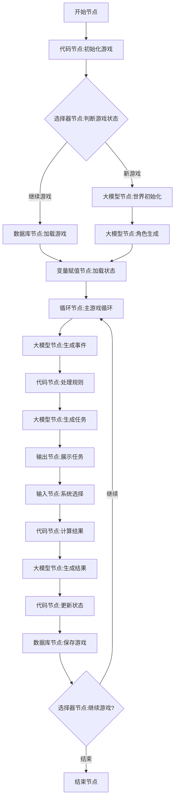

<think>根据用户的需求，我需要设计一个完整的工作流，用于实现一个文字游戏，玩家扮演系统，主角进行冒险。我需要考虑以下几点：

1. 工作流节点的选择和配置
2. 每个节点的输入输出参数
3. 提供详细的提示词内容
4. 指定数据类型
5. 设计数据库结构和变量
6. 符合Coze平台的限制和规范
7. 使用mermaid绘制流程图

从读取的文档中，我了解到Coze支持多种节点类型，对于这个文字游戏，我可能需要以下类型的节点：

- 开始节点：启动工作流
- 大模型节点：生成内容、处理游戏逻辑
- 代码节点：处理计算、验证和规则逻辑
- 变量赋值节点：管理游戏状态
- 数据库节点：持久化存储游戏数据
- 选择器节点：处理分支逻辑
- 循环节点：处理重复任务
- 输出节点：向用户展示信息
- 结束节点：结束工作流

下面我将设计整个工作流的结构和每个节点的具体配置。</think># 文字游戏工作流设计方案

## 整体工作流架构



## 节点详细设计

### 1. 开始节点

**内容**：游戏的入口点，接收用户初始指令

**输入参数**：
- `BOT_USER_INPUT`：String类型，用户输入的内容
- `game_state`：String类型，可选值为"new"或"continue"，表示是新游戏还是继续游戏
- `system_type`：String类型，可选，用户选择的系统类型
- `custom_system`：String类型，可选，用户自定义的系统描述

### 2. 代码节点：初始化游戏

**内容**：处理游戏初始化逻辑，检查游戏状态，准备必要的变量

**输入参数**：
- `game_state`：String类型，从开始节点获取
- `system_type`：String类型，从开始节点获取
- `custom_system`：String类型，从开始节点获取
- `user_id`：String类型，用户标识

**输出参数**：
- `is_new_game`：Boolean类型，是否为新游戏
- `system_info`：Object类型，系统信息
  - `type`：String类型，系统类型
  - `description`：String类型，系统描述
  - `abilities`：Array<String>类型，系统能力列表

**代码内容**：
```javascript
async function main({ params }) {
  const gameState = params.game_state || "new";
  const systemType = params.system_type || "修炼系统";
  const customSystem = params.custom_system || "";
  const userId = params.user_id || "default_user";
  
  let systemInfo = {
    type: systemType,
    description: customSystem || "作为修炼系统，您将引导主角提升修为，突破境界，获取功法与机缘",
    abilities: ["派送任务", "评价表现", "指导修炼", "提供机缘", "分配奖励"]
  };
  
  return {
    is_new_game: gameState === "new",
    system_info: systemInfo
  };
}
```

### 3. 选择器节点：判断游戏状态

**内容**：根据是否为新游戏决定后续流程

**输入参数**：
- `is_new_game`：Boolean类型，从代码节点获取

**条件设置**：
- 如果 `is_new_game` 为 true，则走新游戏流程
- 否则走继续游戏流程

### 4. 大模型节点：世界初始化

**内容**：生成游戏世界的背景、设定和规则

**输入参数**：
- `system_info`：Object类型，从代码节点获取

**输出参数**：
- `world`：Object类型，世界信息
  - `name`：String类型，世界名称
  - `age`：Integer类型，当前世界年代
  - `month`：Integer类型，当前月份
  - `day`：Integer类型，当前日期
  - `realms`：Array<Object>类型，修炼境界列表
    - `name`：String类型，境界名称
    - `description`：String类型，境界描述
    - `lifespan`：Integer类型，该境界寿命
  - `major_events`：Array<Object>类型，重大事件列表
    - `name`：String类型，事件名称
    - `description`：String类型，事件描述
    - `date`：Object类型，事件日期
      - `year`：Integer类型，年
      - `month`：Integer类型，月
      - `day`：Integer类型，日

**提示词**：
```
你是一个专业的修仙世界构建者，需要创建一个完整的修仙世界。你需要精通《凡人修仙传》《仙逆》《遮天》《完美世界》《斗破苍穹》《伏天氏》《绝世武神》《武极天下》《武动乾坤》《真武世界》《三寸人间》《一念永恒》《我欲封天》等经典修仙小说的世界观和设定。

请创建一个有深度的修仙世界，包含以下元素：
1. 世界名称：给这个世界一个独特而富有韵味的名字，体现修仙世界的特色
2. 当前时间：年、月、日（使用该世界的历法）
3. 修炼境界体系：创建6-12个大境界，每个大境界内有细分的小境界，确保境界间有清晰的实力差距和特征
4. 修炼资源：灵气、丹药、法宝、功法等资源的种类和品阶
5. 主要势力：宗门、世家、帝国等，及其之间的关系
6. 世界地理：主要地区、危险区域、秘境等
7. 重大事件：近期或即将发生的事件，如宗门大比、秘境开启等

要求：
- 境界设定需要合理，实力差距明确
- 为每个境界设定寿命上限
- 世界设定需要有内在逻辑，不要有明显矛盾
- 确保设定能支撑长期的故事发展
- 为后续角色冒险提供丰富的背景和可能性

返回格式必须是严格的JSON格式，包含name(世界名称)、age(当前年代)、month(当前月份)、day(当前日期)、realms(修炼境界数组)和major_events(重大事件数组)字段。其中realms数组的每个元素包含name(境界名称)、description(境界描述)和lifespan(该境界寿命)字段；major_events数组的每个元素包含name(事件名称)、description(事件描述)和date(事件日期对象，包含year、month、day字段)。
```

### 5. 数据库节点：加载游戏

**内容**：从数据库中加载已保存的游戏状态

**输入参数**：
- `user_id`：String类型，用户标识

**数据表配置**：
表名：game_data
字段：
- id：Integer类型，主键
- sys_platform：String类型，数据产生渠道
- uuid：String类型，用户标识
- bstudio_create_time：Time类型，数据创建时间
- character_data：String类型，角色数据(JSON格式字符串)
- world_data：String类型，世界数据(JSON格式字符串)
- game_progress：Integer类型，游戏进度
- game_day：Integer类型，游戏内天数
- last_save_time：Time类型，最后保存时间

**SQL语句**：
```sql
SELECT character_data, world_data, game_progress, game_day 
FROM game_data 
WHERE uuid = '{{user_id}}' 
ORDER BY last_save_time DESC 
LIMIT 1
```

**输出参数**：
- `character_data`：String类型，角色数据JSON字符串
- `world_data`：String类型，世界数据JSON字符串
- `game_progress`：Integer类型，游戏进度
- `game_day`：Integer类型，游戏内天数

### 6. 大模型节点：角色生成

**内容**：生成游戏主角的初始信息

**输入参数**：
- `world`：Object类型，从世界初始化节点获取
- `system_info`：Object类型，从代码节点获取

**输出参数**：
- `character`：Object类型，角色信息
  - `name`：String类型，角色名称
  - `age`：Integer类型，角色年龄
  - `lifespan`：Integer类型，寿命上限
  - `background`：String类型，背景故事
  - `realm`：String类型，当前境界
  - `realm_progress`：Integer类型，境界进度(0-1000)
  - `techniques`：Array<Object>类型，已学功法
    - `name`：String类型，功法名称
    - `level`：Integer类型，功法等级
    - `description`：String类型，功法描述
  - `attributes`：Object类型，属性面板
    - `strength`：Integer类型，力量
    - `agility`：Integer类型，敏捷
    - `intelligence`：Integer类型，智力
    - `spirit`：Integer类型，精神
    - `luck`：Integer类型，幸运

**提示词**：
```
你是一个专业的修仙小说角色创作者。请根据提供的修仙世界设定，创建一个合理且有成长潜力的主角。

世界信息：{{world}}

请为这个世界创建一个初始主角，他将由用户扮演的系统引导修炼。主角应该:
1. 有适合修仙小说的名字和背景
2. 初始境界应该是最低级的，处于修炼起步阶段
3. 有明确的性格特点和鲜明的形象
4. 具备一定的成长潜力和独特之处
5. 初始能力和资质中等偏上，但不应过于逆天
6. 拥有简单的初始功法
7. 有合理的年龄设定（通常为青少年或青年）

要求：
- 角色设定需合理，符合修仙世界观
- 设定境界进度为0-1000之间的数值，初始一般在100-300之间
- 为角色设定基础属性值(力量、敏捷、智力、精神、幸运)，数值范围为1-100
- 创建1-2个初始功法，等级和品质较低
- 设定合理的背景故事，但不要过于复杂
- 所有数值必须遵循世界设定的合理性

返回格式必须是严格的JSON格式，包含name(角色名称)、age(年龄)、lifespan(寿命上限)、background(背景故事)、realm(当前境界)、realm_progress(境界进度，0-1000的整数)、techniques(已学功法数组)和attributes(属性面板对象)字段。其中techniques数组的每个元素包含name(功法名称)、level(功法等级)和description(功法描述)字段；attributes对象包含strength(力量)、agility(敏捷)、intelligence(智力)、spirit(精神)和luck(幸运)字段，这些属性值应为1-100的整数。
```

### 7. 变量赋值节点：加载状态

**内容**：根据加载的数据或新生成的数据，设置游戏状态变量

**输入参数**：
- 新游戏流程：
  - `character`：Object类型，从角色生成节点获取
  - `world`：Object类型，从世界初始化节点获取
- 继续游戏流程：
  - `character_data`：String类型，从数据库节点获取
  - `world_data`：String类型，从数据库节点获取
  - `game_progress`：Integer类型，从数据库节点获取
  - `game_day`：Integer类型，从数据库节点获取

**变量赋值**：
以下是应用变量：
- `current_character`：Object类型，当前角色信息
- `current_world`：Object类型，当前世界信息
- `game_day`：Integer类型，游戏内天数，默认值为1
- `system_log`：Array<String>类型，系统日志，默认值为空数组
- `npcs`：Array<Object>类型，NPC列表，默认为空数组
- `completed_tasks`：Array<Object>类型，已完成任务，默认为空数组
- `available_tasks`：Array<Object>类型，可用任务，默认为空数组

### 8. 循环节点：主游戏循环

**内容**：管理游戏的主要循环，每次循环代表游戏中的一天

**循环类型**：指定循环次数或无限循环

**循环设置**：
- 如果设定固定游戏天数，则使用"指定循环次数"，次数为预设天数
- 如果是无限游戏，则使用"无限循环"，配合选择器节点控制退出

**中间变量**：
- `current_day_log`：String类型，当天记录
- `last_event`：Object类型，上一个事件

### 9. 大模型节点：生成事件

**内容**：根据游戏状态生成当日随机事件

**输入参数**：
- `current_character`：Object类型，当前角色信息
- `current_world`：Object类型，当前世界信息
- `game_day`：Integer类型，游戏内天数
- `system_log`：Array<String>类型，系统日志
- `last_event`：Object类型，上一个事件

**输出参数**：
- `daily_event`：Object类型，当日事件
  - `type`：String类型，事件类型
  - `title`：String类型，事件标题
  - `description`：String类型，事件描述
  - `difficulty`：Integer类型，事件难度(1-100)
  - `potential_rewards`：Array<String>类型，潜在奖励
  - `potential_penalties`：Array<String>类型，潜在惩罚

**提示词**：
```
你是一个修仙世界的事件生成器，负责创建主角遭遇的各种事件。请根据主角当前状态、世界背景和历史记录，生成今日的随机事件。

角色信息：{{current_character}}
世界信息：{{current_world}}
游戏天数：{{game_day}}
系统日志：{{system_log}}
上次事件：{{last_event}}

请生成一个合理的修仙世界事件，该事件应当：
1. 符合修仙世界的特色和气质
2. 与主角当前境界相匹配，难度适中（既有挑战又不会过于致命）
3. 包含清晰的风险和潜在收益
4. 考虑主角的背景和特长
5. 与世界背景和前序事件有一定连续性
6. 必须包含详细描述，让读者能够身临其境

事件类型可以包括但不限于：
- 偶遇奇遇（发现宝物、秘境）
- 遭遇危险（妖兽、邪修、天灾）
- 修炼契机（感悟、瓶颈）
- NPC互动（长老指点、同门切磋）
- 宗门活动（比试、任务）

难度设定：
- 1-20：适合初学者，基本无危险
- 21-40：有一定挑战，但风险可控
- 41-60：中等难度，需谨慎应对
- 61-80：较高难度，需全力以赴
- 81-100：极高难度，有生命危险

注意：
- 事件难度应与主角当前境界相匹配，不要生成明显不合理的挑战
- 考虑一定的随机性和多样性，让游戏体验丰富有趣
- 为系统（用户）提供干预和辅助主角的机会

返回格式必须是严格的JSON格式，包含type(事件类型)、title(事件标题)、description(事件描述)、difficulty(事件难度,1-100的整数)、potential_rewards(潜在奖励的字符串数组)和potential_penalties(潜在惩罚的字符串数组)字段。
```

### 10. 代码节点：处理规则

**内容**：根据事件难度和角色信息，计算成功率和可能的任务类型

**输入参数**：
- `daily_event`：Object类型，当日事件
- `current_character`：Object类型，当前角色信息

**输出参数**：
- `success_rate`：Number类型，成功率(0-1)
- `available_tasks`：Array<Object>类型，可用任务列表
  - `id`：Integer类型，任务ID
  - `title`：String类型，任务标题
  - `description`：String类型，任务描述
  - `difficulty`：Integer类型，任务难度
  - `reward_desc`：String类型，奖励描述

**代码内容**：
```javascript
async function main({ params }) {
  const event = params.daily_event;
  const character = params.current_character;
  
  // 计算成功率，基于角色属性和事件难度
  const attributeSum = character.attributes.strength + 
                      character.attributes.agility + 
                      character.attributes.intelligence + 
                      character.attributes.spirit +
                      character.attributes.luck;
  
  // 基础成功率，角色总属性高且事件难度低时成功率高
  let baseSuccessRate = (attributeSum / 500) * (1 - event.difficulty / 100);
  
  // 确保成功率在0.1到0.9之间
  let successRate = Math.min(0.9, Math.max(0.1, baseSuccessRate));
  
  // 根据事件类型和难度生成可能的任务
  const taskTypes = ["修炼", "探索", "战斗", "社交", "采集"];
  const availableTasks = [];
  
  // 至少生成3个任务选项
  for (let i = 0; i < 3; i++) {
    const taskDifficulty = Math.floor(event.difficulty * (0.8 + Math.random() * 0.4));
    const taskType = taskTypes[Math.floor(Math.random() * taskTypes.length)];
    
    availableTasks.push({
      id: i + 1,
      title: `${taskType}任务：${event.title}`,
      description: `应对${event.description}的${taskType}方式`,
      difficulty: taskDifficulty,
      reward_desc: event.potential_rewards[i % event.potential_rewards.length]
    });
  }
  
  return {
    success_rate: successRate,
    available_tasks: availableTasks
  };
}
```

### 11. 大模型节点：生成任务

**内容**：根据事件和规则处理结果，生成详细的任务描述

**输入参数**：
- `daily_event`：Object类型，当日事件
- `available_tasks`：Array<Object>类型，可用任务列表
- `success_rate`：Number类型，成功率
- `current_character`：Object类型，当前角色信息

**输出参数**：
- `tasks`：Array<Object>类型，完整任务列表
  - `id`：Integer类型，任务ID
  - `title`：String类型，任务标题
  - `description`：String类型，任务详细描述
  - `difficulty`：Integer类型，任务难度
  - `reward_desc`：String类型，奖励描述
  - `system_note`：String类型，系统笔记(给用户看的辅助信息)

**提示词**：
```
你是一个修仙世界的系统，负责为主角提供任务选择。请根据今日发生的事件和可用任务列表，生成更详细的任务描述和系统笔记。

今日事件：{{daily_event}}
可用任务列表：{{available_tasks}}
成功概率：{{success_rate}}
角色信息：{{current_character}}

作为系统，你需要：
1. 为每个任务提供更丰富、更有代入感的描述
2. 添加系统笔记，指出任务的难度、风险和可能的策略
3. 结合主角当前的能力和境界，提供针对性的建议
4. 确保描述的风格符合修仙小说的气质和语言特点

注意：
- 任务描述应生动详实，有助于玩家理解任务内容
- 系统笔记应体现出你作为系统对主角的分析和建议
- 保持每个任务的原始难度和奖励，但可以丰富其描述
- 难度较高的任务应明确提示风险，但也要展示高回报
- 符合修仙小说的文风和用词习惯

返回格式必须是严格的JSON格式，包含完整的tasks数组，每个任务对象包含id(任务ID)、title(任务标题)、description(任务详细描述，至少100字)、difficulty(任务难度,1-100的整数)、reward_desc(奖励描述)和system_note(系统笔记，给用户提供的辅助信息)字段。
```

### 12. 输出节点：展示任务

**内容**：向用户展示当前事件和可选任务

**输出变量**：
- `event`：Object类型，引用daily_event
- `tasks`：Array<Object>类型，引用tasks
- `character`：Object类型，引用current_character

**输出内容**：
```
【当前境界】{{character.realm}}（{{character.realm_progress}}/1000）

【今日事件】{{event.title}}
{{event.description}}

【可选任务】

{{task.id}}. {{task.title}}（难度：{{task.difficulty}}）
{{task.description}}

系统笔记：{{task.system_note}}


请选择要分配给主角的任务编号：
```

### 13. 输入节点：系统选择

**内容**：接收用户的任务选择

**输入参数**：
- `task_choice`：Integer类型，任务选择ID

### 14. 代码节点：计算结果

**内容**：根据角色属性、任务难度和随机因素计算任务结果

**输入参数**：
- `task_choice`：Integer类型，从输入节点获取
- `tasks`：Array<Object>类型，任务列表
- `success_rate`：Number类型，成功率
- `current_character`：Object类型，当前角色信息

**输出参数**：
- `task_result`：Object类型，任务结果
  - `success`：Boolean类型，是否成功
  - `reward_type`：String类型，奖励类型
  - `reward_value`：Integer类型，奖励值
  - `experience`：Integer类型，获得经验
  - `special_event`：Boolean类型，是否触发特殊事件
- `selected_task`：Object类型，选中的任务

**代码内容**：
```javascript
async function main({ params }) {
  const taskId = params.task_choice;
  const tasks = params.tasks;
  const baseSuccessRate = params.success_rate;
  const character = params.current_character;
  
  // 找到选中的任务
  const selectedTask = tasks.find(task => task.id === taskId) || tasks[0];
  
  // 根据任务难度和角色属性调整成功率
  let adjustedSuccessRate = baseSuccessRate * (1 - selectedTask.difficulty / 200);
  
  // 根据角色属性进一步调整
  const relevantAttributes = {
    "修炼": "intelligence",
    "探索": "agility",
    "战斗": "strength",
    "社交": "spirit",
    "采集": "luck"
  };
  
  // 从任务标题中提取类型
  const taskTypeMatch = selectedTask.title.match(/^(修炼|探索|战斗|社交|采集)/);
  const taskType = taskTypeMatch ? taskTypeMatch[1] : "修炼";
  const relevantAttribute = relevantAttributes[taskType] || "intelligence";
  
  // 相关属性越高，成功率越高
  adjustedSuccessRate += character.attributes[relevantAttribute] / 200;
  
  // 最终成功率限制在0.05到0.95之间
  adjustedSuccessRate = Math.min(0.95, Math.max(0.05, adjustedSuccessRate));
  
  // 决定是否成功
  const success = Math.random() < adjustedSuccessRate;
  
  // 计算奖励
  const rewardTypes = ["属性", "修为", "功法", "宝物", "机缘"];
  const rewardType = rewardTypes[Math.floor(Math.random() * rewardTypes.length)];
  
  // 奖励值基于任务难度和成功与否
  const baseReward = selectedTask.difficulty * (success ? 1 : 0.3);
  const rewardValue = Math.floor(baseReward * (0.8 + Math.random() * 0.4));
  
  // 经验/修为增长
  const experience = Math.floor(selectedTask.difficulty * (success ? 2 : 0.5));
  
  // 特殊事件触发几率 (10%)
  const specialEvent = Math.random() < 0.1;
  
  return {
    task_result: {
      success: success,
      reward_type: rewardType,
      reward_value: rewardValue,
      experience: experience,
      special_event: specialEvent
    },
    selected_task: selectedTask
  };
}
```

### 15. 大模型节点：生成结果

**内容**：根据任务结果生成详细的叙述性描述

**输入参数**：
- `task_result`：Object类型，任务结果
- `selected_task`：Object类型，选中的任务
- `current_character`：Object类型，当前角色信息
- `daily_event`：Object类型，当日事件

**输出参数**：
- `result_narrative`：String类型，结果叙述
- `character_dialog`：String类型，角色对话
- `system_comments`：String类型，系统评论
- `rewards_detail`：Object类型，奖励详情
  - `type`：String类型，奖励类型
  - `name`：String类型，奖励名称
  - `description`：String类型，奖励描述
  - `value`：Integer类型，奖励值

**提示词**：
```
你是一个修仙世界的系统，需要生成主角完成任务后的详细结果叙述。请根据提供的任务结果信息，创作一段生动的修仙小说文字，描述主角如何执行任务以及最终的结果。

任务结果：{{task_result}}
选择的任务：{{selected_task}}
角色信息：{{current_character}}
今日事件：{{daily_event}}

请创作以下内容：

1. 结果叙述：详细描述主角执行任务的整个过程，包括环境描写、行动细节、遭遇的困难以及结果。至少200字，要有修仙小说的文风和氛围。

2. 角色对话：主角可能与系统（由用户扮演）的一段对话。这段对话应该反映主角对系统的态度，以及对任务结果的感受。

3. 系统评论：作为系统，对主角表现的点评和建议，以及对未来发展的展望。

4. 奖励详情：根据任务结果和奖励类型，详细描述主角获得的具体奖励。如果是功法，提供功法名称和特点；如果是宝物，描述宝物的外观和功能；如果是属性提升，说明具体提升了哪些属性等。

注意：
- 叙述应富有代入感和画面感，符合修仙小说的风格
- 如果任务成功，描述主角克服困难的过程；如果失败，描述失败的原因和主角的反应
- 如果触发特殊事件，添加一些意外但合理的剧情元素
- 保持与角色当前境界和能力相符的描述
- 奖励应当与任务难度和结果相匹配，并具有合理性

返回格式必须是严格的JSON格式，包含result_narrative(结果叙述，字符串)、character_dialog(角色对话，字符串)、system_comments(系统评论，字符串)和rewards_detail(奖励详情对象)字段。其中rewards_detail对象包含type(奖励类型)、name(奖励名称)、description(奖励描述)和value(奖励值，整数)字段。
```

### 16. 代码节点：更新状态

**内容**：根据任务结果更新角色状态和游戏进度

**输入参数**：
- `task_result`：Object类型，任务结果
- `rewards_detail`：Object类型，奖励详情
- `current_character`：Object类型，当前角色信息
- `game_day`：Integer类型，游戏内天数
- `result_narrative`：String类型，结果叙述

**输出参数**：
- `updated_character`：Object类型，更新后的角色信息
- `new_log_entry`：String类型，新的日志条目
- `breakthrough`：Boolean类型，是否突破境界
- `game_day_increment`：Integer类型，天数增加值

**代码内容**：
```javascript
async function main({ params }) {
  const result = params.task_result;
  const rewards = params.rewards_detail;
  const character = JSON.parse(JSON.stringify(params.current_character)); // 深拷贝
  const currentDay = params.game_day;
  const narrative = params.result_narrative;
  
  // 增加修为/经验
  character.realm_progress += result.experience;
  let breakthrough = false;
  
  // 检查是否突破
  if (character.realm_progress >= 1000) {
    // 寻找当前境界在世界境界中的索引
    const realmIndex = world.realms.findIndex(r => r.name === character.realm);
    
    // 如果有下一个境界，则突破
    if (realmIndex >= 0 && realmIndex < world.realms.length - 1) {
      character.realm = world.realms[realmIndex + 1].name;
      character.realm_progress = 0;
      character.lifespan = world.realms[realmIndex + 1].lifespan;
      breakthrough = true;
    } else {
      // 已是最高境界，保持在999
      character.realm_progress = 999;
    }
  }
  
  // 根据奖励类型更新角色
  switch(rewards.type) {
    case "属性":
      // 随机选择一个属性提升
      const attributes = ["strength", "agility", "intelligence", "spirit", "luck"];
      const attrToIncrease = rewards.name.toLowerCase().includes("全属性") 
        ? attributes 
        : [attributes[Math.floor(Math.random() * attributes.length)]];
        
      for (const attr of attrToIncrease) {
        character.attributes[attr] = Math.min(100, character.attributes[attr] + rewards.value);
      }
      break;
      
    case "功法":
      // 添加新功法或升级现有功法
      const existingTechIndex = character.techniques.findIndex(t => t.name === rewards.name);
      if (existingTechIndex >= 0) {
        character.techniques[existingTechIndex].level += 1;
      } else {
        character.techniques.push({
          name: rewards.name,
          level: 1,
          description: rewards.description
        });
      }
      break;
      
    case "宝物":
      // 添加宝物到物品栏
      if (!character.items) {
        character.items = [];
      }
      
      character.items.push({
        name: rewards.name,
        description: rewards.description,
        value: rewards.value
      });
      break;
  }
  
  // 创建日志条目
  const logEntry = `【第${currentDay}天】${character.name}执行了任务"${result.selected_task.title}"。${result.success ? '成功' : '失败'}。${breakthrough ? '突破了境界！' : ''}`;
  
  // 随机决定天数增加
  const dayIncrement = Math.floor(Math.random() * 3) + 1; // 1-3天
  
  return {
    updated_character: character,
    new_log_entry: logEntry,
    breakthrough: breakthrough,
    game_day_increment: dayIncrement
  };
}
```

### 17. 数据库节点：保存游戏

**内容**：将更新后的角色信息和游戏状态保存到数据库

**输入参数**：
- `updated_character`：Object类型，更新后的角色信息
- `current_world`：Object类型，当前世界信息
- `game_day`：Integer类型，游戏内天数
- `game_day_increment`：Integer类型，天数增加值
- `user_id`：String类型，用户标识

**数据表配置**：
表名：game_data
字段：
- id：Integer类型，主键
- sys_platform：String类型，数据产生渠道
- uuid：String类型，用户标识
- bstudio_create_time：Time类型，数据创建时间
- character_data：String类型，角色数据(JSON格式字符串)
- world_data：String类型，世界数据(JSON格式字符串)
- game_progress：Integer类型，游戏进度
- game_day：Integer类型，游戏内天数
- last_save_time：Time类型，最后保存时间

**SQL语句**：
```sql
INSERT INTO game_data 
(uuid, character_data, world_data, game_progress, game_day, last_save_time) 
VALUES 
('{{user_id}}', '{{JSON.stringify(updated_character)}}', '{{JSON.stringify(current_world)}}', 
{{game_progress || 1}}, {{game_day + game_day_increment}}, NOW())
```

**输出参数**：
- `save_success`：Boolean类型，保存是否成功
- `new_game_day`：Integer类型，新的游戏内天数

### 18. 选择器节点：继续游戏？

**内容**：检查是否要继续游戏循环

**输入参数**：
- `breakthrough`：Boolean类型，是否突破境界
- `save_success`：Boolean类型，保存是否成功
- `result_narrative`：String类型，结果叙述
- `new_game_day`：Integer类型，新的游戏内天数
- `BOT_USER_INPUT`：String类型，用户输入

**条件设置**：
- 如果 `BOT_USER_INPUT` 包含"退出"、"结束"、"停止"等关键词，结束游戏
- 否则，继续游戏循环

### 19. 结束节点

**内容**：处理游戏结束并返回最终结果

**输出模式**：返回文本

**输出变量**：
- `final_character`：Object类型，最终角色状态
- `game_days`：Integer类型，游戏总天数
- `summary`：String类型，游戏总结

**回答内容**：
```
【游戏结束】

{{final_character.name}}的修仙之旅暂告一段落。

当前境界：{{final_character.realm}}（{{final_character.realm_progress}}/1000）
修炼天数：{{game_days}}天
已掌握功法：
  {{tech.name}}（等级：{{tech.level}}）：{{tech.description}}


属性面板：
  力量：{{final_character.attributes.strength}}
  敏捷：{{final_character.attributes.agility}}
  智力：{{final_character.attributes.intelligence}}
  精神：{{final_character.attributes.spirit}}
  幸运：{{final_character.attributes.luck}}

游戏总结：
{{summary}}

感谢您体验本游戏！您可以随时继续游戏或开始新的冒险。
```

## 应用变量详细设计

以下是应用变量的详细设计，这些变量在整个应用中可被访问，每次新请求都会初始化为默认值。

### 1. `current_character`
- **类型**：Object
- **默认值**：null
- **描述**：存储当前角色的所有信息
- **子变量**：
  - `name`：String类型，角色名称
  - `age`：Integer类型，角色年龄
  - `lifespan`：Integer类型，寿命上限
  - `background`：String类型，背景故事
  - `realm`：String类型，当前境界
  - `realm_progress`：Integer类型，境界进度(0-1000)
  - `techniques`：Array<Object>类型，已学功法
    - `name`：String类型，功法名称
    - `level`：Integer类型，功法等级
    - `description`：String类型，功法描述
  - `attributes`：Object类型，属性面板
    - `strength`：Integer类型，力量
    - `agility`：Integer类型，敏捷
    - `intelligence`：Integer类型，智力
    - `spirit`：Integer类型，精神
    - `luck`：Integer类型，幸运
  - `items`：Array<Object>类型，物品栏
    - `name`：String类型，物品名称
    - `description`：String类型，物品描述
    - `value`：Integer类型，物品价值


### 2. `current_world`
- **类型**：Object
- **默认值**：null
- **描述**：存储当前世界的详细信息
- **子变量**：
  - `name`：String类型，世界名称
  - `age`：Integer类型，当前世界年代
  - `month`：Integer类型，当前月份
  - `day`：Integer类型，当前日期
  - `realms`：Array<Object>类型，修炼境界列表
    - `name`：String类型，境界名称
    - `description`：String类型，境界描述
    - `lifespan`：Integer类型，该境界寿命
  - `major_events`：Array<Object>类型，重大事件列表
    - `name`：String类型，事件名称
    - `description`：String类型，事件描述
    - `date`：Object类型，事件日期
      - `year`：Integer类型，年
      - `month`：Integer类型，月
      - `day`：Integer类型，日

### 3. `game_day`
- **类型**：Integer
- **默认值**：1
- **描述**：当前游戏内天数

### 4. `system_log`
- **类型**：Array<String>
- **默认值**：[]
- **描述**：系统日志记录，存储游戏主要事件

### 5. `npcs`
- **类型**：Array<Object>
- **默认值**：[]
- **描述**：存储游戏中的NPC信息
- **子变量**（每个NPC对象）：
  - `id`：Integer类型，NPC唯一标识
  - `name`：String类型，NPC名称
  - `identity`：String类型，身份
  - `relationship`：Integer类型，与主角的关系值(-100到100)
  - `recent_activity`：String类型，近期动向
  - `location`：String类型，当前位置
  - `realm`：String类型，修为境界

### 6. `completed_tasks`
- **类型**：Array<Object>
- **默认值**：[]
- **描述**：已完成的任务列表
- **子变量**（每个任务对象）：
  - `id`：Integer类型，任务ID
  - `title`：String类型，任务标题
  - `success`：Boolean类型，是否成功
  - `day`：Integer类型，完成的游戏天数
  - `reward`：String类型，获得的奖励描述

### 7. `available_tasks`
- **类型**：Array<Object>
- **默认值**：[]
- **描述**：当前可用的任务列表
- **子变量**（每个任务对象）：
  - `id`：Integer类型，任务ID
  - `title`：String类型，任务标题
  - `description`：String类型，任务描述
  - `difficulty`：Integer类型，任务难度
  - `reward_desc`：String类型，奖励描述

## 数据库表结构详细设计

### 表名：game_data

| 字段名 | 数据类型 | 描述 |
|--------|---------|------|
| id | Integer | 数据的唯一标识（主键） |
| sys_platform | String | 数据产生或使用的渠道 |
| uuid | String | 用户唯一标识，由系统生成 |
| bstudio_create_time | Time | 数据插入的时间 |
| character_data | String | 角色数据(JSON格式字符串) |
| world_data | String | 世界数据(JSON格式字符串) |
| game_progress | Integer | 游戏进度 |
| game_day | Integer | 游戏内天数 |
| last_save_time | Time | 最后保存时间 |

### 表名：event_history

| 字段名 | 数据类型 | 描述 |
|--------|---------|------|
| id | Integer | 数据的唯一标识（主键） |
| sys_platform | String | 数据产生或使用的渠道 |
| uuid | String | 用户唯一标识，由系统生成 |
| bstudio_create_time | Time | 数据插入的时间 |
| event_day | Integer | 事件发生的游戏天数 |
| event_type | String | 事件类型 |
| event_title | String | 事件标题 |
| event_desc | String | 事件描述 |
| task_id | Integer | 关联任务ID |
| task_result | Boolean | 任务结果(成功/失败) |

### 表名：npc_data

| 字段名 | 数据类型 | 描述 |
|--------|---------|------|
| id | Integer | 数据的唯一标识（主键） |
| sys_platform | String | 数据产生或使用的渠道 |
| uuid | String | 用户唯一标识，由系统生成 |
| bstudio_create_time | Time | 数据插入的时间 |
| npc_id | Integer | NPC唯一标识 |
| npc_name | String | NPC名称 |
| npc_identity | String | NPC身份 |
| npc_realm | String | NPC修为境界 |
| relationship | Integer | 与主角的关系值 |
| first_meet_day | Integer | 初次相遇的游戏天数 |
| last_meet_day | Integer | 最后相遇的游戏天数 |

## 总结

本文字游戏工作流设计实现了一个完整的修仙世界文字游戏，玩家扮演降临在主角身上的系统，引导主角进行修炼冒险。通过使用Coze的工作流节点，我们实现了游戏的初始化、主循环、任务生成、状态更新和数据存储等核心功能。

这个设计充分利用了Coze的大模型节点生成丰富的游戏内容，使用代码节点实现了规则引擎和数据处理，利用数据库节点存储游戏状态，使用变量赋值节点管理游戏变量，并通过循环节点和选择器节点实现了游戏的主循环逻辑。

特别值得注意的是，我们通过详细的提示词设计，确保了生成内容符合修仙小说的风格和特点，同时通过规则引擎和验证机制，有效防止了大模型可能出现的幻觉和矛盾现象。这种设计能够支持长时间的游戏体验，提供丰富多样的任务和事件，同时保持游戏世界的一致性和合理性。
