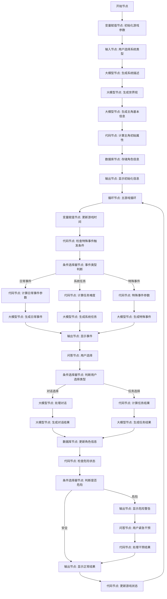

# 基于Coze的文字修仙游戏工作流实现方案


## 工作流流程图（细化版）



## 详细节点配置

### 1. 开始节点

**输入参数**:
- `BOT_USER_INPUT`: String (用户输入的原始内容)

### 2. 变量赋值节点: 初始化游戏参数

**输出参数**:
- `game_version`: String (游戏版本号，如"1.0.0")
- `world_time`: Object
  - `year`: Number (游戏世界年份，初始值如"10000")
  - `month`: Number (游戏世界月份，初始值如"1")
  - `day`: Number (游戏世界日期，初始值如"1")
- `game_settings`: Object
  - `fate_tendency`: String (命运偏向，初始值为"平衡")
  - `time_flow`: Number (时间流速，初始值为"1")
- `memory_context`: Array (上下文记忆，初始为空数组)
- `event_pool`: Array (事件池，初始为空数组)

### 3. 输入节点: 用户选择系统类型

**输入参数**:
- `system_type`: String (用户选择的系统类型，如"修炼辅助系统"、"天道系统"等)
- `custom_system`: String (可选，用户自定义的系统描述)

### 4. 大模型节点: 生成系统描述

**输入参数**:
- `system_type`: String (从输入节点获取)
- `custom_system`: String (从输入节点获取)

**系统提示词**:
```
你是一个专业的修仙小说世界观设计师，现在需要为一个文字修仙游戏设计一个系统。系统是指降临在主角身上的特殊存在，能够辅助主角修炼、提供任务等。 
请根据用户选择的系统类型"{{system_type}}"，设计一个详细的系统描述，包括： 
1. 系统名称（简洁有力）  
2. 系统起源（来自何方，为何降临）  
3. 系统能力（至少3-5种核心能力）  
4. 系统性格特点（如何与主角互动）  
5. 系统限制（有什么不能做的事情）   
如果用户提供了自定义系统描述"{{custom_system}}"且不为空，请基于用户提供的描述进行丰富和完善，保留用户的核心设定。 
如果用户没有提供自定义系统描述，请根据system_type创建一个完整的系统设定。 
你的描述应当符合修仙小说的风格，融入传统修仙元素，但也要有创新性。描述应当详细但不冗长，约500-800字为宜。
```

**输出参数**:
- `system_name`: String (系统名称)
- `system_description`: String (系统详细描述)
- `system_abilities`: Array (系统能力列表)
- `system_personality`: String (系统性格特点)
- `system_limitations`: String (系统限制)

### 5. 大模型节点: 生成世界观

**输入参数**:
- `system_name`: String (从上一节点获取)
- `system_description`: String (从上一节点获取)

**系统提示词**:
```
你是一位精通修仙小说创作的世界观设计大师，现在需要为一个文字修仙游戏创建一个完整而丰富的世界观。请参考《凡人修仙传》《仙逆》《遮天》《完美世界》《斗破苍穹》等经典修仙小说的世界设定，创造一个独特而合理的修仙世界。

请基于系统"{{system_name}}"的特点，设计以下内容：

1. 世界名称与基本背景
2. 修炼体系（必须包含6-12个大境界，每个大境界包含若干小境界）
3. 主要宗门/势力（至少5个，包括其特点和代表功法）
4. 世界地理（至少3个主要区域及其特点）
5. 重要资源与宝物
6. 世界规则（如天道法则、因果规则等）
7. 当前世界重大事件（至少2个，可能影响主角的命运）

你的世界观应当符合修仙小说的传统，但也要有独特创新之处。设计应当考虑到与"{{system_name}}"的互动，为系统的能力提供施展空间。

输出格式应为JSON，包含上述各项内容的详细描述。
```

**输出参数**:
- `world_name`: String (世界名称)
- `world_background`: String (世界背景)
- `cultivation_system`: Object (修炼体系)
  - `realms`: Array (境界列表)
  - `paths`: Array (修炼道路)
- `major_forces`: Array (主要势力)
- `geography`: Object (世界地理)
- `resources`: Array (重要资源)
- `world_rules`: Array (世界规则)
- `major_events`: Array (重大事件)

### 6. 大模型节点: 生成主角基本信息

**输入参数**:
- `world_name`: String (从上一节点获取)
- `cultivation_system`: Object (从上一节点获取)
- `geography`: Object (从上一节点获取)

**系统提示词**:
```
你是一位精通修仙小说的角色设计师，现在需要为一个文字修仙游戏随机生成一位主角。这位主角将生活在"{{world_name}}"世界中，遵循该世界的修炼体系。

请随机生成一位初入修仙之路的主角，包括以下信息：
1. 姓名（符合修仙世界风格）
2. 年龄（16-25岁之间）
3. 出身背景（可以是平民、小家族子弟、落魄贵族等，但不要太强大的背景）
4. 性格特点（3-5个主要特质）
5. 初始修为（必须是最低级别的修为，参考提供的境界体系）
6. 天赋资质（可以有一定特殊之处，但不要过于逆天）
7. 初始所在地（参考提供的地理信息）
8. 初始拥有的功法/技能（最多2个，品质较低）
9. 人生目标或追求

生成的角色应当有成长潜力，但初始实力必须较弱，给予足够的成长空间。角色背景应当有一定的故事性和矛盾点，为后续剧情发展埋下伏笔。

请以JSON格式输出角色信息。
```

**输出参数**:
- `character_name`: String (角色姓名)
- `character_age`: Number (角色年龄)
- `character_background`: String (角色背景)
- `character_traits`: Array (性格特点)
- `initial_realm`: String (初始境界)
- `talent`: String (天赋资质)
- `location`: String (所在地)
- `initial_skills`: Array (初始技能)
- `life_goal`: String (人生目标)

### 7. 代码节点: 计算主角初始属性

**输入参数**:
- `character_age`: Number (从上一节点获取)
- `initial_realm`: String (从上一节点获取)
- `talent`: String (从上一节点获取)

**代码内容** (JavaScript):
```javascript
function main({ params }) {
  const age = params.character_age;
  const initialRealm = params.initial_realm;
  const talent = params.talent;
  
  // 基础属性计算
  let strength = 10 + Math.floor(Math.random() * 5);
  let agility = 10 + Math.floor(Math.random() * 5);
  let intelligence = 10 + Math.floor(Math.random() * 5);
  let constitution = 10 + Math.floor(Math.random() * 5);
  let luck = 10 + Math.floor(Math.random() * 5);
  
  // 根据天赋调整属性
  if (talent.includes('力量')) strength += 5;
  if (talent.includes('敏捷')) agility += 5;
  if (talent.includes('智慧')) intelligence += 5;
  if (talent.includes('体质')) constitution += 5;
  if (talent.includes('运气')) luck += 5;
  
  // 计算寿元
  const baseLifespan = 60;
  const realmBonus = initialRealm.includes('练气') ? 20 : 0;
  const lifespan = baseLifespan + realmBonus;
  
  // 计算境界进度
  const realmProgress = Math.floor(Math.random() * 100);
  
  // 计算初始生命值和法力值
  const maxHealth = constitution * 10;
  const currentHealth = maxHealth;
  const maxMana = intelligence * 5;
  const currentMana = maxMana;
  
  return {
    attributes: {
      strength,
      agility,
      intelligence,
      constitution,
      luck
    },
    health: {
      current: currentHealth,
      max: maxHealth
    },
    mana: {
      current: currentMana,
      max: maxMana
    },
    lifespan,
    realm_progress: realmProgress,
    experience: 0,
    reputation: 0,
    spirit_stones: Math.floor(Math.random() * 10) + 1
  };
}
```

**输出参数**:
- `attributes`: Object (角色属性)
  - `strength`: Number (力量)
  - `agility`: Number (敏捷)
  - `intelligence`: Number (智力)
  - `constitution`: Number (体质)
  - `luck`: Number (运气)
- `health`: Object (生命值)
  - `current`: Number (当前生命值)
  - `max`: Number (最大生命值)
- `mana`: Object (法力值)
  - `current`: Number (当前法力值)
  - `max`: Number (最大法力值)
- `lifespan`: Number (寿元)
- `realm_progress`: Number (境界进度，0-1000)
- `experience`: Number (经验值)
- `reputation`: Number (声望)
- `spirit_stones`: Number (灵石数量)

### 8. 数据库节点: 存储角色信息

**操作类型**: 新增数据

**数据表**: character_data

**字段设置**:
<!-- 系统预制字段，自动管理，不需要手动设置 -->
<!-- - `id`: Integer (数据的唯一标识，主键) -->
<!-- - `sys_platform`: String (数据产生或使用的渠道) -->
<!-- - `uuid`: String (用户唯一标识，由系统生成) -->
<!-- - `bstudio_create_time`: Time (数据插入的时间) -->

<!-- 自定义字段，需要手动设置 -->
- `character_name`: String (从大模型节点获取)
- `character_age`: Number (从大模型节点获取)
- `character_background`: String (从大模型节点获取)
- `character_traits`: String (从大模型节点获取，JSON字符串)
- `initial_realm`: String (从大模型节点获取)
- `current_realm`: String (初始与initial_realm相同)
- `talent`: String (从大模型节点获取)
- `location`: String (从大模型节点获取)
- `initial_skills`: String (从大模型节点获取，JSON字符串)
- `current_skills`: String (初始与initial_skills相同)
- `life_goal`: String (从大模型节点获取)
- `attributes`: String (从代码节点获取，JSON字符串)
- `health`: String (从代码节点获取，JSON字符串)
- `mana`: String (从代码节点获取，JSON字符串)
- `lifespan`: Number (从代码节点获取)
- `realm_progress`: Number (从代码节点获取)
- `experience`: Number (从代码节点获取)
- `reputation`: Number (从代码节点获取)
- `spirit_stones`: Number (从代码节点获取)
- `inventory`: String (初始为"[]"，JSON字符串)
- `relationships`: String (初始为"{}"，JSON字符串)
- `story_progress`: String (初始为"[]"，JSON字符串)

**输出参数**:
- `character_id`: String (生成的角色ID，可以使用系统生成的`id`字段)

### 9. 输出节点: 显示初始化信息

**输入参数**:
- `character_name`: String (从大模型节点获取)
- `character_age`: Number (从大模型节点获取)
- `character_background`: String (从大模型节点获取)
- `initial_realm`: String (从大模型节点获取)
- `talent`: String (从大模型节点获取)
- `location`: String (从大模型节点获取)
- `initial_skills`: Array (从大模型节点获取)
- `life_goal`: String (从大模型节点获取)
- `attributes`: Object (从代码节点获取)
- `lifespan`: Number (从代码节点获取)
- `realm_progress`: Number (从代码节点获取)
- `system_name`: String (从大模型节点获取)
- `system_description`: String (从大模型节点获取)

**输出内容**:
```
# 【修仙之旅】初始化完成

## 角色信息
**姓名**: {{character_name}}
**年龄**: {{character_age}}岁
**寿元**: {{lifespan}}岁
**境界**: {{initial_realm}}（{{realm_progress}}/1000）
**天赋**: {{talent}}
**所在**: {{location}}

## 属性面板
**力量**: {{attributes.strength}}
**敏捷**: {{attributes.agility}}
**智力**: {{attributes.intelligence}}
**体质**: {{attributes.constitution}}
**运气**: {{attributes.luck}}

## 技能
{{#each initial_skills}}
- {{this}}
{{/each}}

## 背景
{{character_background}}

## 人生目标
{{life_goal}}

## 系统信息
一道光芒闪过，{{system_name}}已成功降临到你的身上！

{{system_description}}

*系统将协助你踏上修仙之路，完成各种任务，获取资源，提升修为。*

【游戏开始，请等待...】
```

### 10. 循环节点: 主游戏循环

**循环类型**: 无限循环

**中间变量**:
- `current_context`: String (当前上下文，初始为空)
- `last_event`: Object (上一个事件，初始为null)
- `event_count`: Number (事件计数器，初始为0)

### 11. 变量赋值节点: 更新游戏时间

**输入参数**:
- `world_time`: Object (从变量赋值节点获取)
- `game_settings`: Object (从变量赋值节点获取)

**输出参数**:
- `updated_world_time`: Object (更新后的游戏时间)
  - `year`: Number
  - `month`: Number
  - `day`: Number
- `time_flow`: Number (时间流速)

### 12. 代码节点: 检查特殊事件触发条件

**输入参数**:
- `updated_world_time`: Object (从变量赋值节点获取)
- `character_id`: String (从数据库节点获取)
- `event_count`: Number (从循环节点获取)

**代码内容** (JavaScript):
```javascript
async function main({ params }) {
  const worldTime = params.updated_world_time;
  const characterId = params.character_id;
  const eventCount = params.event_count;
  
  // 查询角色数据
  // 注意：在实际实现中，这里应该调用数据库查询
  // 这里简化处理，假设我们已经有了角色数据
  
  // 特殊事件触发条件
  let eventType = "daily"; // 默认为日常事件
  let eventProbability = Math.random();
  
  // 每10个事件触发一次系统任务
  if (eventCount % 10 === 0) {
    eventType = "system_task";
  }
  
  // 特殊日期触发特殊事件
  if (worldTime.month === 1 && worldTime.day === 1) {
    // 新年
    eventType = "special";
  } else if (worldTime.month === 6 && worldTime.day === 15) {
    // 宗门大比
    eventType = "special";
  }
  
  // 随机特殊事件，概率5%
  if (eventProbability < 0.05) {
    eventType = "special";
  }
  
  return {
    event_type: eventType,
    is_special_date: worldTime.month === 1 && worldTime.day === 1 || worldTime.month === 6 && worldTime.day === 15,
    current_date: `${worldTime.year}年${worldTime.month}月${worldTime.day}日`
  };
}
```

**输出参数**:
- `event_type`: String (事件类型: "daily", "system_task", "special")
- `is_special_date`: Boolean (是否特殊日期)
- `current_date`: String (当前日期文本)

### 13. 条件选择器节点: 事件类型判断

**条件**:
- 条件1: `event_type == "daily"` → 日常事件分支
- 条件2: `event_type == "system_task"` → 系统任务分支
- 条件3: `event_type == "special"` → 特殊事件分支

### 14. 代码节点: 计算日常事件参数

**输入参数**:
- `character_id`: String (从数据库节点获取)
- `current_date`: String (从代码节点获取)

**代码内容** (JavaScript):
```javascript
async function main({ params }) {
  const characterId = params.character_id;
  const currentDate = params.current_date;
  
  // 日常事件类型
  const eventTypes = [
    "cultivation", // 修炼
    "encounter", // 遭遇
    "discovery", // 发现
    "social", // 社交
    "market", // 市场
    "rest" // 休息
  ];
  
  // 随机选择事件类型
  const selectedType = eventTypes[Math.floor(Math.random() * eventTypes.length)];
  
  // 根据事件类型设置参数
  let eventParams = {};
  
  switch (selectedType) {
    case "cultivation":
      eventParams = {
        location: "洞府",
        duration: Math.floor(Math.random() * 6) + 1, // 1-6小时
        focus: ["心法", "功法", "炼体", "炼气"][Math.floor(Math.random() * 4)]
      };
      break;
    case "encounter":
      eventParams = {
        location: ["山林", "城镇", "河边", "荒野"][Math.floor(Math.random() * 4)],
        npc_type: ["普通人", "修士", "妖兽", "商人"][Math.floor(Math.random() * 4)],
        attitude: ["友好", "中立", "敌对"][Math.floor(Math.random() * 3)]
      };
      break;
    // 其他事件类型的参数...
    default:
      eventParams = {
        location: "默认位置",
        duration: 1
      };
  }
  
  return {
    daily_event_type: selectedType,
    daily_event_params: eventParams,
    event_date: currentDate
  };
}
```

**输出参数**:
- `daily_event_type`: String (日常事件类型)
- `daily_event_params`: Object (日常事件参数)
- `event_date`: String (事件发生日期)

### 15. 大模型节点: 生成日常事件

**输入参数**:
- `character_name`: String (从数据库获取)
- `current_realm`: String (从数据库获取)
- `location`: String (从数据库获取)
- `daily_event_type`: String (从代码节点获取)
- `daily_event_params`: Object (从代码节点获取)
- `event_date`: String (从代码节点获取)
- `current_context`: String (从循环节点获取)

**系统提示词**:
```
你是一位精通修仙小说创作的大师，现在需要为一个文字修仙游戏生成一段日常事件描述。请根据提供的角色信息和事件参数，创作一段生动、有趣且符合修仙小说风格的事件描述。

角色信息：
- 角色名称：{{character_name}}
- 当前境界：{{current_realm}}
- 当前位置：{{location}}

事件信息：
- 事件日期：{{event_date}}
- 事件类型：{{daily_event_type}}
- 事件参数：{{daily_event_params}}

上一事件上下文：
{{current_context}}

请注意以下要求：
1. 描述应当符合修仙小说的风格和语言习惯
2. 内容要有代入感，让玩家感受到角色的处境和情绪
3. 根据事件类型和参数，创造合理且有趣的情节
4. 描述长度控制在300-500字之间
5. 可以适当引入NPC，但不要引入过于强大的角色
6. 保持与上一事件的连贯性，但不要直接复制上一事件的内容
7. 结尾应当给玩家提供2-3个选择，这些选择将影响后续发展

请以第三人称视角描述事件，并在最后列出玩家的选择项。
```

**输出参数**:
- `event_title`: String (事件标题)
- `event_description`: String (事件描述)
- `event_choices`: Array (玩家选择项)
- `event_type`: String (固定为"daily")

### 16. 代码节点: 计算任务难度

**输入参数**:
- `character_id`: String (从数据库节点获取)
- `current_date`: String (从代码节点获取)

**代码内容** (JavaScript):
```javascript
async function main({ params }) {
  const characterId = params.character_id;
  const currentDate = params.current_date;
  
  // 任务类型
  const taskTypes = [
    "gathering", // 采集任务
    "hunting", // 狩猎任务
    "escort", // 护送任务
    "delivery", // 递送任务
    "investigation" // 调查任务
  ];
  
  // 随机选择任务类型
  const selectedType = taskTypes[Math.floor(Math.random() * taskTypes.length)];
  
  // 任务难度计算
  // 注意：在实际实现中，这里应该根据角色当前属性计算合适的难度
  // 这里简化处理，随机生成难度
  const difficultyLevels = ["简单", "普通", "困难", "极难"];
  const selectedDifficulty = difficultyLevels[Math.floor(Math.random() * 3)]; // 排除极难
  
  // 任务奖励计算
  let baseReward = 0;
  switch (selectedDifficulty) {
    case "简单":
      baseReward = Math.floor(Math.random() * 50) + 10; // 10-59灵石
      break;
    case "普通":
      baseReward = Math.floor(Math.random() * 100) + 60; // 60-159灵石
      break;
    case "困难":
      baseReward = Math.floor(Math.random() * 200) + 160; // 160-359灵石
      break;
    case "极难":
      baseReward = Math.floor(Math.random() * 500) + 360; // 360-859灵石
      break;
  }
  
  // 任务期限
  const deadline = Math.floor(Math.random() * 5) + 1; // 1-5天
  
  return {
    task_type: selectedType,
    task_difficulty: selectedDifficulty,
    task_reward: baseReward,
    task_deadline: deadline,
    task_date: currentDate
  };
}
```

**输出参数**:
- `task_type`: String (任务类型)
- `task_difficulty`: String (任务难度)
- `task_reward`: Number (任务奖励)
- `task_deadline`: Number (任务期限)
- `task_date`: String (任务发布日期)


### 17. 大模型节点: 生成系统任务（续）

**输入参数**:
- `character_name`: String (从数据库获取)
- `current_realm`: String (从数据库获取)
- `location`: String (从数据库获取)
- `task_type`: String (从代码节点获取)
- `task_difficulty`: String (从代码节点获取)
- `task_reward`: Number (从代码节点获取)
- `task_deadline`: Number (从代码节点获取)
- `task_date`: String (从代码节点获取)
- `system_name`: String (从数据库获取)
- `current_context`: String (从循环节点获取)

**系统提示词**:
```
你是一位精通修仙小说创作的大师，现在需要为一个文字修仙游戏生成一个系统任务。请根据提供的角色信息和任务参数，创作一段生动、有趣且符合修仙小说风格的任务描述。

角色信息：
- 角色名称：{{character_name}}
- 当前境界：{{current_realm}}
- 当前位置：{{location}}

任务信息：
- 任务日期：{{task_date}}
- 任务类型：{{task_type}}
- 任务难度：{{task_difficulty}}
- 任务奖励：{{task_reward}}灵石
- 任务期限：{{task_deadline}}天

系统名称：{{system_name}}

上一事件上下文：
{{current_context}}

请注意以下要求：
1. 描述应当符合修仙小说的风格和语言习惯
2. 任务应当由系统"{{system_name}}"发布，表现出系统的特性和风格
3. 任务内容要与任务类型和难度相匹配
4. 任务描述长度控制在300-500字之间
5. 任务应当有明确的目标和完成条件
6. 任务应当与角色当前的境界和能力相匹配
7. 任务奖励除了灵石外，可以适当添加其他奖励（如功法、丹药等）
8. 结尾应当给玩家提供2-3个选择，这些选择将影响后续发展

请以系统对话的形式呈现任务，并在最后列出玩家的选择项。
```

**输出参数**:
- `task_title`: String (任务标题)
- `task_description`: String (任务描述)
- `task_objectives`: Array (任务目标)
- `task_rewards`: Object (任务奖励)
- `task_choices`: Array (玩家选择项)
- `event_type`: String (固定为"system_task")

### 18. 代码节点: 特殊事件参数

**输入参数**:
- `character_id`: String (从数据库节点获取)
- `current_date`: String (从代码节点获取)
- `is_special_date`: Boolean (从代码节点获取)

**代码内容** (JavaScript):
```javascript
async function main({ params }) {
  const characterId = params.character_id;
  const currentDate = params.current_date;
  const isSpecialDate = params.is_special_date;
  
  // 特殊事件类型
  const specialEventTypes = [
    "sect_competition", // 宗门大比
    "treasure_discovery", // 宝藏发现
    "mysterious_encounter", // 神秘遭遇
    "heavenly_tribulation", // 天劫
    "ancient_ruins", // 古遗迹
    "market_fair", // 修仙集市
    "monster_invasion" // 妖兽入侵
  ];
  
  // 根据是否特殊日期选择事件类型
  let selectedType;
  if (isSpecialDate) {
    // 如果是特殊日期，选择宗门大比或修仙集市
    selectedType = Math.random() < 0.5 ? "sect_competition" : "market_fair";
  } else {
    // 随机选择其他类型
    const filteredTypes = specialEventTypes.filter(t => t !== "sect_competition" && t !== "market_fair");
    selectedType = filteredTypes[Math.floor(Math.random() * filteredTypes.length)];
  }
  
  // 事件重要性
  const importanceLevels = ["普通", "重要", "关键"];
  const selectedImportance = importanceLevels[Math.floor(Math.random() * importanceLevels.length)];
  
  // 事件影响范围
  const scopeLevels = ["个人", "宗门", "区域", "世界"];
  const selectedScope = scopeLevels[Math.floor(Math.random() * (selectedImportance === "关键" ? 4 : 3))];
  
  // 事件持续时间
  const duration = Math.floor(Math.random() * 5) + 1; // 1-5天
  
  return {
    special_event_type: selectedType,
    event_importance: selectedImportance,
    event_scope: selectedScope,
    event_duration: duration,
    event_date: currentDate
  };
}
```

**输出参数**:
- `special_event_type`: String (特殊事件类型)
- `event_importance`: String (事件重要性)
- `event_scope`: String (事件影响范围)
- `event_duration`: Number (事件持续时间)
- `event_date`: String (事件发生日期)

### 19. 大模型节点: 生成特殊事件

**输入参数**:
- `character_name`: String (从数据库获取)
- `current_realm`: String (从数据库获取)
- `location`: String (从数据库获取)
- `special_event_type`: String (从代码节点获取)
- `event_importance`: String (从代码节点获取)
- `event_scope`: String (从代码节点获取)
- `event_duration`: Number (从代码节点获取)
- `event_date`: String (从代码节点获取)
- `current_context`: String (从循环节点获取)

**系统提示词**:
```
你是一位精通修仙小说创作的大师，现在需要为一个文字修仙游戏生成一个特殊事件。请根据提供的角色信息和事件参数，创作一段生动、有趣且符合修仙小说风格的特殊事件描述。

角色信息：
- 角色名称：{{character_name}}
- 当前境界：{{current_realm}}
- 当前位置：{{location}}

事件信息：
- 事件日期：{{event_date}}
- 事件类型：{{special_event_type}}
- 事件重要性：{{event_importance}}
- 事件影响范围：{{event_scope}}
- 事件持续时间：{{event_duration}}天

上一事件上下文：
{{current_context}}

请注意以下要求：
1. 描述应当符合修仙小说的风格和语言习惯
2. 特殊事件应当有戏剧性和紧张感，能够引起玩家的兴趣
3. 事件内容要与事件类型、重要性和影响范围相匹配
4. 事件描述长度控制在400-600字之间
5. 事件应当对角色的修仙之路有重要影响
6. 事件可以引入重要NPC或势力，但要符合角色当前的实力水平
7. 结尾应当给玩家提供2-4个选择，这些选择将显著影响后续发展

请以第三人称视角描述事件，营造出特殊事件的氛围和紧迫感，并在最后列出玩家的选择项。
```

**输出参数**:
- `event_title`: String (事件标题)
- `event_description`: String (事件描述)
- `event_impact`: String (事件影响)
- `event_choices`: Array (玩家选择项)
- `event_type`: String (固定为"special")

### 20. 输出节点: 显示事件

**输入参数**:
- `event_title`: String (从大模型节点获取)
- `event_description`: String (从大模型节点获取)
- `event_type`: String (从大模型节点获取)
- `event_choices`: Array (从大模型节点获取)
- `current_date`: String (从代码节点获取)
- `character_name`: String (从数据库获取)
- `current_realm`: String (从数据库获取)
- `realm_progress`: Number (从数据库获取)

**输出内容**:
```
# 【{{current_date}}】{{event_title}}

**{{character_name}}** [{{current_realm}}({{realm_progress}}/1000)]

---

{{event_description}}

---

## 你的选择:
{{#each event_choices}}
{{@index+1}}. {{this}}
{{/each}}

请输入选择编号...
```

### 21. 问答节点: 用户选择

**输入参数**:
- `event_choices`: Array (从大模型节点获取)

**提问内容**:
```
请选择你要采取的行动（输入选项编号）：
{{#each event_choices}}
{{@index+1}}. {{this}}
{{/each}}
```

**输出参数**:
- `user_choice`: String (用户选择的内容)
- `choice_index`: Number (用户选择的索引)

### 22. 条件选择器节点: 判断用户选择类型

**条件**:
- 条件1: `user_choice.includes("对话") || user_choice.includes("交谈") || user_choice.includes("询问") || user_choice.includes("交流")` → 对话选择分支
- 条件2: `true` → 任务选择分支（默认分支）

### 23. 大模型节点: 处理对话

**输入参数**:
- `character_name`: String (从数据库获取)
- `current_realm`: String (从数据库获取)
- `user_choice`: String (从问答节点获取)
- `event_description`: String (从大模型节点获取)
- `system_name`: String (从数据库获取)

**系统提示词**:
```
你是一位精通修仙小说创作的大师，现在需要为一个文字修仙游戏生成一段对话内容。玩家选择了与系统或NPC进行对话，请根据提供的信息，创作一段生动、有趣且符合修仙小说风格的对话场景。

角色信息：
- 角色名称：{{character_name}}
- 当前境界：{{current_realm}}

对话背景：
{{event_description}}

玩家选择：
{{user_choice}}

系统名称（如果是与系统对话）：{{system_name}}

请注意以下要求：
1. 对话应当符合修仙小说的风格和语言习惯
2. 对话应当有代入感，展现角色和对话对象的性格特点
3. 对话内容要与玩家的选择相匹配
4. 对话长度控制在300-500字之间
5. 对话应当提供有价值的信息或线索，帮助玩家了解游戏世界或推进剧情
6. 如果是与系统对话，要体现系统的特性和风格

请以对话形式呈现内容，清晰标明说话者，并在最后总结对话的结果或影响。
```

**输出参数**:
- `dialogue_content`: String (对话内容)
- `dialogue_result`: String (对话结果)
- `gained_information`: String (获得的信息)
- `relationship_change`: Object (关系变化)
  - `npc_name`: String (NPC名称)
  - `change`: Number (变化值)

### 24. 代码节点: 计算任务结果

**输入参数**:
- `character_id`: String (从数据库节点获取)
- `user_choice`: String (从问答节点获取)
- `event_type`: String (从大模型节点获取)
- `task_difficulty`: String (从代码节点获取，可能为空)

**代码内容** (JavaScript):
```javascript
async function main({ params }) {
  const characterId = params.character_id;
  const userChoice = params.user_choice;
  const eventType = params.event_type;
  const taskDifficulty = params.task_difficulty || "普通";
  
  // 查询角色数据
  // 注意：在实际实现中，这里应该调用数据库查询
  // 这里简化处理，假设我们已经有了角色数据
  const characterAttributes = {
    strength: 15,
    agility: 12,
    intelligence: 14,
    constitution: 13,
    luck: 10
  };
  
  // 计算成功率基数
  let baseSuccessRate = 70; // 基础70%成功率
  
  // 根据任务难度调整
  switch (taskDifficulty) {
    case "简单":
      baseSuccessRate += 20;
      break;
    case "普通":
      // 保持基础成功率
      break;
    case "困难":
      baseSuccessRate -= 20;
      break;
    case "极难":
      baseSuccessRate -= 40;
      break;
  }
  
  // 根据选择关键词调整成功率
  if (userChoice.includes("谨慎") || userChoice.includes("小心")) {
    baseSuccessRate += 10;
  }
  if (userChoice.includes("冒险") || userChoice.includes("冲动")) {
    baseSuccessRate -= 10;
  }
  
  // 根据事件类型选择主要属性
  let primaryAttribute = "strength"; // 默认使用力量
  if (eventType === "daily") {
    if (userChoice.includes("修炼") || userChoice.includes("冥想")) {
      primaryAttribute = "intelligence";
    } else if (userChoice.includes("奔跑") || userChoice.includes("躲避")) {
      primaryAttribute = "agility";
    }
  } else if (eventType === "system_task") {
    if (userChoice.includes("调查") || userChoice.includes("搜索")) {
      primaryAttribute = "intelligence";
    } else if (userChoice.includes("潜行") || userChoice.includes("速度")) {
      primaryAttribute = "agility";
    }
  } else if (eventType === "special") {
    // 特殊事件可能需要多种属性
    primaryAttribute = "luck"; // 特殊事件更依赖运气
  }
  
  // 属性加成
  const attributeBonus = Math.floor((characterAttributes[primaryAttribute] - 10) * 2);
  baseSuccessRate += attributeBonus;
  
  // 运气影响
  const luckFactor = (characterAttributes.luck - 10) * 1;
  baseSuccessRate += luckFactor;
  
  // 随机因素
  const randomFactor = Math.floor(Math.random() * 20) - 10; // -10到+10的随机值
  baseSuccessRate += randomFactor;
  
  // 确保成功率在合理范围内
  baseSuccessRate = Math.max(5, Math.min(baseSuccessRate, 95));
  
  // 确定最终结果
  const roll = Math.random() * 100;
  const isSuccess = roll <= baseSuccessRate;
  
  // 计算奖励或惩罚
  let rewardMultiplier = isSuccess ? 1 : 0.2;
  if (isSuccess && roll <= baseSuccessRate * 0.3) {
    // 大成功
    rewardMultiplier = 1.5;
  } else if (!isSuccess && roll >= baseSuccessRate * 1.5) {
    // 大失败
    rewardMultiplier = 0;
  }
  
  // 经验获得
  let experienceGain = 0;
  switch (taskDifficulty) {
    case "简单":
      experienceGain = 10;
      break;
    case "普通":
      experienceGain = 20;
      break;
    case "困难":
      experienceGain = 40;
      break;
    case "极难":
      experienceGain = 80;
      break;
  }
  experienceGain = Math.floor(experienceGain * rewardMultiplier);
  
  // 灵石获得
  let spiritStoneGain = 0;
  switch (taskDifficulty) {
    case "简单":
      spiritStoneGain = Math.floor(Math.random() * 20) + 5;
      break;
    case "普通":
      spiritStoneGain = Math.floor(Math.random() * 40) + 20;
      break;
    case "困难":
      spiritStoneGain = Math.floor(Math.random() * 80) + 50;
      break;
    case "极难":
      spiritStoneGain = Math.floor(Math.random() * 150) + 100;
      break;
  }
  spiritStoneGain = Math.floor(spiritStoneGain * rewardMultiplier);
  
  return {
    success: isSuccess,
    success_rate: baseSuccessRate,
    actual_roll: roll,
    result_type: isSuccess ? 
      (roll <= baseSuccessRate * 0.3 ? "great_success" : "success") : 
      (roll >= baseSuccessRate * 1.5 ? "great_failure" : "failure"),
    primary_attribute: primaryAttribute,
    experience_gain: experienceGain,
    spirit_stone_gain: spiritStoneGain,
    attribute_used: primaryAttribute.charAt(0).toUpperCase() + primaryAttribute.slice(1)
  };
}
```

**输出参数**:
- `success`: Boolean (是否成功)
- `success_rate`: Number (成功率)
- `actual_roll`: Number (实际掷骰结果)
- `result_type`: String (结果类型: "great_success", "success", "failure", "great_failure")
- `primary_attribute`: String (主要使用的属性)
- `experience_gain`: Number (获得的经验)
- `spirit_stone_gain`: Number (获得的灵石)
- `attribute_used`: String (使用的属性名称，首字母大写)

### 25. 大模型节点: 生成对话结果

**输入参数**:
- `character_name`: String (从数据库获取)
- `current_realm`: String (从数据库获取)
- `dialogue_content`: String (从大模型节点获取)
- `dialogue_result`: String (从大模型节点获取)
- `gained_information`: String (从大模型节点获取)
- `relationship_change`: Object (从大模型节点获取)

**系统提示词**:
```
你是一位精通修仙小说创作的大师，现在需要为一个文字修仙游戏生成对话结果的总结。玩家已经完成了一段对话，请根据提供的信息，创作一段简洁、清晰且符合修仙小说风格的对话结果总结。

角色信息：
- 角色名称：{{character_name}}
- 当前境界：{{current_realm}}

对话内容：
{{dialogue_content}}

对话结果：
{{dialogue_result}}

获得的信息：
{{gained_information}}

关系变化：
- NPC: {{relationship_change.npc_name}}
- 变化: {{relationship_change.change}}

请注意以下要求：
1. 总结应当符合修仙小说的风格和语言习惯
2. 总结应当简洁明了，突出对话的关键成果
3. 总结长度控制在150-250字之间
4. 总结应当包含对话获得的信息、关系变化和对角色的影响
5. 如果对话中有重要的线索或信息，应当在总结中强调

请以第三人称视角总结对话结果，并明确指出对话对角色产生的影响。
```

**输出参数**:
- `result_title`: String (结果标题)
- `result_description`: String (结果描述)
- `result_effects`: Array (结果效果)
- `result_type`: String (固定为"dialogue")

### 26. 大模型节点: 生成任务结果

**输入参数**:
- `character_name`: String (从数据库获取)
- `current_realm`: String (从数据库获取)
- `user_choice`: String (从问答节点获取)
- `event_type`: String (从大模型节点获取)
- `event_description`: String (从大模型节点获取)
- `success`: Boolean (从代码节点获取)
- `result_type`: String (从代码节点获取)
- `attribute_used`: String (从代码节点获取)
- `experience_gain`: Number (从代码节点获取)
- `spirit_stone_gain`: Number (从代码节点获取)

**系统提示词**:
```
你是一位精通修仙小说创作的大师，现在需要为一个文字修仙游戏生成任务结果描述。请根据提供的角色信息和任务结果，创作一段生动、有趣且符合修仙小说风格的结果描述。

角色信息：
- 角色名称：{{character_name}}
- 当前境界：{{current_realm}}

事件背景：
{{event_description}}

玩家选择：
{{user_choice}}

任务结果：
- 成功状态：{{success ? "成功" : "失败"}}
- 结果类型：{{result_type === "great_success" ? "大成功" : (result_type === "success" ? "成功" : (result_type === "failure" ? "失败" : "大失败"))}}
- 主要使用属性：{{attribute_used}}
- 获得经验：{{experience_gain}}
- 获得灵石：{{spirit_stone_gain}}

请注意以下要求：
1. 描述应当符合修仙小说的风格和语言习惯
2. 根据任务结果（成功/失败）和结果类型（大成功/成功/失败/大失败）创造相应的情节
3. 描述中应当体现角色使用的主要属性({{attribute_used}})如何影响结果
4. 描述长度控制在300-500字之间
5. 描述应当有代入感，让玩家感受到角色的情绪和处境
6. 结尾应当总结任务的收获或损失，包括经验、灵石和其他可能的奖励或惩罚

请以第三人称视角描述任务结果，生动展现角色的行动和结果，并在最后总结任务的收获或损失。
```

**输出参数**:
- `result_title`: String (结果标题)
- `result_description`: String (结果描述)
- `result_effects`: Array (结果效果)
- `result_type`: String (固定为"task")
- `additional_rewards`: Array (额外奖励，可能为空)

### 27. 数据库节点: 更新角色信息

**操作类型**: 更新数据

**数据表**: character_data

**更新条件**:
- `character_id = {{character_id}}`

**更新字段**:
- `experience`: `experience + {{experience_gain}}`
- `spirit_stones`: `spirit_stones + {{spirit_stone_gain}}`
- `realm_progress`: 根据经验值计算
- `story_progress`: 添加新事件

### 28. 代码节点: 检查危险状态

**输入参数**:
- `character_id`: String (从数据库节点获取)
- `result_type`: String (从大模型节点获取)
- `success`: Boolean (从代码节点获取，可能为空)

**代码内容** (JavaScript):
```javascript
async function main({ params }) {
  const characterId = params.character_id;
  const resultType = params.result_type;
  const success = params.success;
  
  // 查询角色数据
  // 注意：在实际实现中，这里应该调用数据库查询
  // 这里简化处理，假设我们已经有了角色数据
  const characterHealth = {
    current: 80,
    max: 100
  };
  
  // 判断是否处于危险状态
  let isDangerous = false;
  let dangerLevel = 0;
  let dangerReason = "";
  
  // 健康状态危险
  if (characterHealth.current < characterHealth.max * 0.3) {
    isDangerous = true;
    dangerLevel = Math.max(dangerLevel, 2);
    dangerReason = "生命值严重不足";
  } else if (characterHealth.current < characterHealth.max * 0.5) {
    isDangerous = true;
    dangerLevel = Math.max(dangerLevel, 1);
    dangerReason = "生命值不足";
  }
  
  // 任务失败且是大失败
  if (resultType === "task" && success === false && params.result_type === "great_failure") {
    isDangerous = true;
    dangerLevel = Math.max(dangerLevel, 3);
    dangerReason = "任务大失败，处境危险";
  }
  
  // 随机危险事件（低概率）
  if (Math.random() < 0.05) {
    isDangerous = true;
    dangerLevel = Math.max(dangerLevel, 1);
    dangerReason = "突发危险情况";
  }
  
  return {
    is_dangerous: isDangerous,
    danger_level: dangerLevel, // 1-轻微危险，2-中度危险，3-严重危险
    danger_reason: dangerReason,
    countdown: dangerLevel * 3 // 危险等级越高，倒计时越长
  };
}
```

**输出参数**:
- `is_dangerous`: Boolean (是否处于危险状态)
- `danger_level`: Number (危险等级: 1-轻微, 2-中度, 3-严重)
- `danger_reason`: String (危险原因)
- `countdown`: Number (倒计时秒数)

### 29. 条件选择器节点: 判断是否危险

**条件**:
- 条件1: `is_dangerous == true` → 危险分支
- 条件2: `is_dangerous == false` → 安全分支

### 30. 输出节点: 显示危险警告

**输入参数**:
- `danger_level`: Number (从代码节点获取)
- `danger_reason`: String (从代码节点获取)
- `countdown`: Number (从代码节点获取)
- `character_name`: String (从数据库获取)

**输出内容**:
```
# ⚠️ 危险警告 ⚠️

**{{character_name}}**正面临严重危险！

**危险原因**: {{danger_reason}}

**危险等级**: {{danger_level === 1 ? "轻微" : (danger_level === 2 ? "中度" : "严重")}}

系统将在{{countdown}}秒后自动处理，如需干预请立即操作！

<div class="danger-countdown" data-seconds="{{countdown}}">
  <div class="progress-bar"></div>
  <div class="countdown-text">{{countdown}}</div>
</div>
```

### 31. 问答节点: 用户紧急干预

**输入参数**:
- `danger_reason`: String (从代码节点获取)

**提问内容**:
```
危险情况：{{danger_reason}}

请选择紧急干预方式：
1. 立即撤退
2. 寻求帮助
3. 使用保命物品
4. 拼死一搏
```

**输出参数**:
- `intervention_choice`: String (用户干预选择)
- `intervention_index`: Number (用户选择的索引)


### 32. 代码节点: 处理干预结果

**输入参数**:
- `character_id`: String (从数据库节点获取)
- `intervention_choice`: String (从问答节点获取)
- `intervention_index`: Number (从问答节点获取)
- `danger_level`: Number (从代码节点获取)

**代码内容** (JavaScript):
```javascript
async function main({ params }) {
  const characterId = params.character_id;
  const interventionChoice = params.intervention_choice;
  const interventionIndex = params.intervention_index;
  const dangerLevel = params.danger_level;
  
  // 计算干预成功率
  let baseSuccessRate = 70; // 基础70%成功率
  
  // 根据危险等级调整
  baseSuccessRate -= dangerLevel * 10;
  
  // 根据干预选择调整
  switch (interventionIndex) {
    case 1: // 立即撤退
      baseSuccessRate += 20; // 撤退成功率较高
      break;
    case 2: // 寻求帮助
      baseSuccessRate += 10; // 寻求帮助成功率中等
      break;
    case 3: // 使用保命物品
      baseSuccessRate += 30; // 使用物品成功率最高
      break;
    case 4: // 拼死一搏
      baseSuccessRate -= 10; // 拼死一搏成功率最低
      break;
  }
  
  // 随机因素
  const randomFactor = Math.floor(Math.random() * 20) - 10; // -10到+10的随机值
  baseSuccessRate += randomFactor;
  
  // 确保成功率在合理范围内
  baseSuccessRate = Math.max(5, Math.min(baseSuccessRate, 95));
  
  // 确定最终结果
  const roll = Math.random() * 100;
  const isSuccess = roll <= baseSuccessRate;
  
  // 计算干预后果
  let healthLoss = 0;
  let spiritStoneLoss = 0;
  let reputationChange = 0;
  
  if (isSuccess) {
    // 成功干预
    healthLoss = Math.floor(dangerLevel * 5 * Math.random());
    spiritStoneLoss = Math.floor(dangerLevel * 10 * Math.random());
    reputationChange = Math.floor(dangerLevel * 2 * Math.random());
  } else {
    // 干预失败
    healthLoss = Math.floor(dangerLevel * 15 + Math.random() * 10);
    spiritStoneLoss = Math.floor(dangerLevel * 30 + Math.random() * 20);
    reputationChange = -Math.floor(dangerLevel * 5 * Math.random());
  }
  
  // 根据干预选择调整后果
  switch (interventionIndex) {
    case 1: // 立即撤退
      healthLoss = Math.floor(healthLoss * 0.5);
      reputationChange -= 5; // 撤退可能损失声望
      break;
    case 2: // 寻求帮助
      spiritStoneLoss += 20; // 寻求帮助可能需要付出代价
      break;
    case 3: // 使用保命物品
      spiritStoneLoss += 50; // 保命物品价值较高
      healthLoss = Math.floor(healthLoss * 0.3);
      break;
    case 4: // 拼死一搏
      if (isSuccess) {
        reputationChange += 10; // 成功拼搏增加声望
      } else {
        healthLoss = Math.floor(healthLoss * 1.5); // 失败伤害更大
      }
      break;
  }
  
  return {
    intervention_success: isSuccess,
    health_loss: healthLoss,
    spirit_stone_loss: spiritStoneLoss,
    reputation_change: reputationChange,
    intervention_result: isSuccess ? "成功避险" : "未能避险",
    system_trust_change: isSuccess ? -5 : -15 // 系统干预会降低主角对系统的信任
  };
}
```

**输出参数**:
- `intervention_success`: Boolean (干预是否成功)
- `health_loss`: Number (生命值损失)
- `spirit_stone_loss`: Number (灵石损失)
- `reputation_change`: Number (声望变化)
- `intervention_result`: String (干预结果描述)
- `system_trust_change`: Number (系统信任度变化)

### 33. 输出节点: 显示正常结果

**输入参数**:
- `result_title`: String (从大模型节点获取)
- `result_description`: String (从大模型节点获取)
- `result_effects`: Array (从大模型节点获取)
- `result_type`: String (从大模型节点获取)
- `experience_gain`: Number (从代码节点获取，可能为空)
- `spirit_stone_gain`: Number (从代码节点获取，可能为空)
- `additional_rewards`: Array (从大模型节点获取，可能为空)
- `intervention_success`: Boolean (从代码节点获取，可能为空)
- `health_loss`: Number (从代码节点获取，可能为空)
- `spirit_stone_loss`: Number (从代码节点获取，可能为空)
- `reputation_change`: Number (从代码节点获取，可能为空)
- `intervention_result`: String (从代码节点获取，可能为空)

**输出内容**:
```
# 【结果】{{result_title}}

{{result_description}}

---

## 效果:
{{#each result_effects}}
- {{this}}
{{/each}}

{{#if experience_gain}}
**获得经验**: {{experience_gain}}
{{/if}}

{{#if spirit_stone_gain}}
**获得灵石**: {{spirit_stone_gain}}
{{/if}}

{{#if additional_rewards}}
**额外奖励**:
{{#each additional_rewards}}
- {{this}}
{{/each}}
{{/if}}

{{#if intervention_success !== undefined}}
## 干预结果: {{intervention_result}}
{{#if health_loss > 0}}**生命损失**: {{health_loss}}{{/if}}
{{#if spirit_stone_loss > 0}}**灵石损失**: {{spirit_stone_loss}}{{/if}}
{{#if reputation_change !== 0}}**声望变化**: {{reputation_change > 0 ? "+" : ""}}{{reputation_change}}{{/if}}
{{/if}}

【按任意键继续...】
```

### 34. 代码节点: 更新游戏状态

**输入参数**:
- `character_id`: String (从数据库节点获取)
- `updated_world_time`: Object (从变量赋值节点获取)
- `time_flow`: Number (从变量赋值节点获取)
- `event_count`: Number (从循环节点获取)
- `result_description`: String (从大模型节点获取)

**代码内容** (JavaScript):
```javascript
async function main({ params }) {
  const characterId = params.character_id;
  const worldTime = params.updated_world_time;
  const timeFlow = params.time_flow;
  const eventCount = params.event_count;
  const resultDescription = params.result_description;
  
  // 更新游戏时间
  let newWorldTime = {...worldTime};
  
  // 根据时间流速增加天数
  newWorldTime.day += timeFlow;
  
  // 处理月份和年份进位
  while (newWorldTime.day > 30) {
    newWorldTime.day -= 30;
    newWorldTime.month += 1;
    
    if (newWorldTime.month > 12) {
      newWorldTime.month = 1;
      newWorldTime.year += 1;
    }
  }
  
  // 更新事件计数
  const newEventCount = eventCount + 1;
  
  // 提取结果描述中的关键信息作为上下文
  // 实际应用中可能需要更复杂的处理
  let contextSummary = resultDescription;
  if (contextSummary.length > 300) {
    contextSummary = contextSummary.substring(0, 300) + "...";
  }
  
  return {
    new_world_time: newWorldTime,
    new_event_count: newEventCount,
    context_summary: contextSummary
  };
}
```

**输出参数**:
- `new_world_time`: Object (更新后的游戏时间)
  - `year`: Number
  - `month`: Number
  - `day`: Number
- `new_event_count`: Number (更新后的事件计数)
- `context_summary`: String (上下文摘要)

## 数据库设计

### 1. character_data 表

用于存储角色的基本信息和属性。

| 字段名 | 数据类型 | 说明 |
|--------|----------|------|
| character_id | String | 主键，角色ID |
| character_name | String | 角色姓名 |
| character_age | Number | 角色年龄 |
| character_background | String | 角色背景故事 |
| character_traits | String | 角色性格特点，JSON字符串 |
| initial_realm | String | 初始境界 |
| current_realm | String | 当前境界 |
| talent | String | 天赋资质 |
| location | String | 当前所在地 |
| initial_skills | String | 初始技能，JSON字符串 |
| current_skills | String | 当前技能，JSON字符串 |
| life_goal | String | 人生目标 |
| attributes | String | 角色属性，JSON字符串 |
| health | String | 生命值，JSON字符串 |
| mana | String | 法力值，JSON字符串 |
| lifespan | Number | 寿元 |
| realm_progress | Number | 境界进度(0-1000) |
| experience | Number | 经验值 |
| reputation | Number | 声望 |
| spirit_stones | Number | 灵石数量 |
| inventory | String | 物品栏，JSON字符串 |
| relationships | String | NPC关系，JSON字符串 |
| story_progress | String | 剧情进度，JSON字符串 |

### 2. world_data 表

用于存储世界设定和状态。

| 字段名 | 数据类型 | 说明 |
|--------|----------|------|
| world_id | String | 主键，世界ID |
| world_name | String | 世界名称 |
| world_background | String | 世界背景 |
| cultivation_system | String | 修炼体系，JSON字符串 |
| major_forces | String | 主要势力，JSON字符串 |
| geography | String | 世界地理，JSON字符串 |
| resources | String | 重要资源，JSON字符串 |
| world_rules | String | 世界规则，JSON字符串 |
| major_events | String | 重大事件，JSON字符串 |
| current_time | String | 当前时间，JSON字符串 |

### 3. system_data 表

用于存储系统信息。

| 字段名 | 数据类型 | 说明 |
|--------|----------|------|
| system_id | String | 主键，系统ID |
| system_name | String | 系统名称 |
| system_description | String | 系统描述 |
| system_abilities | String | 系统能力，JSON字符串 |
| system_personality | String | 系统性格 |
| system_limitations | String | 系统限制 |
| trust_level | Number | 信任度(0-100) |

### 4. event_history 表

用于存储事件历史记录。

| 字段名 | 数据类型 | 说明 |
|--------|----------|------|
| event_id | String | 主键，事件ID |
| character_id | String | 关联的角色ID |
| event_type | String | 事件类型 |
| event_title | String | 事件标题 |
| event_description | String | 事件描述 |
| event_choices | String | 玩家选择，JSON字符串 |
| event_result | String | 事件结果 |
| event_time | String | 事件发生时间，JSON字符串 |
| event_effects | String | 事件效果，JSON字符串 |

## 提示词设计

### 1. 世界观生成提示词

这个提示词用于生成游戏的世界观，包括修炼体系、势力分布等。

```
你是一位精通修仙小说创作的世界观设计大师，现在需要为一个文字修仙游戏创建一个完整而丰富的世界观。请参考《凡人修仙传》《仙逆》《遮天》《完美世界》《斗破苍穹》等经典修仙小说的世界设定，创造一个独特而合理的修仙世界。

请基于系统"{{system_name}}"的特点，设计以下内容：

1. 世界名称与基本背景
   - 创造一个独特的世界名称
   - 描述世界的起源和历史
   - 设定世界的基本特性和法则

2. 修炼体系（必须包含6-12个大境界，每个大境界包含若干小境界）
   - 详细描述每个境界的特点和能力
   - 说明突破境界的条件和难度
   - 设计不同的修炼道路和体系

3. 主要宗门/势力（至少5个，包括其特点和代表功法）
   - 描述每个宗门的历史和特色
   - 说明宗门之间的关系和冲突
   - 设计每个宗门的代表性功法和传承

4. 世界地理（至少3个主要区域及其特点）
   - 描述主要区域的地理特征
   - 说明各区域的资源分布和特产
   - 设计区域之间的交通和联系

5. 重要资源与宝物
   - 设计修炼所需的基本资源
   - 创造一些独特的天材地宝
   - 设计一些传说中的神器或秘宝

6. 世界规则（如天道法则、因果规则等）
   - 描述世界的基本运行规则
   - 设计修炼者需要遵守的天道法则
   - 创造一些独特的世界机制

7. 当前世界重大事件（至少2个，可能影响主角的命运）
   - 描述正在发生的重大事件
   - 说明这些事件对世界的影响
   - 设计这些事件可能对主角产生的影响

你的世界观应当符合修仙小说的传统，但也要有独特创新之处。设计应当考虑到与"{{system_name}}"的互动，为系统的能力提供施展空间。

输出格式应为JSON，包含上述各项内容的详细描述。
```

### 2. 角色生成提示词

这个提示词用于生成游戏的主角，包括基本信息、背景故事等。

```
你是一位精通修仙小说的角色设计师，现在需要为一个文字修仙游戏随机生成一位主角。这位主角将生活在"{{world_name}}"世界中，遵循该世界的修炼体系。

请随机生成一位初入修仙之路的主角，包括以下信息：

1. 姓名（符合修仙世界风格）
   - 创造一个符合东方修仙风格的名字
   - 名字应当有一定的含义和韵味

2. 年龄（16-25岁之间）
   - 选择一个适合初入修仙之路的年龄
   - 考虑这个年龄在修仙世界中的意义

3. 出身背景（可以是平民、小家族子弟、落魄贵族等，但不要太强大的背景）
   - 详细描述角色的家庭和成长环境
   - 设计一些影响角色性格形成的关键事件
   - 创造一些与角色有关的重要人物

4. 性格特点（3-5个主要特质）
   - 描述角色的核心性格特点
   - 说明这些特点如何影响角色的行为和决策
   - 设计一些性格上的矛盾点，增加角色的复杂性

5. 初始修为（必须是最低级别的修为，参考提供的境界体系）
   - 选择世界体系中的最低境界
   - 描述角色在这个境界的具体状态

6. 天赋资质（可以有一定特殊之处，但不要过于逆天）
   - 设计角色的修炼天赋
   - 可以有一些独特之处，但要保持合理性
   - 设计一些天赋上的限制或缺陷

7. 初始所在地（参考提供的地理信息）
   - 选择一个适合初学者的地点
   - 描述这个地点对角色的意义

8. 初始拥有的功法/技能（最多2个，品质较低）
   - 设计初始的基础功法
   - 描述这些功法的特点和局限性
   - 说明角色如何获得这些功法

9. 人生目标或追求
   - 设计角色的核心追求
   - 这个目标应当有足够的动力驱动角色前进
   - 可以设计一些次要目标

生成的角色应当有成长潜力，但初始实力必须较弱，给予足够的成长空间。角色背景应当有一定的故事性和矛盾点，为后续剧情发展埋下伏笔。

请以JSON格式输出角色信息。
```

### 3. 日常事件生成提示词

这个提示词用于生成游戏中的日常事件，提供玩家日常体验。

```
你是一位精通修仙小说创作的大师，现在需要为一个文字修仙游戏生成一段日常事件描述。请根据提供的角色信息和事件参数，创作一段生动、有趣且符合修仙小说风格的事件描述。

角色信息：
- 角色名称：{{character_name}}
- 当前境界：{{current_realm}}
- 当前位置：{{location}}

事件信息：
- 事件日期：{{event_date}}
- 事件类型：{{daily_event_type}}
- 事件参数：{{daily_event_params}}

上一事件上下文：
{{current_context}}

请注意以下要求：
1. 描述应当符合修仙小说的风格和语言习惯，使用恰当的修仙术语和表达方式
2. 内容要有代入感，让玩家感受到角色的处境和情绪，使用生动的描写和细节
3. 根据事件类型和参数，创造合理且有趣的情节，情节应当符合修仙世界的逻辑
4. 描述长度控制在300-500字之间，节奏要适中，不要过于冗长或简略
5. 可以适当引入NPC，但不要引入过于强大的角色，NPC应当符合角色当前的实力水平
6. 保持与上一事件的连贯性，但不要直接复制上一事件的内容
7. 结尾应当给玩家提供2-3个选择，这些选择将影响后续发展，选择应当各有利弊，没有明显的最优解

事件类型说明：
- cultivation（修炼）：描述角色的日常修炼过程，可能有所感悟或遇到瓶颈
- encounter（遭遇）：描述角色遇到其他修士或凡人的互动
- discovery（发现）：描述角色发现某些有趣或有价值的事物
- social（社交）：描述角色参与的社交活动或与他人的交往
- market（市场）：描述角色在集市或交易场所的经历
- rest（休息）：描述角色休息或放松的时光

请以第三人称视角描述事件，并在最后列出玩家的选择项。每个选择应当简洁明了，并暗示可能的后果。
```

### 4. 系统任务生成提示词

这个提示词用于生成游戏中的系统任务，提供玩家挑战和奖励。

```
你是一位精通修仙小说创作的大师，现在需要为一个文字修仙游戏生成一个系统任务。请根据提供的角色信息和任务参数，创作一段生动、有趣且符合修仙小说风格的任务描述。

角色信息：
- 角色名称：{{character_name}}
- 当前境界：{{current_realm}}
- 当前位置：{{location}}

任务信息：
- 任务日期：{{task_date}}
- 任务类型：{{task_type}}
- 任务难度：{{task_difficulty}}
- 任务奖励：{{task_reward}}灵石
- 任务期限：{{task_deadline}}天

系统名称：{{system_name}}

上一事件上下文：
{{current_context}}

请注意以下要求：
1. 描述应当符合修仙小说的风格和语言习惯，使用恰当的修仙术语和表达方式
2. 任务应当由系统"{{system_name}}"发布，表现出系统的特性和风格，系统应当有自己的语气和态度
3. 任务内容要与任务类型和难度相匹配，难度越高的任务应当越具挑战性
4. 任务描述长度控制在300-500字之间，要清晰说明任务目标、难度和奖励
5. 任务应当有明确的目标和完成条件，玩家应当清楚知道需要做什么
6. 任务应当与角色当前的境界和能力相匹配，不要超出角色能力太多
7. 任务奖励除了灵石外，可以适当添加其他奖励（如功法、丹药等），但要符合任务难度
8. 结尾应当给玩家提供2-3个选择，这些选择将影响后续发展

任务类型说明：
- gathering（采集任务）：收集某种材料或资源
- hunting（狩猎任务）：猎杀某种妖兽或敌人
- escort（护送任务）：护送某人或某物到达目的地
- delivery（递送任务）：将某物送达指定地点
- investigation（调查任务）：调查某事或某地

请以系统对话的形式呈现任务，使用"【系统】"作为前缀，并在最后列出玩家的选择项。每个选择应当简洁明了，并暗示可能的后果。
```

### 5. 特殊事件生成提示词

这个提示词用于生成游戏中的特殊事件，提供玩家重要的剧情体验。

```
你是一位精通修仙小说创作的大师，现在需要为一个文字修仙游戏生成一个特殊事件。请根据提供的角色信息和事件参数，创作一段生动、有趣且符合修仙小说风格的特殊事件描述。

角色信息：
- 角色名称：{{character_name}}
- 当前境界：{{current_realm}}
- 当前位置：{{location}}

事件信息：
- 事件日期：{{event_date}}
- 事件类型：{{special_event_type}}
- 事件重要性：{{event_importance}}
- 事件影响范围：{{event_scope}}
- 事件持续时间：{{event_duration}}天

上一事件上下文：
{{current_context}}

请注意以下要求：
1. 描述应当符合修仙小说的风格和语言习惯，使用恰当的修仙术语和表达方式
2. 特殊事件应当有戏剧性和紧张感，能够引起玩家的兴趣，与普通日常事件有明显区别
3. 事件内容要与事件类型、重要性和影响范围相匹配，重要性越高的事件应当越具影响力
4. 事件描述长度控制在400-600字之间，要有足够的细节和氛围营造
5. 事件应当对角色的修仙之路有重要影响，可能带来机遇或挑战
6. 事件可以引入重要NPC或势力，但要符合角色当前的实力水平
7. 结尾应当给玩家提供2-4个选择，这些选择将显著影响后续发展

特殊事件类型说明：
- sect_competition（宗门大比）：描述宗门之间的比试或竞争
- treasure_discovery（宝藏发现）：描述发现珍贵资源或宝物的机会
- mysterious_encounter（神秘遭遇）：描述与神秘人物或存在的遭遇
- heavenly_tribulation（天劫）：描述角色或他人面临的天劫
- ancient_ruins（古遗迹）：描述发现或探索古代遗迹
- market_fair（修仙集市）：描述特殊的交易会或集市
- monster_invasion（妖兽入侵）：描述妖兽对区域的入侵

请以第三人称视角描述事件，营造出特殊事件的氛围和紧迫感，并在最后列出玩家的选择项。每个选择应当简洁明了，并暗示可能的重大后果。
```

## 总结

这个工作流设计实现了一个完整的文字修仙游戏系统，包括以下核心功能：

1. **游戏初始化**：生成世界观、角色和系统
2. **主游戏循环**：处理日常事件、系统任务和特殊事件
3. **角色成长**：通过任务和事件获得经验和资源，提升境界
4. **危险处理**：实现了危险状态检测和紧急干预机制
5. **数据管理**：使用数据库存储和管理游戏数据

工作流使用了多种Coze节点类型，包括：
- 大模型节点：生成文本内容和创意元素
- 代码节点：处理游戏逻辑和计算
- 数据库节点：存储和管理游戏数据
- 条件选择器节点：实现分支逻辑
- 循环节点：实现主游戏循环
- 输出节点：向用户展示游戏内容
- 问答节点：获取用户输入和选择

这个设计充分利用了Coze的工作流功能，实现了一个复杂的游戏系统，同时保持了良好的可维护性和扩展性。通过合理的提示词设计和数据结构，确保了游戏内容的丰富性和连贯性。
