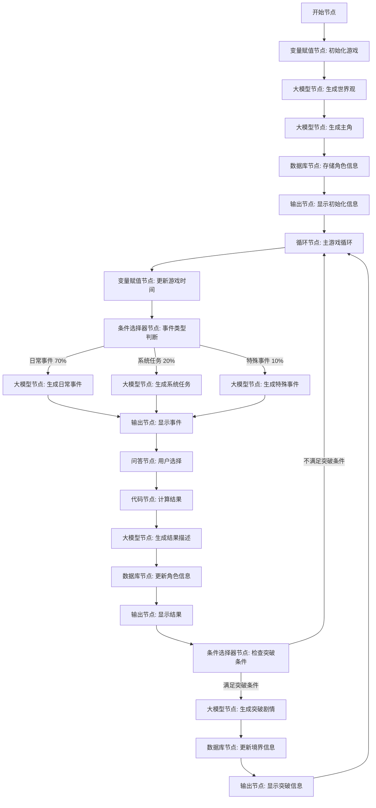

# 文字游戏工作流详细设计

根据您提供的流程图，我将为您详细设计一个完整的文字游戏工作流，包括每个节点的具体内容、输入输出参数、提示词设计以及数据类型说明。

## 工作流程图（细化版）



## 节点详细设计

### 1. 开始节点

**节点内容**：
- 接收用户输入，启动游戏流程

**输入参数**：
```json
{
  "BOT_USER_INPUT": {
    "type": "String",
    "description": "用户的原始输入内容",
    "required": true
  },
  "system_type": {
    "type": "String",
    "description": "用户选择的系统类型",
    "required": false
  },
  "custom_system_description": {
    "type": "String",
    "description": "用户自定义的系统描述",
    "required": false
  }
}
```

**说明**：
- `BOT_USER_INPUT`：默认参数，接收用户输入
- `system_type`：可选参数，用户可以选择预设的系统类型
- `custom_system_description`：可选参数，用户可以自定义系统描述

### 2. 变量赋值节点：初始化游戏

**节点内容**：
- 初始化游戏所需的基本变量
- 设置游戏世界的基础参数

**输入参数**：
- 引用开始节点的输出

**变量赋值**：
```json
{
  "game_state": {
    "type": "Object",
    "value": {
      "current_year": 1,
      "current_month": 1,
      "current_day": 1,
      "world_age": 10000,
      "is_initialized": false
    }
  },
  "system_info": {
    "type": "Object",
    "value": {
      "system_type": "{{system_type}}",
      "system_description": "{{custom_system_description}}",
      "system_level": 1,
      "system_reputation": 0
    }
  },
  "event_history": {
    "type": "Array",
    "value": []
  },
  "random_seed": {
    "type": "Number",
    "value": "{{Math.floor(Math.random() * 1000000)}}"
  }
}
```

**说明**：
- `game_state`：存储游戏基本状态信息
- `system_info`：存储系统相关信息
- `event_history`：存储历史事件记录
- `random_seed`：随机种子，用于保证游戏的随机性

### 3. 大模型节点：生成世界观

**节点内容**：
- 调用大模型生成游戏世界的背景设定
- 生成修真世界的大境界设定

**输入参数**：
```json
{
  "system_info": {
    "type": "Object",
    "description": "系统信息"
  },
  "random_seed": {
    "type": "Number",
    "description": "随机种子"
  }
}
```

**系统提示词**：
```
你是一位精通修真小说创作的世界观设计师。现在需要你创建一个完整的修真世界背景，这个世界将作为一个文字游戏的舞台。请根据以下要求设计：

1. 创建一个有6-12个大境界的修真体系，每个境界有明确的名称和特点
2. 设计这个世界的基本规则，包括灵气分布、宗门体系、势力分布
3. 创建3-5个主要宗门，包括其特点、功法特色和在世界中的地位
4. 设计世界中的基本地理环境，包括主要的修真圣地、凡人国度和险地
5. 制定这个世界的基本历史背景，包括重要事件和传说

你的设计应当符合传统修真小说的风格，参考《凡人修仙传》《仙逆》《遮天》等经典作品。设计要有深度和合理性，能够支撑长期的故事发展。

请注意：
- 设计要有独特性，避免直接复制现有小说的设定
- 境界设计要有明确的进阶条件和特点
- 世界规则要自洽，符合逻辑
- 为后续的随机事件和任务留下足够的发展空间

根据用户选择的系统类型"{{system_info.system_type}}"和描述"{{system_info.system_description}}"，调整世界观以适应这种系统的存在。
```

**输出参数**：
```json
{
  "world_settings": {
    "type": "Object",
    "description": "世界设定信息",
    "properties": {
      "world_name": {
        "type": "String",
        "description": "世界名称"
      },
      "cultivation_system": {
        "type": "Array",
        "description": "修炼境界体系",
        "items": {
          "type": "Object",
          "properties": {
            "level_name": {
              "type": "String",
              "description": "境界名称"
            },
            "level_description": {
              "type": "String",
              "description": "境界描述"
            },
            "breakthrough_condition": {
              "type": "String",
              "description": "突破条件"
            },
            "lifespan_increase": {
              "type": "Number",
              "description": "寿命增加值"
            }
          }
        }
      },
      "major_sects": {
        "type": "Array",
        "description": "主要宗门",
        "items": {
          "type": "Object",
          "properties": {
            "sect_name": {
              "type": "String",
              "description": "宗门名称"
            },
            "sect_description": {
              "type": "String",
              "description": "宗门描述"
            },
            "sect_location": {
              "type": "String",
              "description": "宗门位置"
            },
            "sect_techniques": {
              "type": "Array",
              "description": "宗门功法",
              "items": {
                "type": "String"
              }
            }
          }
        }
      },
      "geography": {
        "type": "Object",
        "description": "地理环境",
        "properties": {
          "sacred_lands": {
            "type": "Array",
            "description": "修真圣地",
            "items": {
              "type": "String"
            }
          },
          "mortal_kingdoms": {
            "type": "Array",
            "description": "凡人国度",
            "items": {
              "type": "String"
            }
          },
          "dangerous_areas": {
            "type": "Array",
            "description": "险地",
            "items": {
              "type": "String"
            }
          }
        }
      },
      "history": {
        "type": "Array",
        "description": "历史事件",
        "items": {
          "type": "Object",
          "properties": {
            "event_name": {
              "type": "String",
              "description": "事件名称"
            },
            "event_description": {
              "type": "String",
              "description": "事件描述"
            },
            "years_ago": {
              "type": "Number",
              "description": "发生于多少年前"
            }
          }
        }
      }
    }
  }
}
```

### 4. 大模型节点：生成主角

**节点内容**：
- 调用大模型生成游戏主角的基本信息
- 设定主角的初始属性和背景故事

**输入参数**：
```json
{
  "world_settings": {
    "type": "Object",
    "description": "世界设定信息"
  },
  "system_info": {
    "type": "Object",
    "description": "系统信息"
  },
  "random_seed": {
    "type": "Number",
    "description": "随机种子"
  }
}
```

**系统提示词**：
```
你是一位精通角色设计的修真小说作家。现在需要你为一个修真文字游戏创建一个主角。这个主角将由玩家扮演的系统辅助成长。请根据以下要求设计：

1. 创建一个有鲜明特点的修真新人，包括姓名、年龄、外貌特征和性格特点
2. 设计角色的初始背景故事，包括出身、家庭情况和成长经历
3. 设定角色的初始属性，包括修为境界(必须是最低境界)、基础属性(如体质、灵根等)、初始功法和技能
4. 设计角色的初始目标和动机，这将影响角色的发展方向
5. 确定角色的起始位置和初始人际关系

你的设计应当符合修真小说的风格，参考《凡人修仙传》《仙逆》《遮天》等经典作品中的角色设计。角色应当有成长潜力，但初始实力不能太强。

请注意：
- 角色设计要有独特性，避免套用常见的主角模板
- 初始属性要合理，不能过强，要给成长留下空间
- 背景故事要有一定深度，但不要过于复杂
- 角色的性格和动机要有内在逻辑，符合人物设定

根据世界设定"{{world_settings.world_name}}"和系统类型"{{system_info.system_type}}"，调整角色设计以适应这个世界和系统的存在。
```

**输出参数**：
```json
{
  "character": {
    "type": "Object",
    "description": "角色信息",
    "properties": {
      "name": {
        "type": "String",
        "description": "角色姓名"
      },
      "age": {
        "type": "Number",
        "description": "角色年龄"
      },
      "lifespan": {
        "type": "Number",
        "description": "角色寿命"
      },
      "appearance": {
        "type": "String",
        "description": "外貌描述"
      },
      "personality": {
        "type": "String",
        "description": "性格描述"
      },
      "background": {
        "type": "String",
        "description": "背景故事"
      },
      "cultivation": {
        "type": "Object",
        "description": "修炼信息",
        "properties": {
          "realm": {
            "type": "String",
            "description": "当前境界"
          },
          "realm_progress": {
            "type": "Number",
            "description": "境界进度(0-1000)"
          },
          "techniques": {
            "type": "Array",
            "description": "已学功法",
            "items": {
              "type": "Object",
              "properties": {
                "name": {
                  "type": "String",
                  "description": "功法名称"
                },
                "level": {
                  "type": "Number",
                  "description": "功法等级"
                },
                "description": {
                  "type": "String",
                  "description": "功法描述"
                }
              }
            }
          }
        }
      },
      "attributes": {
        "type": "Object",
        "description": "基础属性",
        "properties": {
          "strength": {
            "type": "Number",
            "description": "力量"
          },
          "agility": {
            "type": "Number",
            "description": "敏捷"
          },
          "constitution": {
            "type": "Number",
            "description": "体质"
          },
          "spirit": {
            "type": "Number",
            "description": "神识"
          },
          "luck": {
            "type": "Number",
            "description": "运气"
          }
        }
      },
      "location": {
        "type": "String",
        "description": "当前位置"
      },
      "relationships": {
        "type": "Array",
        "description": "人际关系",
        "items": {
          "type": "Object",
          "properties": {
            "npc_name": {
              "type": "String",
              "description": "NPC姓名"
            },
            "relationship_type": {
              "type": "String",
              "description": "关系类型"
            },
            "affinity": {
              "type": "Number",
              "description": "好感度(-100到100)"
            }
          }
        }
      }
    }
  },
  "first_encounter": {
    "type": "String",
    "description": "系统与主角的初次相遇描述"
  }
}
```

### 5. 数据库节点：存储角色信息

**节点内容**：
- 将生成的角色信息存储到数据库中
- 存储游戏世界设定和系统信息

**输入参数**：
```json
{
  "character": {
    "type": "Object",
    "description": "角色信息"
  },
  "world_settings": {
    "type": "Object",
    "description": "世界设定信息"
  },
  "system_info": {
    "type": "Object",
    "description": "系统信息"
  },
  "game_state": {
    "type": "Object",
    "description": "游戏状态"
  }
}
```

**数据库设计**：
由于Coze数据库有预制内容和字段限制，我们需要合理设计数据结构：

```
表名：game_data
字段：
- id: Integer (主键，自增)
- sys_platform: String (系统预设)
- uuid: String (用户ID，系统预设)
- bstudio_create_time: Time (系统预设)
- data_type: String (数据类型：character/world/system/state)
- character_data: String (JSON格式的角色数据)
- world_data: String (JSON格式的世界数据)
- system_data: String (JSON格式的系统数据)
- game_state_data: String (JSON格式的游戏状态数据)
- last_update_time: Time (最后更新时间)
```

**SQL语句**：
```sql
INSERT INTO game_data 
(data_type, character_data, world_data, system_data, game_state_data, last_update_time) 
VALUES 
('character', '{{JSON.stringify(character)}}', '{{JSON.stringify(world_settings)}}', '{{JSON.stringify(system_info)}}', '{{JSON.stringify(game_state)}}', NOW())
```

**输出参数**：
```json
{
  "outputList": {
    "type": "Array",
    "description": "数据库操作结果"
  },
  "rowNum": {
    "type": "Number",
    "description": "影响的行数"
  },
  "game_id": {
    "type": "Number",
    "description": "游戏ID"
  }
}
```

### 6. 输出节点：显示初始化信息

**节点内容**：
- 向用户展示游戏初始化信息
- 显示主角信息和系统与主角的初次相遇

**输入参数**：
```json
{
  "character": {
    "type": "Object",
    "description": "角色信息"
  },
  "world_settings": {
    "type": "Object",
    "description": "世界设定信息"
  },
  "system_info": {
    "type": "Object",
    "description": "系统信息"
  },
  "first_encounter": {
    "type": "String",
    "description": "系统与主角的初次相遇描述"
  },
  "game_state": {
    "type": "Object",
    "description": "游戏状态"
  }
}
```

**输出内容**：
```
# 【修真世界：{{world_settings.world_name}}】

## 【系统信息】
系统类型：{{system_info.system_type}}
系统描述：{{system_info.system_description}}

## 【角色信息】
姓名：{{character.name}}
年龄：{{character.age}}岁
寿元：{{character.lifespan}}年
境界：{{character.cultivation.realm}}（{{character.cultivation.realm_progress}}/1000）
位置：{{character.location}}

## 【属性面板】
力量：{{character.attributes.strength}}
敏捷：{{character.attributes.agility}}
体质：{{character.attributes.constitution}}
神识：{{character.attributes.spirit}}
运气：{{character.attributes.luck}}

## 【已学功法】
{{#each character.techniques}}
- {{this.name}}（等级：{{this.level}}）
{{/each}}

## 【初始相遇】
{{first_encounter}}

---
当前时间：{{game_state.current_year}}年 {{game_state.current_month}}月 {{game_state.current_day}}日
```

**输出变量**：
```json
{
  "output": {
    "type": "String",
    "description": "格式化的输出内容"
  }
}
```

### 7. 循环节点：主游戏循环

**节点内容**：
- 创建游戏主循环
- 设置循环类型为无限循环，需要通过条件终止

**循环设置**：
- 循环类型：无限循环
- 中间变量：
  ```json
  {
    "current_event": {
      "type": "Object",
      "description": "当前事件信息",
      "initial_value": {}
    },
    "event_result": {
      "type": "Object",
      "description": "事件结果",
      "initial_value": {}
    }
  }
  ```

**输出设置**：
- 输出类型：循环体的执行结果集合

### 8. 变量赋值节点：更新游戏时间

**节点内容**：
- 更新游戏内的时间
- 计算随机事件的概率

**输入参数**：
```json
{
  "game_state": {
    "type": "Object",
    "description": "游戏状态"
  }
}
```

**变量赋值**：
```json
{
  "game_state": {
    "type": "Object",
    "value": {
      "current_day": "{{game_state.current_day + 1}}",
      "current_month": "{{game_state.current_day >= 30 ? game_state.current_month + 1 : game_state.current_month}}",
      "current_year": "{{game_state.current_month > 12 ? game_state.current_year + 1 : game_state.current_year}}",
      "is_initialized": true
    }
  },
  "event_probabilities": {
    "type": "Object",
    "value": {
      "daily_event": 0.7,
      "system_task": 0.2,
      "special_event": 0.1
    }
  },
  "random_value": {
    "type": "Number",
    "value": "{{Math.random()}}"
  }
}
```

**说明**：
- 更新游戏日期，每30天为一个月，每12个月为一年
- 设置不同类型事件的概率
- 生成随机值用于事件类型判断

### 9. 条件选择器节点：事件类型判断

**节点内容**：
- 根据随机值判断触发哪种类型的事件
- 设置三种事件类型的分支

**输入参数**：
```json
{
  "random_value": {
    "type": "Number",
    "description": "随机值"
  },
  "event_probabilities": {
    "type": "Object",
    "description": "事件概率"
  }
}
```

**条件设置**：
- 条件1：`random_value < event_probabilities.daily_event`
  - 结果：日常事件
- 条件2：`random_value < event_probabilities.daily_event + event_probabilities.system_task`
  - 结果：系统任务
- 条件3：`random_value <= 1`
  - 结果：特殊事件

### 10. 大模型节点：生成日常事件

**节点内容**：
- 调用大模型生成日常事件
- 根据角色当前状态生成合适的事件

**输入参数**：
```json
{
  "character": {
    "type": "Object",
    "description": "角色信息"
  },
  "world_settings": {
    "type": "Object",
    "description": "世界设定信息"
  },
  "game_state": {
    "type": "Object",
    "description": "游戏状态"
  },
  "event_history": {
    "type": "Array",
    "description": "历史事件"
  }
}
```

**系统提示词**：
```
你是一位精通修真小说创作的事件设计师。现在需要你为一个修真文字游戏生成一个日常事件。请根据以下要求设计：

1. 根据角色当前的境界、位置和背景，生成一个合理的日常事件
2. 事件应当有一定的随机性，但要符合修真世界的逻辑和规则
3. 事件描述要生动具体，有场景、有细节，能够让玩家身临其境
4. 事件应当给予角色一些选择，至少提供2-3个不同的选项
5. 每个选项都应当有不同的风险和收益，让玩家做出有意义的决策

你的设计应当符合修真小说的风格，参考《凡人修仙传》《仙逆》《遮天》等经典作品中的事件设计。事件难度应当与角色当前实力相匹配，既不会太简单也不会太困难。

请注意：
- 事件设计要有独特性，避免重复之前的事件
- 事件要与角色当前的状态和处境相关联
- 事件的选项要有明显的差异，不同选择应导致不同的结果
- 事件描述要简洁但有画面感，不要过于冗长

根据角色"{{character.name}}"当前的境界"{{character.cultivation.realm}}"和位置"{{character.location}}"，设计一个合适的日常事件。
```

**输出参数**：
```json
{
  "daily_event": {
    "type": "Object",
    "description": "日常事件信息",
    "properties": {
      "event_title": {
        "type": "String",
        "description": "事件标题"
      },
      "event_description": {
        "type": "String",
        "description": "事件描述"
      },
      "event_type": {
        "type": "String",
        "description": "事件类型",
        "enum": ["encounter", "discovery", "challenge", "opportunity", "social"]
      },
      "options": {
        "type": "Array",
        "description": "可选选项",
        "items": {
          "type": "Object",
          "properties": {
            "option_text": {
              "type": "String",
              "description": "选项文本"
            },
            "option_id": {
              "type": "Number",
              "description": "选项ID"
            },
            "difficulty": {
              "type": "Number",
              "description": "选项难度(1-100)"
            },
            "potential_gains": {
              "type": "String",
              "description": "潜在收益"
            },
            "potential_risks": {
              "type": "String",
              "description": "潜在风险"
            }
          }
        }
      }
    }
  }
}
```

### 11. 大模型节点：生成系统任务

**节点内容**：
- 调用大模型生成系统任务
- 根据系统类型和角色状态生成任务

**输入参数**：
```json
{
  "character": {
    "type": "Object",
    "description": "角色信息"
  },
  "world_settings": {
    "type": "Object",
    "description": "世界设定信息"
  },
  "system_info": {
    "type": "Object",
    "description": "系统信息"
  },
  "game_state": {
    "type": "Object",
    "description": "游戏状态"
  },
  "event_history": {
    "type": "Array",
    "description": "历史事件"
  }
}
```

**系统提示词**：
```
你是一位精通游戏设计的系统任务生成器。现在需要你为一个修真文字游戏生成一个系统任务。在这个游戏中，玩家扮演降临在主角身上的系统，通过派送任务来帮助主角成长。请根据以下要求设计：

1. 根据系统类型"{{system_info.system_type}}"和系统描述"{{system_info.system_description}}"，生成一个符合系统特性的任务
2. 任务应当与角色当前的境界、位置和能力相匹配，具有适当的挑战性
3. 任务描述要清晰具体，包括任务目标、完成条件和奖励
4. 任务应当有一定的故事性和背景，而不仅仅是简单的指令
5. 任务奖励应当对角色有实质性帮助，如提升修为、获得功法、获取资源等

你的设计应当符合修真小说的风格，参考《凡人修仙传》《仙逆》《遮天》等经典作品中的任务设计。任务难度应当与角色当前实力相匹配，既有挑战性又有可完成性。

请注意：
- 任务设计要有独特性，避免重复之前的任务
- 任务要与角色当前的状态和处境相关联
- 任务的奖励要与难度相匹配，且符合系统的特性
- 任务描述要简洁但有画面感，不要过于冗长

根据角色"{{character.name}}"当前的境界"{{character.cultivation.realm}}"和位置"{{character.location}}"，设计一个由系统"{{system_info.system_type}}"派发的任务。任务应当符合系统的特性和目标，同时对角色的成长有所帮助。
```

**输出参数**：
```json
{
  "system_task": {
    "type": "Object",
    "description": "系统任务信息",
    "properties": {
      "task_title": {
        "type": "String",
        "description": "任务标题"
      },
      "task_description": {
        "type": "String",
        "description": "任务描述"
      },
      "task_objective": {
        "type": "String",
        "description": "任务目标"
      },
      "task_difficulty": {
        "type": "Number",
        "description": "任务难度(1-100)"
      },
      "time_limit": {
        "type": "Number",
        "description": "时间限制(天)"
      },
      "rewards": {
        "type": "Object",
        "description": "任务奖励",
        "properties": {
          "cultivation_increase": {
            "type": "Number",
            "description": "修为增加"
          },
          "attribute_increases": {
            "type": "Object",
            "description": "属性增加",
            "properties": {
              "strength": {
                "type": "Number",
                "description": "力量增加"
              },
              "agility": {
                "type": "Number",
                "description": "敏捷增加"
              },
              "constitution": {
                "type": "Number",
                "description": "体质增加"
              },
              "spirit": {
                "type": "Number",
                "description": "神识增加"
              },
              "luck": {
                "type": "Number",
                "description": "运气增加"
              }
            }
          },
          "items": {
            "type": "Array",
            "description": "获得物品",
            "items": {
              "type": "Object",
              "properties": {
                "item_name": {
                  "type": "String",
                  "description": "物品名称"
                },
                "item_description": {
                  "type": "String",
                  "description": "物品描述"
                },
                "item_quality": {
                  "type": "Number",
                  "description": "物品品质(1-10)"
                }
              }
            }
          },
          "techniques": {
            "type": "Array",
            "description": "获得功法",
            "items": {
              "type": "Object",
              "properties": {
                "technique_name": {
                  "type": "String",
                  "description": "功法名称"
                },
                "technique_description": {
                  "type": "String",
                  "description": "功法描述"
                },
                "technique_level": {
                  "type": "Number",
                  "description": "功法等级(1-10)"
                }
              }
            }
          }
        }
      },
      "accept_options": {
        "type": "Array",
        "description": "接受任务的选项",
        "items": {
          "type": "Object",
          "properties": {
            "option_text": {
              "type": "String",
              "description": "选项文本"
            },
            "option_id": {
              "type": "Number",
              "description": "选项ID"
            }
          }
        }
      }
    }
  }
}
```

### 12. 大模型节点：生成特殊事件

**节点内容**：
- 调用大模型生成特殊事件
- 生成影响游戏世界或角色发展的重大事件

**输入参数**：
```json
{
  "character": {
    "type": "Object",
    "description": "角色信息"
  },
  "world_settings": {
    "type": "Object",
    "description": "世界设定信息"
  },
  "system_info": {
    "type": "Object",
    "description": "系统信息"
  },
  "game_state": {
    "type": "Object",
    "description": "游戏状态"
  },
  "event_history": {
    "type": "Array",
    "description": "历史事件"
  }
}
```

**系统提示词**：
```
你是一位精通修真小说创作的特殊事件设计师。现在需要你为一个修真文字游戏生成一个特殊事件。特殊事件是指那些对角色发展或游戏世界产生重大影响的事件，如宗门大比、天地异象、奇遇机缘等。请根据以下要求设计：

1. 根据角色当前的境界、位置和游戏进度，生成一个具有重大影响的特殊事件
2. 事件应当有深刻的背景和意义，不仅是简单的遭遇
3. 事件描述要生动具体，有场景、有细节，能够让玩家身临其境
4. 事件应当给予角色一些重要的选择，这些选择可能会影响角色的发展方向
5. 事件的结果应当对角色产生长期影响，如获得稀有功法、结识重要人物、加入特殊组织等

你的设计应当符合修真小说的风格，参考《凡人修仙传》《仙逆》《遮天》等经典作品中的重大事件设计。事件难度和重要性应当与角色当前实力和游戏进度相匹配。

请注意：
- 特殊事件应当相对罕见，每次设计都应当有独特性
- 事件要与角色当前的状态和处境相关联，但也可以引入新的元素
- 事件的选项要有深远的影响，可能改变角色的发展路线
- 事件描述要有史诗感和重要性，让玩家感受到这是一个关键时刻

根据角色"{{character.name}}"当前的境界"{{character.cultivation.realm}}"和位置"{{character.location}}"，设计一个具有重大影响的特殊事件。考虑当前游戏时间"{{game_state.current_year}}年{{game_state.current_month}}月{{game_state.current_day}}日"可能发生的特殊情况。
```

**输出参数**：
```json
{
  "special_event": {
    "type": "Object",
    "description": "特殊事件信息",
    "properties": {
      "event_title": {
        "type": "String",
        "description": "事件标题"
      },
      "event_description": {
        "type": "String",
        "description": "事件描述"
      },
      "event_significance": {
        "type": "String",
        "description": "事件意义"
      },
      "event_type": {
        "type": "String",
        "description": "事件类型",
        "enum": ["sect_competition", "celestial_phenomenon", "ancient_ruin", "secret_realm", "major_conflict", "destiny_encounter"]
      },
      "duration": {
        "type": "Number",
        "description": "事件持续时间(天)"
      },
      "options": {
        "type": "Array",
        "description": "可选选项",
        "items": {
          "type": "Object",
          "properties": {
            "option_text": {
              "type": "String",
              "description": "选项文本"
            },
            "option_id": {
              "type": "Number",
              "description": "选项ID"
            },
            "difficulty": {
              "type": "Number",
              "description": "选项难度(1-100)"
            },
            "potential_outcomes": {
              "type": "Array",
              "description": "潜在结果",
              "items": {
                "type": "String"
              }
            }
          }
        }
      }
    }
  }
}
```

### 13. 输出节点：显示事件

**节点内容**：
- 向用户展示当前事件信息
- 显示事件描述和可选选项

**输入参数**：
```json
{
  "daily_event": {
    "type": "Object",
    "description": "日常事件信息"
  },
  "system_task": {
    "type": "Object",
    "description": "系统任务信息"
  },
  "special_event": {
    "type": "Object",
    "description": "特殊事件信息"
  },
  "character": {
    "type": "Object",
    "description": "角色信息"
  },
  "game_state": {
    "type": "Object",
    "description": "游戏状态"
  }
}
```

**输出内容**：
```
# 【当前时间：{{game_state.current_year}}年 {{game_state.current_month}}月 {{game_state.current_day}}日】

## 【角色状态】
姓名：{{character.name}}
境界：{{character.cultivation.realm}}（{{character.cultivation.realm_progress}}/1000）
位置：{{character.location}}

---

{{#if daily_event}}
## 【日常事件】：{{daily_event.event_title}}

{{daily_event.event_description}}

### 可选行动：
{{#each daily_event.options}}
{{this.option_id}}. {{this.option_text}}
{{/each}}
{{/if}}

{{#if system_task}}
## 【系统任务】：{{system_task.task_title}}

{{system_task.task_description}}

**任务目标**：{{system_task.task_objective}}
**难度**：{{system_task.task_difficulty}}/100
**时限**：{{system_task.time_limit}}天

### 任务奖励：
- 修为增加：{{system_task.rewards.cultivation_increase}}点
{{#if system_task.rewards.attribute_increases}}
- 属性增加：
  {{#each system_task.rewards.attribute_increases}}
  {{@key}}: +{{this}}
  {{/each}}
{{/if}}
{{#if system_task.rewards.items}}
- 物品奖励：
  {{#each system_task.rewards.items}}
  {{this.item_name}}（品质：{{this.item_quality}}）
  {{/each}}
{{/if}}
{{#if system_task.rewards.techniques}}
- 功法奖励：
  {{#each system_task.rewards.techniques}}
  {{this.technique_name}}（等级：{{this.technique_level}}）
  {{/each}}
{{/if}}

### 是否接受任务：
{{#each system_task.accept_options}}
{{this.option_id}}. {{this.option_text}}
{{/each}}
{{/if}}

{{#if special_event}}
## 【特殊事件】：{{special_event.event_title}}

{{special_event.event_description}}

**事件意义**：{{special_event.event_significance}}
**持续时间**：{{special_event.duration}}天

### 可选行动：
{{#each special_event.options}}
{{this.option_id}}. {{this.option_text}}
{{/each}}
{{/if}}

---

请输入选项编号做出选择：
```

**输出变量**：
```json
{
  "output": {
    "type": "String",
    "description": "格式化的输出内容"
  },
  "current_event": {
    "type": "Object",
    "description": "当前事件信息",
    "value": "{{daily_event || system_task || special_event}}"
  }
}
```

### 14. 问答节点：用户选择

**节点内容**：
- 接收用户的选择
- 将用户选择传递给后续节点

**输入参数**：
```json
{
  "current_event": {
    "type": "Object",
    "description": "当前事件信息"
  }
}
```

**提问内容**：
```
请输入选项编号做出选择：
```

**回答类型**：直接回答

**输出参数**：
```json
{
  "user_choice": {
    "type": "String",
    "description": "用户选择的选项编号"
  }
}
```

### 15. 代码节点：计算结果

**节点内容**：
- 根据用户选择和事件信息计算结果
- 计算角色属性变化和事件成功率

**输入参数**：
```json
{
  "user_choice": {
    "type": "String",
    "description": "用户选择的选项编号"
  },
  "current_event": {
    "type": "Object",
    "description": "当前事件信息"
  },
  "character": {
    "type": "Object",
    "description": "角色信息"
  }
}
```

**代码**：
```javascript
async function main({ params }) {
  // 获取输入参数
  const userChoice = parseInt(params.user_choice);
  const currentEvent = params.current_event;
  const character = params.character;
  
  // 初始化结果对象
  const result = {
    success: false,
    critical_success: false,
    critical_failure: false,
    attribute_changes: {},
    cultivation_change: 0,
    item_gains: [],
    technique_gains: [],
    relationship_changes: [],
    description_type: "normal"
  };
  
  // 获取选择的选项
  let selectedOption = null;
  if (currentEvent.options) {
    selectedOption = currentEvent.options.find(opt => opt.option_id === userChoice);
  } else if (currentEvent.accept_options) {
    selectedOption = currentEvent.accept_options.find(opt => opt.option_id === userChoice);
  }
  
  if (!selectedOption) {
    return {
      result: {
        success: false,
        description_type: "invalid_choice",
        message: "无效的选择，请重新选择。"
      }
    };
  }
  
  // 计算事件成功率
  let successRate = 0.5; // 基础成功率
  
  if (selectedOption.difficulty) {
    // 根据难度和角色属性计算成功率
    const difficultyFactor = 1 - (selectedOption.difficulty / 100);
    
    // 计算角色属性总和作为能力值
    const attributeSum = 
      character.attributes.strength + 
      character.attributes.agility + 
      character.attributes.constitution + 
      character.attributes.spirit + 
      character.attributes.luck;
    
    // 根据角色能力调整成功率
    const attributeFactor = Math.min(attributeSum / 100, 2);
    
    successRate = difficultyFactor * attributeFactor;
    
    // 确保成功率在合理范围内
    successRate = Math.max(0.05, Math.min(successRate, 0.95));
  }
  
  // 随机决定是否成功
  const roll = Math.random();
  result.success = roll <= successRate;
  
  // 判断是否暴击成功或失败
  result.critical_success = roll <= successRate * 0.2;
  result.critical_failure = roll >= 1 - (1 - successRate) * 0.2;
  
  // 根据事件类型设置不同的结果
  if (currentEvent.event_type) {
    // 日常事件或特殊事件
    if (result.success) {
      // 成功时的奖励
      result.cultivation_change = Math.floor(Math.random() * 20) + 10;
      
      // 随机属性提升
      const attributes = ['strength', 'agility', 'constitution', 'spirit', 'luck'];
      const randomAttribute = attributes[Math.floor(Math.random() * attributes.length)];
      result.attribute_changes[randomAttribute] = Math.floor(Math.random() * 3) + 1;
      
      if (result.critical_success) {
        // 暴击成功额外奖励
        result.cultivation_change *= 2;
        result.attribute_changes[randomAttribute] += 2;
        
        // 可能获得物品或功法
        if (Math.random() > 0.5) {
          result.item_gains.push({
            item_name: "神秘物品",
            item_quality: Math.floor(Math.random() * 5) + 5,
            item_description: "一个意外获得的神秘物品"
          });
        }
      }
    } else {
      // 失败时的惩罚
      if (result.critical_failure) {
        // 暴击失败额外惩罚
        result.cultivation_change = -Math.floor(Math.random() * 15);
        
        // 随机属性降低
        const attributes = ['strength', 'agility', 'constitution', 'spirit', 'luck'];
        const randomAttribute = attributes[Math.floor(Math.random() * attributes.length)];
        result.attribute_changes[randomAttribute] = -Math.floor(Math.random() * 2) - 1;
      }
    }
  } else if (currentEvent.task_title) {
    // 系统任务
    if (result.success) {
      // 成功完成任务的奖励
      result.cultivation_change = currentEvent.rewards.cultivation_increase || 0;
      
      // 属性增加
      if (currentEvent.rewards.attribute_increases) {
        result.attribute_changes = {...currentEvent.rewards.attribute_increases};
      }
      
      // 物品奖励
      if (currentEvent.rewards.items) {
        result.item_gains = [...currentEvent.rewards.items];
      }
      
      // 功法奖励
      if (currentEvent.rewards.techniques) {
        result.technique_gains = [...currentEvent.rewards.techniques];
      }
    }
  }
  
  // 设置描述类型
  if (result.critical_success) {
    result.description_type = "critical_success";
  } else if (result.critical_failure) {
    result.description_type = "critical_failure";
  } else if (result.success) {
    result.description_type = "success";
  } else {
    result.description_type = "failure";
  }
  
  return { result };
}
```

**输出参数**：
```json
{
  "result": {
    "type": "Object",
    "description": "计算结果",
    "properties": {
      "success": {
        "type": "Boolean",
        "description": "是否成功"
      },
      "critical_success": {
        "type": "Boolean",
        "description": "是否暴击成功"
      },
      "critical_failure": {
        "type": "Boolean",
        "description": "是否暴击失败"
      },
      "attribute_changes": {
        "type": "Object",
        "description": "属性变化"
      },
      "cultivation_change": {
        "type": "Number",
        "description": "修为变化"
      },
      "item_gains": {
        "type": "Array",
        "description": "获得物品"
      },
      "technique_gains": {
        "type": "Array",
        "description": "获得功法"
      },
      "relationship_changes": {
        "type": "Array",
        "description": "关系变化"
      },
      "description_type": {
        "type": "String",
        "description": "描述类型"
      }
    }
  }
}
```

### 16. 大模型节点：生成结果描述

**节点内容**：
- 调用大模型生成事件结果的详细描述
- 根据计算结果生成符合情境的描述

**输入参数**：
```json
{
  "result": {
    "type": "Object",
    "description": "计算结果"
  },
  "current_event": {
    "type": "Object",
    "description": "当前事件信息"
  },
  "character": {
    "type": "Object",
    "description": "角色信息"
  },
  "user_choice": {
    "type": "String",
    "description": "用户选择的选项编号"
  }
}
```

**系统提示词**：
```
你是一位精通修真小说创作的结果描述生成器。现在需要你为一个修真文字游戏生成事件结果的详细描述。请根据以下要求设计：

1. 根据事件信息、用户选择和计算结果，生成一段生动具体的结果描述
2. 描述应当有场景感和细节，让玩家能够身临其境地感受结果
3. 根据结果类型（成功、失败、暴击成功、暴击失败）调整描述的风格和内容
4. 描述中应当包含角色的情感反应和系统的反应
5. 描述应当与事件的背景和角色的状态相符合

你的描述应当符合修真小说的风格，参考《凡人修仙传》《仙逆》《遮天》等经典作品中的描写方式。根据不同的结果类型，描述的风格应当有所不同：

- 成功：描述应当积极向上，展示角色的成长和收获
- 暴击成功：描述应当充满惊喜和意外之喜，展示超出预期的收获
- 失败：描述应当展示挫折和教训，但也要给角色留下成长的空间
- 暴击失败：描述应当展示严重的挫折和危险，但不要过于绝望

请注意：
- 描述要与事件和选择紧密相关，不要生成泛泛而谈的内容
- 描述中要体现角色的特点和系统的特性
- 描述要有画面感和情感共鸣，让玩家能够投入其中
- 描述长度适中，既要有足够的细节，又不要过于冗长

根据事件"{{current_event.event_title || current_event.task_title}}"、用户选择的选项编号"{{user_choice}}"和计算结果（{{result.description_type}}），生成一段生动具体的结果描述。
```

**输出参数**：
```json
{
  "result_description": {
    "type": "String",
    "description": "结果描述"
  },
  "system_comment": {
    "type": "String",
    "description": "系统评论"
  }
}
```

### 17. 数据库节点：更新角色信息

**节点内容**：
- 更新数据库中的角色信息
- 记录事件历史

**输入参数**：
```json
{
  "character": {
    "type": "Object",
    "description": "角色信息"
  },
  "result": {
    "type": "Object",
    "description": "计算结果"
  },
  "current_event": {
    "type": "Object",
    "description": "当前事件信息"
  },
  "result_description": {
    "type": "String",
    "description": "结果描述"
  },
  "game_state": {
    "type": "Object",
    "description": "游戏状态"
  },
  "event_history": {
    "type": "Array",
    "description": "历史事件"
  },
  "game_id": {
    "type": "Number",
    "description": "游戏ID"
  }
}
```

**代码**：
```javascript
// 更新角色信息
const updatedCharacter = JSON.parse(JSON.stringify(character));

// 更新修为
updatedCharacter.cultivation.realm_progress += result.cultivation_change;

// 检查是否突破
let breakthrough = false;
if (updatedCharacter.cultivation.realm_progress >= 1000) {
  // 找到当前境界在世界设定中的索引
  const realmIndex = world_settings.cultivation_system.findIndex(
    level => level.level_name === updatedCharacter.cultivation.realm
  );
  
  // 如果不是最高境界，则突破
  if (realmIndex < world_settings.cultivation_system.length - 1) {
    updatedCharacter.cultivation.realm = world_settings.cultivation_system[realmIndex + 1].level_name;
    updatedCharacter.cultivation.realm_progress = 0;
    updatedCharacter.lifespan += world_settings.cultivation_system[realmIndex + 1].lifespan_increase;
    breakthrough = true;
  } else {
    // 已是最高境界，修为保持在999
    updatedCharacter.cultivation.realm_progress = 999;
  }
}

// 更新属性
for (const [attr, change] of Object.entries(result.attribute_changes)) {
  updatedCharacter.attributes[attr] += change;
  // 确保属性不小于1
  updatedCharacter.attributes[attr] = Math.max(1, updatedCharacter.attributes[attr]);
}

// 添加新获得的物品
if (result.item_gains && result.item_gains.length > 0) {
  if (!updatedCharacter.inventory) {
    updatedCharacter.inventory = [];
  }
  updatedCharacter.inventory.push(...result.item_gains);
}

// 添加新获得的功法
if (result.technique_gains && result.technique_gains.length > 0) {
  updatedCharacter.cultivation.techniques.push(...result.technique_gains);
}

// 更新关系
if (result.relationship_changes && result.relationship_changes.length > 0) {
  for (const change of result.relationship_changes) {
    const existingRelation = updatedCharacter.relationships.find(
      rel => rel.npc_name === change.npc_name
    );
    
    if (existingRelation) {
      existingRelation.affinity += change.affinity_change;
      // 确保好感度在-100到100之间
      existingRelation.affinity = Math.max(-100, Math.min(100, existingRelation.affinity));
    } else {
      updatedCharacter.relationships.push({
        npc_name: change.npc_name,
        relationship_type: change.relationship_type,
        affinity: change.affinity_change
      });
    }
  }
}

// 更新事件历史
const newEvent = {
  event_date: `${game_state.current_year}年${game_state.current_month}月${game_state.current_day}日`,
  event_title: current_event.event_title || current_event.task_title,
  event_result: result.success ? "成功" : "失败",
  event_description: result_description
};

const updatedEventHistory = [...event_history, newEvent];

// 构建SQL更新语句
const sql = `
UPDATE game_data 
SET character_data = '${JSON.stringify(updatedCharacter)}',
    game_state_data = '${JSON.stringify(game_state)}',
    last_update_time = NOW()
WHERE id = ${game_id}
`;
```

**输出参数**：
```json
{
  "outputList": {
    "type": "Array",
    "description": "数据库操作结果"
  },
  "rowNum": {
    "type": "Number",
    "description": "影响的行数"
  },
  "updated_character": {
    "type": "Object",
    "description": "更新后的角色信息"
  },
  "updated_event_history": {
    "type": "Array",
    "description": "更新后的事件历史"
  },
  "breakthrough": {
    "type": "Boolean",
    "description": "是否突破"
  }
}
```

### 18. 输出节点：显示结果

**节点内容**：
- 向用户展示事件结果
- 显示角色属性变化

**输入参数**：
```json
{
  "result_description": {
    "type": "String",
    "description": "结果描述"
  },
  "system_comment": {
    "type": "String",
    "description": "系统评论"
  },
  "result": {
    "type": "Object",
    "description": "计算结果"
  },
  "updated_character": {
    "type": "Object",
    "description": "更新后的角色信息"
  },
  "game_state": {
    "type": "Object",
    "description": "游戏状态"
  }
}
```

**输出内容**：
```
# 【事件结果】

{{result_description}}

---

## 【系统评论】
{{system_comment}}

---

## 【属性变化】
{{#if result.cultivation_change}}
修为变化：{{#if result.cultivation_change > 0}}+{{/if}}{{result.cultivation_change}}
{{/if}}

{{#each result.attribute_changes}}
{{@key}}变化：{{#if this > 0}}+{{/if}}{{this}}
{{/each}}

{{#if result.item_gains.length}}
## 【获得物品】
{{#each result.item_gains}}
- {{this.item_name}}（品质：{{this.item_quality}}）：{{this.item_description}}
{{/each}}
{{/if}}

{{#if result.technique_gains.length}}
## 【获得功法】
{{#each result.technique_gains}}
- {{this.technique_name}}（等级：{{this.technique_level}}）：{{this.technique_description}}
{{/each}}
{{/if}}

---

## 【当前状态】
姓名：{{updated_character.name}}
年龄：{{updated_character.age}}岁
寿元：{{updated_character.lifespan}}年
境界：{{updated_character.cultivation.realm}}（{{updated_character.cultivation.realm_progress}}/1000）
位置：{{updated_character.location}}

### 属性：
- 力量：{{updated_character.attributes.strength}}
- 敏捷：{{updated_character.attributes.agility}}
- 体质：{{updated_character.attributes.constitution}}
- 神识：{{updated_character.attributes.spirit}}
- 运气：{{updated_character.attributes.luck}}
```

**输出变量**：
```json
{
  "output": {
    "type": "String",
    "description": "格式化的输出内容"
  }
}
```

### 19. 条件选择器节点：检查突破条件

**节点内容**：
- 检查角色是否满足突破条件
- 根据突破状态选择不同的分支

**输入参数**：
```json
{
  "breakthrough": {
    "type": "Boolean",
    "description": "是否突破"
  },
  "updated_character": {
    "type": "Object",
    "description": "更新后的角色信息"
  }
}
```

**条件设置**：
- 条件：`breakthrough === true`
  - 结果：满足突破条件
- 条件：`breakthrough !== true`
  - 结果：不满足突破条件

### 20. 大模型节点：生成突破剧情

**节点内容**：
- 调用大模型生成境界突破的剧情描述
- 描述突破过程和系统的辅助

**输入参数**：
```json
{
  "updated_character": {
    "type": "Object",
    "description": "更新后的角色信息"
  },
  "world_settings": {
    "type": "Object",
    "description": "世界设定信息"
  },
  "system_info": {
    "type": "Object",
    "description": "系统信息"
  }
}
```

**系统提示词**：
```
你是一位精通修真小说创作的突破剧情生成器。现在需要你为一个修真文字游戏生成角色突破境界的剧情描述。在这个游戏中，玩家扮演降临在主角身上的系统，辅助主角修炼成长。请根据以下要求设计：

1. 根据角色刚刚突破的新境界"{{updated_character.cultivation.realm}}"，生成一段生动具体的突破剧情
2. 描述突破过程中的感受、异象和变化，展现修真世界的玄妙
3. 描述系统在突破过程中的辅助作用，体现玩家作为系统的价值
4. 描述突破后角色的变化和新获得的能力
5. 描述突破对角色未来道路的影响和新的可能性

你的描述应当符合修真小说的风格，参考《凡人修仙传》《仙逆》《遮天》等经典作品中的突破描写。突破剧情应当是一个重要的里程碑，充满仪式感和成就感。

请注意：
- 描述要有画面感和细节，让玩家能够身临其境
- 描述中要体现角色的特点和系统"{{system_info.system_type}}"的特性
- 描述要符合修真世界"{{world_settings.world_name}}"的设定和规则
- 描述要有情感共鸣，让玩家感受到成长的喜悦

根据角色"{{updated_character.name}}"突破到"{{updated_character.cultivation.realm}}"的情况，生成一段生动具体的突破剧情。
```

**输出参数**：
```json
{
  "breakthrough_description": {
    "type": "String",
    "description": "突破剧情描述"
  },
  "new_abilities": {
    "type": "Array",
    "description": "新获得的能力",
    "items": {
      "type": "Object",
      "properties": {
        "ability_name": {
          "type": "String",
          "description": "能力名称"
        },
        "ability_description": {
          "type": "String",
          "description": "能力描述"
        }
      }
    }
  }
}
```

### 21. 数据库节点：更新境界信息

**节点内容**：
- 更新数据库中的角色境界信息
- 记录突破事件

**输入参数**：
```json
{
  "updated_character": {
    "type": "Object",
    "description": "更新后的角色信息"
  },
  "breakthrough_description": {
    "type": "String",
    "description": "突破剧情描述"
  },
  "new_abilities": {
    "type": "Array",
    "description": "新获得的能力"
  },
  "game_state": {
    "type": "Object",
    "description": "游戏状态"
  },
  "event_history": {
    "type": "Array",
    "description": "历史事件"
  },
  "game_id": {
    "type": "Number",
    "description": "游戏ID"
  }
}
```

**SQL语句**：
```sql
UPDATE game_data 
SET character_data = '{{JSON.stringify(updated_character)}}',
    game_state_data = '{{JSON.stringify(game_state)}}',
    last_update_time = NOW()
WHERE id = {{game_id}}
```

**输出参数**：
```json
{
  "outputList": {
    "type": "Array",
    "description": "数据库操作结果"
  },
  "rowNum": {
    "type": "Number",
    "description": "影响的行数"
  }
}
```

### 22. 输出节点：显示突破信息

**节点内容**：
- 向用户展示境界突破信息
- 显示新获得的能力

**输入参数**：
```json
{
  "breakthrough_description": {
    "type": "String",
    "description": "突破剧情描述"
  },
  "new_abilities": {
    "type": "Array",
    "description": "新获得的能力"
  },
  "updated_character": {
    "type": "Object",
    "description": "更新后的角色信息"
  }
}
```

**输出内容**：
```
# 【境界突破】

{{breakthrough_description}}

---

## 【新境界】
恭喜！{{updated_character.name}}已突破至{{updated_character.cultivation.realm}}境界！
寿元增加至{{updated_character.lifespan}}年。

{{#if new_abilities.length}}
## 【新获得能力】
{{#each new_abilities}}
- {{this.ability_name}}：{{this.ability_description}}
{{/each}}
{{/if}}

---

## 【当前状态】
姓名：{{updated_character.name}}
年龄：{{updated_character.age}}岁
寿元：{{updated_character.lifespan}}年
境界：{{updated_character.cultivation.realm}}（{{updated_character.cultivation.realm_progress}}/1000）
位置：{{updated_character.location}}

### 属性：
- 力量：{{updated_character.attributes.strength}}
- 敏捷：{{updated_character.attributes.agility}}
- 体质：{{updated_character.attributes.constitution}}
- 神识：{{updated_character.attributes.spirit}}
- 运气：{{updated_character.attributes.luck}}
```

**输出变量**：
```json
{
  "output": {
    "type": "String",
    "description": "格式化的输出内容"
  }
}
```

## 数据库设计详解

由于Coze数据库有预制内容和字段限制（最多新增20个字段），我们采用JSON字段存储复杂数据结构的方式来优化数据库设计：

### 表名：game_data

**预设字段**：
- id: Integer (主键，自增)
- sys_platform: String (系统预设)
- uuid: String (用户ID，系统预设)
- bstudio_create_time: Time (系统预设)

**自定义字段**：
- data_type: String (数据类型：character/world/system/state)
- character_data: String (JSON格式的角色数据)
- world_data: String (JSON格式的世界数据)
- system_data: String (JSON格式的系统数据)
- game_state_data: String (JSON格式的游戏状态数据)
- event_history_data: String (JSON格式的事件历史数据)
- last_update_time: Time (最后更新时间)

**数据结构说明**：
1. **character_data**：存储角色的所有信息，包括基本信息、属性、修炼状态、物品、关系等
2. **world_data**：存储世界设定，包括修炼体系、宗门、地理环境、历史事件等
3. **system_data**：存储系统信息，包括系统类型、描述、等级等
4. **game_state_data**：存储游戏状态，包括游戏时间、初始化状态等
5. **event_history_data**：存储历史事件记录，包括事件日期、标题、结果、描述等

## 总结

这个工作流设计实现了一个完整的文字游戏系统，包括：

1. **游戏初始化**：生成世界观、创建角色、设置系统
2. **主游戏循环**：更新游戏时间、生成事件、处理用户选择、计算结果
3. **角色成长**：属性变化、修为提升、境界突破
4. **数据管理**：存储和更新游戏数据、记录事件历史

通过大模型节点生成丰富的文本内容，代码节点处理游戏逻辑和计算，数据库节点存储游戏状态，条件选择器节点实现分支逻辑，循环节点实现游戏主循环，共同构建了一个完整的文字游戏系统。

这个设计充分利用了Coze的工作流功能，实现了一个具有深度和可玩性的修真文字游戏，玩家可以扮演系统与主角互动，体验修真世界的奇妙冒险。
