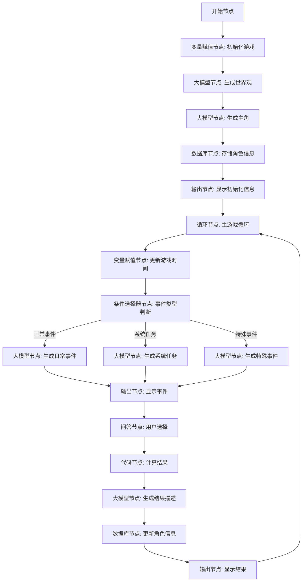

我将为您细化这个文字游戏工作流，详细说明每个节点的具体内容、参数和数据类型。

# 文字游戏工作流详细设计

## 工作流流程图



## 节点详细说明

### 1. 开始节点 (A)

**节点内容**：
- 接收用户初始输入，启动游戏流程

**输入参数**：
```json
{
  "BOT_USER_INPUT": {
    "type": "String",
    "description": "用户的初始输入",
    "required": true
  },
  "system_type": {
    "type": "String",
    "description": "用户选择的系统类型",
    "required": false
  },
  "custom_system": {
    "type": "String",
    "description": "用户自定义的系统描述",
    "required": false
  }
}
```

### 2. 变量赋值节点: 初始化游戏 (B)

**节点内容**：
- 初始化游戏所需的基本变量
- 设置游戏世界的基础参数

**输入参数**：
- 引用开始节点的输出

**变量赋值**：
```json
{
  "game_year": {
    "type": "Integer",
    "value": 1,
    "description": "游戏内当前年份"
  },
  "game_month": {
    "type": "Integer",
    "value": 1,
    "description": "游戏内当前月份"
  },
  "game_day": {
    "type": "Integer",
    "value": 1,
    "description": "游戏内当前日期"
  },
  "system_type": {
    "type": "String",
    "value": "{{system_type}}",
    "description": "系统类型"
  },
  "custom_system": {
    "type": "String",
    "value": "{{custom_system}}",
    "description": "自定义系统描述"
  },
  "game_started": {
    "type": "Boolean",
    "value": true,
    "description": "游戏是否已开始"
  }
}
```

**输出参数**：
```json
{
  "game_year": {
    "type": "Integer",
    "description": "游戏内当前年份"
  },
  "game_month": {
    "type": "Integer",
    "description": "游戏内当前月份"
  },
  "game_day": {
    "type": "Integer",
    "description": "游戏内当前日期"
  },
  "system_type": {
    "type": "String",
    "description": "系统类型"
  },
  "custom_system": {
    "type": "String",
    "description": "自定义系统描述"
  },
  "game_started": {
    "type": "Boolean",
    "description": "游戏是否已开始"
  }
}
```

### 3. 大模型节点: 生成世界观 (C)

**节点内容**：
- 调用大模型生成游戏世界观
- 创建修仙世界的基本设定

**输入参数**：
```json
{
  "system_type": {
    "type": "String",
    "description": "系统类型"
  },
  "custom_system": {
    "type": "String",
    "description": "自定义系统描述"
  }
}
```

**提示词**：
```
你是一位专业的修仙世界构建者，现在需要创建一个完整的修仙世界作为游戏背景。

请根据以下系统类型：{{system_type}}
以及自定义系统描述：{{custom_system}}

创建一个详尽的修仙世界，包括但不限于：

1. 世界名称与基本介绍
2. 修炼体系（大境界划分，至少6个大境界，最多12个大境界）
3. 每个大境界的详细描述（寿命增长规则、能力提升等）
4. 世界主要势力（至少3-5个主要宗门/势力）
5. 世界地理分布（主要区域、特殊地点）
6. 修炼资源与功法体系
7. 世界基本规则（如天道规则、因果法则等）

你的回答需要有深度和连贯性，要符合传统修仙小说的世界观，参考《凡人修仙传》《仙逆》《遮天》等经典作品的设定。

请以JSON格式返回，包含以下字段：
- world_name: 世界名称
- world_intro: 世界简介
- cultivation_system: 修炼体系概述
- realms: 境界列表（数组，每个元素包含name和description）
- major_forces: 主要势力（数组，每个元素包含name和description）
- geography: 地理分布（数组，每个元素包含name和description）
- resources: 修炼资源（数组，每个元素包含name和description）
- rules: 世界规则（数组，每个元素包含name和description）
```

**输出参数**：
```json
{
  "world_data": {
    "type": "Object",
    "description": "生成的世界数据",
    "properties": {
      "world_name": {
        "type": "String",
        "description": "世界名称"
      },
      "world_intro": {
        "type": "String",
        "description": "世界简介"
      },
      "cultivation_system": {
        "type": "String",
        "description": "修炼体系概述"
      },
      "realms": {
        "type": "Array",
        "description": "境界列表",
        "items": {
          "type": "Object",
          "properties": {
            "name": {
              "type": "String",
              "description": "境界名称"
            },
            "description": {
              "type": "String",
              "description": "境界描述"
            }
          }
        }
      },
      "major_forces": {
        "type": "Array",
        "description": "主要势力",
        "items": {
          "type": "Object",
          "properties": {
            "name": {
              "type": "String",
              "description": "势力名称"
            },
            "description": {
              "type": "String",
              "description": "势力描述"
            }
          }
        }
      },
      "geography": {
        "type": "Array",
        "description": "地理分布",
        "items": {
          "type": "Object",
          "properties": {
            "name": {
              "type": "String",
              "description": "地区名称"
            },
            "description": {
              "type": "String",
              "description": "地区描述"
            }
          }
        }
      },
      "resources": {
        "type": "Array",
        "description": "修炼资源",
        "items": {
          "type": "Object",
          "properties": {
            "name": {
              "type": "String",
              "description": "资源名称"
            },
            "description": {
              "type": "String",
              "description": "资源描述"
            }
          }
        }
      },
      "rules": {
        "type": "Array",
        "description": "世界规则",
        "items": {
          "type": "Object",
          "properties": {
            "name": {
              "type": "String",
              "description": "规则名称"
            },
            "description": {
              "type": "String",
              "description": "规则描述"
            }
          }
        }
      }
    }
  }
}
```

### 4. 大模型节点: 生成主角 (D)

**节点内容**：
- 调用大模型生成游戏主角
- 设定主角的基本属性和背景

**输入参数**：
```json
{
  "world_data": {
    "type": "Object",
    "description": "生成的世界数据"
  },
  "system_type": {
    "type": "String",
    "description": "系统类型"
  }
}
```

**提示词**：
```
你是一位专业的修仙小说角色设计师，现在需要为游戏创建一个主角。

请根据以下世界设定和系统类型，创建一个合理的修仙主角：

世界名称：{{world_data.world_name}}
世界简介：{{world_data.world_intro}}
修炼体系：{{world_data.cultivation_system}}
系统类型：{{system_type}}

创建一个有深度、有潜力的修仙主角，包括：

1. 基本信息（姓名、年龄、性别、外貌特征）
2. 出身背景（家庭、来历、成长经历）
3. 性格特点（至少3-5个鲜明特点）
4. 初始境界（必须是世界体系中最低或第二低的境界）
5. 天赋潜力（与未来成长相关的特质）
6. 初始功法（一个基础功法，品质较低）
7. 初始物品（随身携带的几件物品）
8. 初始关系（与NPC的初始关系，如亲友、师门等）

请确保角色设计合理，符合修仙世界的设定，有足够的成长空间。角色应当处于修炼初期，有明显的弱点和不足，需要通过系统的帮助逐渐成长。

请以JSON格式返回，包含以下字段：
- name: 角色姓名
- age: 年龄
- gender: 性别
- appearance: 外貌描述
- background: 背景故事
- personality: 性格特点（数组）
- realm: 初始境界
- realm_progress: 境界进度（0-1000之间的数值）
- talent: 天赋潜力描述
- technique: 初始功法
- items: 初始物品（数组）
- relationships: 初始关系（数组，每个元素包含npc_name和relation）
- lifespan: 当前寿元
```

**输出参数**：
```json
{
  "character_data": {
    "type": "Object",
    "description": "生成的角色数据",
    "properties": {
      "name": {
        "type": "String",
        "description": "角色姓名"
      },
      "age": {
        "type": "Integer",
        "description": "年龄"
      },
      "gender": {
        "type": "String",
        "description": "性别"
      },
      "appearance": {
        "type": "String",
        "description": "外貌描述"
      },
      "background": {
        "type": "String",
        "description": "背景故事"
      },
      "personality": {
        "type": "Array",
        "description": "性格特点",
        "items": {
          "type": "String"
        }
      },
      "realm": {
        "type": "String",
        "description": "初始境界"
      },
      "realm_progress": {
        "type": "Integer",
        "description": "境界进度(0-1000)"
      },
      "talent": {
        "type": "String",
        "description": "天赋潜力描述"
      },
      "technique": {
        "type": "String",
        "description": "初始功法"
      },
      "items": {
        "type": "Array",
        "description": "初始物品",
        "items": {
          "type": "String"
        }
      },
      "relationships": {
        "type": "Array",
        "description": "初始关系",
        "items": {
          "type": "Object",
          "properties": {
            "npc_name": {
              "type": "String",
              "description": "NPC名称"
            },
            "relation": {
              "type": "String",
              "description": "关系描述"
            }
          }
        }
      },
      "lifespan": {
        "type": "Integer",
        "description": "当前寿元"
      }
    }
  }
}
```

### 5. 数据库节点: 存储角色信息 (E)

**节点内容**：
- 将生成的世界观和角色信息存入数据库
- 初始化游戏状态

**数据库表设计**：
```
表名：game_data
字段：
- id (Integer, 主键)
- sys_platform (String)
- uuid (String)
- bstudio_create_time (Time)
- char_name (String)
- char_age (Integer)
- char_gender (String)
- char_realm (String)
- realm_progress (Integer)
- char_lifespan (Integer)
- technique (String)
- world_name (String)
- game_year (Integer)
- game_month (Integer)
- game_day (Integer)
- system_type (String)
- char_data (String)
- world_data (String)
- event_history (String)
- last_event (String)
- fate_direction (String)
```

**输入参数**：
```json
{
  "character_data": {
    "type": "Object",
    "description": "生成的角色数据"
  },
  "world_data": {
    "type": "Object",
    "description": "生成的世界数据"
  },
  "game_year": {
    "type": "Integer",
    "description": "游戏内当前年份"
  },
  "game_month": {
    "type": "Integer",
    "description": "游戏内当前月份"
  },
  "game_day": {
    "type": "Integer",
    "description": "游戏内当前日期"
  },
  "system_type": {
    "type": "String",
    "description": "系统类型"
  }
}
```

**SQL语句**：
```sql
INSERT INTO game_data (
  char_name, char_age, char_gender, char_realm, 
  realm_progress, char_lifespan, technique, 
  world_name, game_year, game_month, game_day, 
  system_type, char_data, world_data, 
  event_history, last_event, fate_direction
) 
VALUES (
  '{{character_data.name}}', {{character_data.age}}, '{{character_data.gender}}', 
  '{{character_data.realm}}', {{character_data.realm_progress}}, {{character_data.lifespan}}, 
  '{{character_data.technique}}', '{{world_data.world_name}}', 
  {{game_year}}, {{game_month}}, {{game_day}}, 
  '{{system_type}}', '{{JSON.stringify(character_data)}}', 
  '{{JSON.stringify(world_data)}}', '[]', '', '平衡'
)
```

**输出参数**：
```json
{
  "outputList": {
    "type": "Array",
    "description": "数据库操作结果"
  },
  "rowNum": {
    "type": "Integer",
    "description": "影响的行数"
  }
}
```

### 6. 输出节点: 显示初始化信息 (F)

**节点内容**：
- 向用户展示游戏初始化信息
- 介绍世界观和主角

**输入参数**：
```json
{
  "character_data": {
    "type": "Object",
    "description": "生成的角色数据"
  },
  "world_data": {
    "type": "Object",
    "description": "生成的世界数据"
  },
  "system_type": {
    "type": "String",
    "description": "系统类型"
  }
}
```

**输出内容**：
```
【{{world_data.world_name}}】

{{world_data.world_intro}}

你降临在了名为{{character_data.name}}的修士身上，成为了他的系统。

【角色信息】
姓名：{{character_data.name}}
年龄：{{character_data.age}}岁
寿元：{{character_data.lifespan}}年
境界：{{character_data.realm}}（{{character_data.realm_progress}}/1000）
功法：{{character_data.technique}}

【角色背景】
{{character_data.background}}

【系统类型】
{{system_type}}

当{{character_data.name}}感受到你的存在时，他惊讶地环顾四周，试图寻找声音的来源...

游戏现已开始，你可以与主角对话，并为他派发任务。
```

### 7. 循环节点: 主游戏循环 (G)

**节点内容**：
- 创建游戏主循环
- 设置为无限循环类型

**循环类型**：无限循环（需要配合终止循环节点使用）

**中间变量**：
```json
{
  "last_event": {
    "type": "String",
    "description": "上一次事件的描述",
    "initial_value": ""
  },
  "event_history": {
    "type": "Array",
    "description": "事件历史记录",
    "initial_value": []
  }
}
```

### 8. 变量赋值节点: 更新游戏时间 (H)

**节点内容**：
- 更新游戏内的时间
- 每次循环增加一天

**输入参数**：
```json
{
  "game_year": {
    "type": "Integer",
    "description": "游戏内当前年份"
  },
  "game_month": {
    "type": "Integer",
    "description": "游戏内当前月份"
  },
  "game_day": {
    "type": "Integer",
    "description": "游戏内当前日期"
  }
}
```

**代码逻辑**：
```javascript
// 更新日期
let day = game_day + 1;
let month = game_month;
let year = game_year;

// 处理月份变更
if (day > 30) {
  day = 1;
  month += 1;
}

// 处理年份变更
if (month > 12) {
  month = 1;
  year += 1;
}

return {
  game_year: year,
  game_month: month,
  game_day: day
};
```

**输出参数**：
```json
{
  "game_year": {
    "type": "Integer",
    "description": "更新后的游戏年份"
  },
  "game_month": {
    "type": "Integer",
    "description": "更新后的游戏月份"
  },
  "game_day": {
    "type": "Integer",
    "description": "更新后的游戏日期"
  }
}
```

### 9. 条件选择器节点: 事件类型判断 (I)

**节点内容**：
- 根据概率判断触发的事件类型
- 分流到不同的事件生成节点

**输入参数**：
```json
{
  "character_data": {
    "type": "Object",
    "description": "角色数据"
  },
  "last_event": {
    "type": "String",
    "description": "上一次事件的描述"
  },
  "event_history": {
    "type": "Array",
    "description": "事件历史记录"
  }
}
```

**条件判断**：
```
条件1（系统任务）：
- 表达式：Math.random() < 0.3
- 描述：30%概率触发系统任务

条件2（特殊事件）：
- 表达式：Math.random() < 0.2
- 描述：20%概率触发特殊事件

条件3（日常事件）：
- 表达式：true
- 描述：默认触发日常事件
```

### 10. 大模型节点: 生成日常事件 (J)

**节点内容**：
- 生成日常修炼、遭遇等事件
- 根据角色当前状态生成合适的事件

**输入参数**：
```json
{
  "character_data": {
    "type": "Object",
    "description": "角色数据"
  },
  "world_data": {
    "type": "Object",
    "description": "世界数据"
  },
  "game_year": {
    "type": "Integer",
    "description": "游戏内当前年份"
  },
  "game_month": {
    "type": "Integer",
    "description": "游戏内当前月份"
  },
  "game_day": {
    "type": "Integer",
    "description": "游戏内当前日期"
  },
  "last_event": {
    "type": "String",
    "description": "上一次事件的描述"
  },
  "event_history": {
    "type": "Array",
    "description": "事件历史记录"
  }
}
```

**提示词**：
```
你是一位专业的修仙小说剧情设计师，现在需要为游戏生成一个日常事件。

角色信息：
姓名：{{character_data.name}}
年龄：{{character_data.age}}岁
境界：{{character_data.realm}}
功法：{{character_data.technique}}

当前游戏时间：{{game_year}}年{{game_month}}月{{game_day}}日

请根据角色当前状态和世界设定，生成一个合理的日常事件。日常事件应该是角色在修炼过程中可能遇到的普通情况，如：
- 修炼感悟
- 偶遇其他修士
- 发现小型资源
- 遭遇小型危险
- 日常交流互动

事件应该：
1. 符合角色当前的境界和能力
2. 有一定的挑战性但不会致命
3. 提供少量的成长机会
4. 与上一次事件有一定的连贯性
5. 情节生动有趣，细节丰富

上一次事件：{{last_event}}

请以JSON格式返回，包含以下字段：
- event_title: 事件标题
- event_description: 事件详细描述
- choices: 可选的应对方式（数组，至少2个选项）
- difficulty: 事件难度（1-10的整数）
- potential_rewards: 潜在奖励描述
- potential_risks: 潜在风险描述
```

**输出参数**：
```json
{
  "event_data": {
    "type": "Object",
    "description": "生成的事件数据",
    "properties": {
      "event_title": {
        "type": "String",
        "description": "事件标题"
      },
      "event_description": {
        "type": "String",
        "description": "事件详细描述"
      },
      "choices": {
        "type": "Array",
        "description": "可选的应对方式",
        "items": {
          "type": "String"
        }
      },
      "difficulty": {
        "type": "Integer",
        "description": "事件难度(1-10)"
      },
      "potential_rewards": {
        "type": "String",
        "description": "潜在奖励描述"
      },
      "potential_risks": {
        "type": "String",
        "description": "潜在风险描述"
      }
    }
  },
  "event_type": {
    "type": "String",
    "value": "daily",
    "description": "事件类型"
  }
}
```

### 11. 大模型节点: 生成系统任务 (K)

**节点内容**：
- 生成系统派发的任务
- 任务难度与角色当前能力匹配

**输入参数**：
```json
{
  "character_data": {
    "type": "Object",
    "description": "角色数据"
  },
  "world_data": {
    "type": "Object",
    "description": "世界数据"
  },
  "system_type": {
    "type": "String",
    "description": "系统类型"
  },
  "game_year": {
    "type": "Integer",
    "description": "游戏内当前年份"
  },
  "game_month": {
    "type": "Integer",
    "description": "游戏内当前月份"
  },
  "game_day": {
    "type": "Integer",
    "description": "游戏内当前日期"
  },
  "last_event": {
    "type": "String",
    "description": "上一次事件的描述"
  },
  "event_history": {
    "type": "Array",
    "description": "事件历史记录"
  }
}
```

**提示词**：
```
你是一位专业的修仙游戏任务设计师，现在需要为游戏生成一个系统任务。

角色信息：
姓名：{{character_data.name}}
年龄：{{character_data.age}}岁
境界：{{character_data.realm}}
功法：{{character_data.technique}}

系统类型：{{system_type}}
当前游戏时间：{{game_year}}年{{game_month}}月{{game_day}}日

请根据角色当前状态、系统类型和世界设定，生成一个合理的系统任务。系统任务应该是由系统（玩家）派发给主角的任务，如：
- 收集特定资源
- 击败特定敌人
- 探索特定区域
- 学习特定技能
- 完成特定挑战

任务应该：
1. 符合角色当前的境界和能力
2. 有明确的目标和奖励
3. 有一定的挑战性但可以完成
4. 与系统类型相符
5. 提供明显的成长机会
6. 情节生动有趣，细节丰富

请以JSON格式返回，包含以下字段：
- task_title: 任务标题
- task_description: 任务详细描述
- task_objective: 任务目标
- task_difficulty: 任务难度（1-10的整数）
- task_rewards: 任务奖励描述
- task_deadline: 任务期限（天数）
- choices: 可选的应对方式（数组，至少2个选项）
```

**输出参数**：
```json
{
  "event_data": {
    "type": "Object",
    "description": "生成的任务数据",
    "properties": {
      "task_title": {
        "type": "String",
        "description": "任务标题"
      },
      "task_description": {
        "type": "String",
        "description": "任务详细描述"
      },
      "task_objective": {
        "type": "String",
        "description": "任务目标"
      },
      "task_difficulty": {
        "type": "Integer",
        "description": "任务难度(1-10)"
      },
      "task_rewards": {
        "type": "String",
        "description": "任务奖励描述"
      },
      "task_deadline": {
        "type": "Integer",
        "description": "任务期限(天数)"
      },
      "choices": {
        "type": "Array",
        "description": "可选的应对方式",
        "items": {
          "type": "String"
        }
      }
    }
  },
  "event_type": {
    "type": "String",
    "value": "system",
    "description": "事件类型"
  }
}
```

### 12. 大模型节点: 生成特殊事件 (L)

**节点内容**：
- 生成重大剧情或转折点事件
- 可能影响角色长期发展的重要事件

**输入参数**：
```json
{
  "character_data": {
    "type": "Object",
    "description": "角色数据"
  },
  "world_data": {
    "type": "Object",
    "description": "世界数据"
  },
  "game_year": {
    "type": "Integer",
    "description": "游戏内当前年份"
  },
  "game_month": {
    "type": "Integer",
    "description": "游戏内当前月份"
  },
  "game_day": {
    "type": "Integer",
    "description": "游戏内当前日期"
  },
  "last_event": {
    "type": "String",
    "description": "上一次事件的描述"
  },
  "event_history": {
    "type": "Array",
    "description": "事件历史记录"
  }
}
```

**提示词**：
```
你是一位专业的修仙小说剧情设计师，现在需要为游戏生成一个特殊事件。

角色信息：
姓名：{{character_data.name}}
年龄：{{character_data.age}}岁
境界：{{character_data.realm}}
功法：{{character_data.technique}}

当前游戏时间：{{game_year}}年{{game_month}}月{{game_day}}日

请根据角色当前状态和世界设定，生成一个重大的特殊事件。特殊事件应该是对角色发展有重要影响的关键事件，如：
- 遭遇强大敌人
- 发现珍贵宝物或秘境
- 遇到重要人物或势力
- 卷入宗门争端
- 突破瓶颈的机缘
- 生死危机
- 重大天灾或异象

事件应该：
1. 符合角色当前的世界背景
2. 有重大的影响力和转折性
3. 提供重要的选择机会
4. 可能改变角色的发展轨迹
5. 情节生动有张力，细节丰富
6. 与世界观中的重要元素相关联

请以JSON格式返回，包含以下字段：
- event_title: 事件标题
- event_description: 事件详细描述
- event_significance: 事件重要性描述
- choices: 可选的应对方式（数组，至少3个选项）
- potential_outcomes: 潜在结果描述（数组，对应每个选择）
- difficulty: 事件难度（1-10的整数）
```

**输出参数**：
```json
{
  "event_data": {
    "type": "Object",
    "description": "生成的特殊事件数据",
    "properties": {
      "event_title": {
        "type": "String",
        "description": "事件标题"
      },
      "event_description": {
        "type": "String",
        "description": "事件详细描述"
      },
      "event_significance": {
        "type": "String",
        "description": "事件重要性描述"
      },
      "choices": {
        "type": "Array",
        "description": "可选的应对方式",
        "items": {
          "type": "String"
        }
      },
      "potential_outcomes": {
        "type": "Array",
        "description": "潜在结果描述",
        "items": {
          "type": "String"
        }
      },
      "difficulty": {
        "type": "Integer",
        "description": "事件难度(1-10)"
      }
    }
  },
  "event_type": {
    "type": "String",
    "value": "special",
    "description": "事件类型"
  }
}
```

### 13. 输出节点: 显示事件 (M)

**节点内容**：
- 向用户展示当前事件
- 根据事件类型显示不同格式的内容

**输入参数**：
```json
{
  "event_data": {
    "type": "Object",
    "description": "生成的事件数据"
  },
  "event_type": {
    "type": "String",
    "description": "事件类型"
  },
  "character_data": {
    "type": "Object",
    "description": "角色数据"
  },
  "game_year": {
    "type": "Integer",
    "description": "游戏内当前年份"
  },
  "game_month": {
    "type": "Integer",
    "description": "游戏内当前月份"
  },
  "game_day": {
    "type": "Integer",
    "description": "游戏内当前日期"
  }
}
```

**输出内容**：
```
【{{game_year}}年{{game_month}}月{{game_day}}日】


## {{event_data.event_title}}

{{event_data.event_description}}

【难度】：★☆

【潜在奖励】：{{event_data.potential_rewards}}

【潜在风险】：{{event_data.potential_risks}}


## 系统任务：{{event_data.task_title}}

{{event_data.task_description}}

【任务目标】：{{event_data.task_objective}}
【任务难度】：★☆
【任务奖励】：{{event_data.task_rewards}}
【任务期限】：{{event_data.task_deadline}}天


## 【特殊事件】{{event_data.event_title}}

{{event_data.event_description}}

【事件重要性】：{{event_data.event_significance}}
【事件难度】：★☆



【可选行动】：

{{loop.index}}. {{choice}}


请选择你要采取的行动（输入选项编号）：
```

### 14. 问答节点: 用户选择 (N)

**节点内容**：
- 获取用户对事件的选择
- 将用户选择传递给后续节点

**输入参数**：
```json
{
  "event_data": {
    "type": "Object",
    "description": "生成的事件数据"
  },
  "event_type": {
    "type": "String",
    "description": "事件类型"
  }
}
```

**提问内容**：
```
请选择你要采取的行动（输入选项编号或描述你的自定义行动）：
```

**输出参数**：
```json
{
  "user_choice": {
    "type": "String",
    "description": "用户的选择"
  }
}
```

### 15. 代码节点: 计算结果 (O)

**节点内容**：
- 根据事件难度和用户选择计算结果
- 更新角色属性和状态

**输入参数**：
```json
{
  "event_data": {
    "type": "Object",
    "description": "生成的事件数据"
  },
  "event_type": {
    "type": "String",
    "description": "事件类型"
  },
  "user_choice": {
    "type": "String",
    "description": "用户的选择"
  },
  "character_data": {
    "type": "Object",
    "description": "角色数据"
  }
}
```

**代码内容**：
```javascript
async function main({ params }) {
  // 获取输入参数
  const eventData = params.event_data;
  const eventType = params.event_type;
  const userChoice = params.user_choice;
  const characterData = JSON.parse(JSON.stringify(params.character_data));
  
  // 初始化结果对象
  const result = {
    success: false,
    reward_type: "none",
    reward_value: 0,
    realm_progress: characterData.realm_progress,
    new_item: "",
    new_technique: "",
    lifespan_change: 0,
    death_risk: 0,
    result_description: ""
  };
  
  // 解析用户选择
  let choiceIndex = -1;
  if (!isNaN(parseInt(userChoice))) {
    choiceIndex = parseInt(userChoice) - 1;
  } else {
    // 尝试匹配选项内容
    const choices = eventType === 'daily' || eventType === 'special' 
      ? eventData.choices 
      : eventData.choices;
    
    choiceIndex = choices.findIndex(choice => 
      userChoice.toLowerCase().includes(choice.toLowerCase().substring(0, 10)));
  }
  
  // 计算基础成功率
  let baseSuccessRate = 0;
  let difficulty = 0;
  
  if (eventType === 'daily') {
    difficulty = eventData.difficulty;
  } else if (eventType === 'system') {
    difficulty = eventData.task_difficulty;
  } else if (eventType === 'special') {
    difficulty = eventData.difficulty;
  }
  
  // 基础成功率计算公式：100% - (难度 * 10%)
  baseSuccessRate = 1 - (difficulty * 0.1);
  
  // 根据选择调整成功率
  let successRate = baseSuccessRate;
  if (choiceIndex === 0) {
    // 第一个选项通常是最安全的
    successRate += 0.1;
  } else if (choiceIndex === 1) {
    // 第二个选项通常是平衡的
    successRate += 0.05;
  } else if (choiceIndex >= 2) {
    // 后续选项通常风险更高，但回报也更高
    successRate -= 0.05 * (choiceIndex - 1);
  }
  
  // 确保成功率在合理范围内
  successRate = Math.max(0.1, Math.min(0.95, successRate));
  
  // 随机决定是否成功
  const roll = Math.random();
  result.success = roll <= successRate;
  
  // 计算奖励和惩罚
  if (result.success) {
    // 成功情况下的奖励
    const rewardTypes = ["realm_progress", "item", "technique", "lifespan"];
    const rewardWeights = [0.6, 0.2, 0.1, 0.1];
    
    // 根据权重随机选择奖励类型
    let rewardTypeIndex = 0;
    const rewardRoll = Math.random();
    let cumulativeWeight = 0;
    
    for (let i = 0; i < rewardWeights.length; i++) {
      cumulativeWeight += rewardWeights[i];
      if (rewardRoll <= cumulativeWeight) {
        rewardTypeIndex = i;
        break;
      }
    }
    
    result.reward_type = rewardTypes[rewardTypeIndex];
    
    // 根据事件类型和难度计算奖励值
    let baseReward = difficulty * 10;
    if (eventType === 'system') {
      baseReward *= 1.5; // 系统任务奖励更高
    } else if (eventType === 'special') {
      baseReward *= 2; // 特殊事件奖励最高
    }
    
    // 根据选择调整奖励值
    if (choiceIndex >= 2) {
      baseReward *= (1 + (choiceIndex - 1) * 0.2); // 风险更高的选择奖励更高
    }
    
    // 应用奖励
    switch (result.reward_type) {
      case "realm_progress":
        result.reward_value = Math.floor(baseReward);
        result.realm_progress = Math.min(1000, characterData.realm_progress + result.reward_value);
        break;
      case "item":
        result.reward_value = 1;
        result.new_item = "获得了一件物品";
        break;
      case "technique":
        result.reward_value = 1;
        result.new_technique = "获得了一门功法";
        break;
      case "lifespan":
        result.reward_value = Math.floor(baseReward / 2);
        result.lifespan_change = result.reward_value;
        break;
    }
  } else {
    // 失败情况下的惩罚
    const penaltyTypes = ["realm_progress", "lifespan", "death_risk"];
    const penaltyWeights = [0.6, 0.3, 0.1];
    
    // 根据权重随机选择惩罚类型
    let penaltyTypeIndex = 0;
    const penaltyRoll = Math.random();
    let cumulativeWeight = 0;
    
    for (let i = 0; i < penaltyWeights.length; i++) {
      cumulativeWeight += penaltyWeights[i];
      if (penaltyRoll <= cumulativeWeight) {
        penaltyTypeIndex = i;
        break;
      }
    }
    
    const penaltyType = penaltyTypes[penaltyTypeIndex];
    
    // 根据事件类型和难度计算惩罚值
    let basePenalty = difficulty * 5;
    if (eventType === 'special') {
      basePenalty *= 1.5; // 特殊事件惩罚更严重
    }
    
    // 根据选择调整惩罚值
    if (choiceIndex >= 2) {
      basePenalty *= (1 + (choiceIndex - 1) * 0.2); // 风险更高的选择惩罚更严重
    }
    
    // 应用惩罚
    switch (penaltyType) {
      case "realm_progress":
        result.reward_value = -Math.floor(basePenalty);
        result.realm_progress = Math.max(0, characterData.realm_progress + result.reward_value);
        break;
      case "lifespan":
        result.reward_value = -Math.floor(basePenalty / 2);
        result.lifespan_change = result.reward_value;
        break;
      case "death_risk":
        result.death_risk = Math.min(0.8, difficulty * 0.1); // 最高80%死亡风险
        break;
    }
  }
  
  // 生成结果描述
  if (result.success) {
    result.result_description = "行动成功！";
    
    if (result.reward_type === "realm_progress") {
      result.result_description += `获得了${result.reward_value}点修为。`;
    } else if (result.reward_type === "item") {
      result.result_description += result.new_item;
    } else if (result.reward_type === "technique") {
      result.result_description += result.new_technique;
    } else if (result.reward_type === "lifespan") {
      result.result_description += `寿元增加了${result.lifespan_change}年。`;
    }
  } else {
    result.result_description = "行动失败！";
    
    if (result.reward_value < 0) {
      if (result.reward_type === "realm_progress") {
        result.result_description += `损失了${-result.reward_value}点修为。`;
      } else if (result.lifespan_change < 0) {
        result.result_description += `寿元减少了${-result.lifespan_change}年。`;
      }
    }
    
    if (result.death_risk > 0) {
      result.result_description += `面临生死危机！死亡风险：${Math.floor(result.death_risk * 100)}%`;
    }
  }
  
  return result;
}
```

**输出参数**：
```json
{
  "calculation_result": {
    "type": "Object",
    "description": "计算的结果",
    "properties": {
      "success": {
        "type": "Boolean",
        "description": "是否成功"
      },
      "reward_type": {
        "type": "String",
        "description": "奖励类型"
      },
      "reward_value": {
        "type": "Integer",
        "description": "奖励值"
      },
      "realm_progress": {
        "type": "Integer",
        "description": "更新后的境界进度"
      },
      "new_item": {
        "type": "String",
        "description": "获得的新物品"
      },
      "new_technique": {
        "type": "String",
        "description": "获得的新功法"
      },
      "lifespan_change": {
        "type": "Integer",
        "description": "寿元变化"
      },
      "death_risk": {
        "type": "Number",
        "description": "死亡风险"
      },
      "result_description": {
        "type": "String",
        "description": "结果描述"
      }
    }
  }
}
```

### 16. 大模型节点: 生成结果描述 (P)

**节点内容**：
- 根据计算结果生成详细的文字描述
- 创建生动的结果叙述

**输入参数**：
```json
{
  "event_data": {
    "type": "Object",
    "description": "生成的事件数据"
  },
  "event_type": {
    "type": "String",
    "description": "事件类型"
  },
  "user_choice": {
    "type": "String",
    "description": "用户的选择"
  },
  "character_data": {
    "type": "Object",
    "description": "角色数据"
  },
  "calculation_result": {
    "type": "Object",
    "description": "计算的结果"
  }
}
```

**提示词**：
```
你是一位专业的修仙小说作家，现在需要为游戏生成一个事件结果的详细描述。

角色信息：
姓名：{{character_data.name}}
境界：{{character_data.realm}}

事件信息：

事件标题：{{event_data.event_title}}
事件描述：{{event_data.event_description}}

任务标题：{{event_data.task_title}}
任务描述：{{event_data.task_description}}

事件标题：{{event_data.event_title}}
事件描述：{{event_data.event_description}}


用户选择：{{user_choice}}

计算结果：
成功：{{calculation_result.success ? '是' : '否'}}
奖励类型：{{calculation_result.reward_type}}
奖励值：{{calculation_result.reward_value}}
境界进度：{{calculation_result.realm_progress}}
新物品：{{calculation_result.new_item}}
新功法：{{calculation_result.new_technique}}
寿元变化：{{calculation_result.lifespan_change}}
死亡风险：{{calculation_result.death_risk}}
结果简述：{{calculation_result.result_description}}

请根据以上信息，生成一段详细、生动、有画面感的结果描述。描述应该：
1. 符合修仙小说的文风和语言风格
2. 详细描述角色的行动过程和结果
3. 包含角色的情感反应和内心活动
4. 描述环境和场景的变化
5. 如果有奖励或惩罚，详细描述其效果
6. 如果面临死亡风险，描述危险场景和角色的应对
7. 为后续剧情留下合理的铺垫

请以第三人称视角描述，字数在300-500字之间。

请以JSON格式返回，包含以下字段：
- result_narrative: 结果叙述
- updated_event: 更新后的事件描述（用于历史记录）
```

**输出参数**：
```json
{
  "result_output": {
    "type": "Object",
    "description": "生成的结果输出",
    "properties": {
      "result_narrative": {
        "type": "String",
        "description": "结果叙述"
      },
      "updated_event": {
        "type": "String",
        "description": "更新后的事件描述"
      }
    }
  }
}
```

### 17. 数据库节点: 更新角色信息 (Q)

**节点内容**：
- 更新数据库中的角色信息
- 记录事件历史

**输入参数**：
```json
{
  "character_data": {
    "type": "Object",
    "description": "角色数据"
  },
  "calculation_result": {
    "type": "Object",
    "description": "计算的结果"
  },
  "result_output": {
    "type": "Object",
    "description": "生成的结果输出"
  },
  "event_data": {
    "type": "Object",
    "description": "事件数据"
  },
  "event_type": {
    "type": "String",
    "description": "事件类型"
  },
  "game_year": {
    "type": "Integer",
    "description": "游戏内当前年份"
  },
  "game_month": {
    "type": "Integer",
    "description": "游戏内当前月份"
  },
  "game_day": {
    "type": "Integer",
    "description": "游戏内当前日期"
  },
  "event_history": {
    "type": "Array",
    "description": "事件历史记录"
  }
}
```

**代码逻辑**：
```javascript
// 更新角色数据
const updatedCharacter = JSON.parse(JSON.stringify(character_data));

// 更新境界进度
updatedCharacter.realm_progress = calculation_result.realm_progress;

// 检查是否突破境界
const realmIndex = world_data.realms.findIndex(r => r.name === updatedCharacter.realm);
if (updatedCharacter.realm_progress >= 1000 && realmIndex < world_data.realms.length - 1) {
  updatedCharacter.realm = world_data.realms[realmIndex + 1].name;
  updatedCharacter.realm_progress = 0;
  
  // 突破时增加寿元
  const lifespanIncrease = (realmIndex + 2) * 50; // 简单公式：(当前境界索引+2)*50
  updatedCharacter.lifespan += lifespanIncrease;
}

// 更新寿元
if (calculation_result.lifespan_change !== 0) {
  updatedCharacter.lifespan += calculation_result.lifespan_change;
}

// 添加新物品
if (calculation_result.new_item && calculation_result.new_item !== "") {
  if (!updatedCharacter.items) {
    updatedCharacter.items = [];
  }
  updatedCharacter.items.push(calculation_result.new_item);
}

// 添加新功法
if (calculation_result.new_technique && calculation_result.new_technique !== "") {
  updatedCharacter.technique = calculation_result.new_technique;
}

// 更新事件历史
const newEvent = {
  year: game_year,
  month: game_month,
  day: game_day,
  event: result_output.updated_event,
  type: event_type
};

const updatedHistory = [...event_history, newEvent];
// 保留最近的50条记录
if (updatedHistory.length > 50) {
  updatedHistory.shift();
}

// 返回更新后的数据
return {
  updated_character: updatedCharacter,
  updated_history: updatedHistory,
  last_event: result_output.updated_event
};
```

**SQL语句**：
```sql
UPDATE game_data 
SET 
  char_realm = '{{updated_character.realm}}', 
  realm_progress = {{updated_character.realm_progress}}, 
  char_lifespan = {{updated_character.lifespan}}, 
  technique = '{{updated_character.technique}}', 
  char_data = '{{JSON.stringify(updated_character)}}', 
  event_history = '{{JSON.stringify(updated_history)}}', 
  last_event = '{{last_event}}'
WHERE id = {{character_data.id}}
```

**输出参数**：
```json
{
  "outputList": {
    "type": "Array",
    "description": "数据库操作结果"
  },
  "rowNum": {
    "type": "Integer",
    "description": "影响的行数"
  },
  "updated_character": {
    "type": "Object",
    "description": "更新后的角色数据"
  },
  "updated_history": {
    "type": "Array",
    "description": "更新后的事件历史"
  },
  "last_event": {
    "type": "String",
    "description": "最新事件描述"
  }
}
```

### 18. 输出节点: 显示结果 (R)

**节点内容**：
- 向用户展示事件结果
- 显示角色状态变化

**输入参数**：
```json
{
  "result_output": {
    "type": "Object",
    "description": "生成的结果输出"
  },
  "calculation_result": {
    "type": "Object",
    "description": "计算的结果"
  },
  "updated_character": {
    "type": "Object",
    "description": "更新后的角色数据"
  },
  "game_year": {
    "type": "Integer",
    "description": "游戏内当前年份"
  },
  "game_month": {
    "type": "Integer",
    "description": "游戏内当前月份"
  },
  "game_day": {
    "type": "Integer",
    "description": "游戏内当前日期"
  }
}
```

**输出内容**：
```
【{{game_year}}年{{game_month}}月{{game_day}}日】

{{result_output.result_narrative}}


【行动成功】

【行动失败】



【修为提升】+{{calculation_result.reward_value}}



【获得物品】{{calculation_result.new_item}}



【获得功法】{{calculation_result.new_technique}}



【寿元变化】{{calculation_result.lifespan_change > 0 ? '+' : ''}}{{calculation_result.lifespan_change}}年



【危险警告】死亡风险：{{Math.floor(calculation_result.death_risk * 100)}}%


【角色状态】
姓名：{{updated_character.name}}
年龄：{{updated_character.age}}岁
寿元：{{updated_character.lifespan}}年
境界：{{updated_character.realm}}（{{updated_character.realm_progress}}/1000）
功法：{{updated_character.technique}}

系统正在等待下一轮循环...
```

## 数据库设计详情

### 游戏数据表 (game_data)

**预设字段**：
- id (Integer, 主键)：数据的唯一标识
- sys_platform (String)：数据产生或使用的渠道
- uuid (String)：用户唯一标识，由系统生成
- bstudio_create_time (Time)：数据插入的时间

**自定义字段**：
1. char_name (String)：角色姓名
2. char_age (Integer)：角色年龄
3. char_gender (String)：角色性别
4. char_realm (String)：角色当前境界
5. realm_progress (Integer)：境界进度(0-1000)
6. char_lifespan (Integer)：角色当前寿元
7. technique (String)：当前修炼功法
8. world_name (String)：游戏世界名称
9. game_year (Integer)：游戏内当前年份
10. game_month (Integer)：游戏内当前月份
11. game_day (Integer)：游戏内当前日期
12. system_type (String)：系统类型
13. char_data (String)：角色完整数据(JSON字符串)
14. world_data (String)：世界完整数据(JSON字符串)
15. event_history (String)：事件历史记录(JSON字符串)
16. last_event (String)：最近一次事件
17. fate_direction (String)：命运偏向(保守/平衡/激进)
18. death_count (Integer)：死亡次数
19. system_trust (Integer)：主角对系统的信任度(0-100)
20. special_flags (String)：特殊标记(JSON字符串)

## 变量设计详情

### 游戏状态变量

1. **game_year** (Integer)：游戏内当前年份
2. **game_month** (Integer)：游戏内当前月份
3. **game_day** (Integer)：游戏内当前日期
4. **system_type** (String)：系统类型
5. **custom_system** (String)：自定义系统描述
6. **game_started** (Boolean)：游戏是否已开始

### 循环节点中间变量

1. **last_event** (String)：上一次事件的描述
2. **event_history** (Array)：事件历史记录

### 角色数据结构

```json
{
  "name": "String",
  "age": "Integer",
  "gender": "String",
  "appearance": "String",
  "background": "String",
  "personality": ["String"],
  "realm": "String",
  "realm_progress": "Integer",
  "talent": "String",
  "technique": "String",
  "items": ["String"],
  "relationships": [
    {
      "npc_name": "String",
      "relation": "String"
    }
  ],
  "lifespan": "Integer"
}
```

### 世界数据结构

```json
{
  "world_name": "String",
  "world_intro": "String",
  "cultivation_system": "String",
  "realms": [
    {
      "name": "String",
      "description": "String"
    }
  ],
  "major_forces": [
    {
      "name": "String",
      "description": "String"
    }
  ],
  "geography": [
    {
      "name": "String",
      "description": "String"
    }
  ],
  "resources": [
    {
      "name": "String",
      "description": "String"
    }
  ],
  "rules": [
    {
      "name": "String",
      "description": "String"
    }
  ]
}
```

### 事件数据结构

#### 日常事件

```json
{
  "event_title": "String",
  "event_description": "String",
  "choices": ["String"],
  "difficulty": "Integer",
  "potential_rewards": "String",
  "potential_risks": "String"
}
```

#### 系统任务

```json
{
  "task_title": "String",
  "task_description": "String",
  "task_objective": "String",
  "task_difficulty": "Integer",
  "task_rewards": "String",
  "task_deadline": "Integer",
  "choices": ["String"]
}
```

#### 特殊事件

```json
{
  "event_title": "String",
  "event_description": "String",
  "event_significance": "String",
  "choices": ["String"],
  "potential_outcomes": ["String"],
  "difficulty": "Integer"
}
```

## 工作流执行流程总结

1. **游戏初始化**：
   - 开始节点接收用户输入
   - 初始化游戏变量
   - 生成世界观和主角
   - 存储数据到数据库
   - 显示初始化信息

2. **主游戏循环**：
   - 更新游戏时间
   - 根据概率判断事件类型
   - 生成对应类型的事件
   - 显示事件给用户

3. **用户交互与结果处理**：
   - 获取用户选择
   - 计算事件结果
   - 生成结果描述
   - 更新角色信息
   - 显示结果给用户
   - 返回主循环

这个工作流设计实现了一个完整的文字修仙游戏，包含了世界生成、角色创建、事件系统、任务系统、属性计算和数据持久化等核心功能。通过大模型节点生成丰富的文本内容，代码节点处理游戏逻辑，数据库节点保存游戏状态，为用户提供沉浸式的修仙体验。
