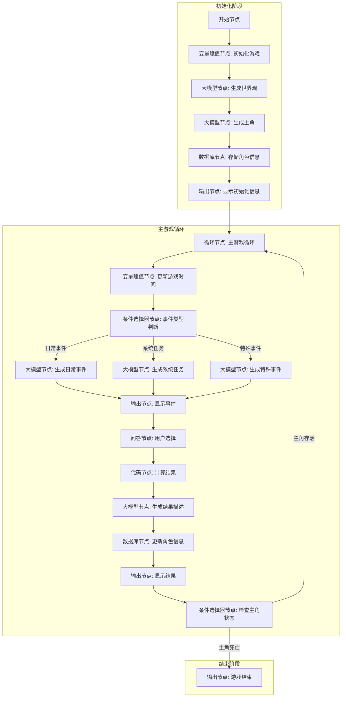

# 文字游戏工作流详细设计方案

我将根据您提供的流程图，详细设计一个完整的文字游戏工作流系统，包括每个节点的具体内容、参数设置、提示词设计以及数据结构。

## 工作流程图（细化版）



## 节点详细设计

### 1. 开始节点

**节点内容**：
- 接收用户输入，启动游戏流程

**输入参数**：
```json
{
  "BOT_USER_INPUT": {
    "type": "String",
    "description": "用户的原始输入内容",
    "required": true
  },
  "system_type": {
    "type": "String",
    "description": "用户选择的系统类型（可选：修炼系统、战斗系统、宝物系统等，也可自定义）",
    "required": false
  },
  "custom_system": {
    "type": "String",
    "description": "用户自定义的系统描述",
    "required": false
  }
}
```

### 2. 变量赋值节点：初始化游戏

**节点内容**：
- 初始化游戏所需的基本变量
- 设置游戏世界的基础参数

**输入参数**：
- 引用开始节点的 `system_type` 和 `custom_system`

**输出参数**：
```json
{
  "game_id": {
    "type": "String",
    "description": "游戏的唯一标识符",
    "value": "生成的UUID"
  },
  "world_seed": {
    "type": "Integer",
    "description": "世界生成的随机种子",
    "value": "随机生成的数字"
  },
  "game_time": {
    "type": "Object",
    "description": "游戏内时间",
    "value": {
      "year": 1,
      "month": 1,
      "day": 1
    }
  },
  "system_info": {
    "type": "Object",
    "description": "系统信息",
    "value": {
      "type": "引用system_type或默认值",
      "custom_desc": "引用custom_system或空字符串"
    }
  },
  "event_counter": {
    "type": "Integer",
    "description": "事件计数器",
    "value": 0
  }
}
```

### 3. 大模型节点：生成世界观

**节点内容**：
- 调用大模型生成游戏世界的详细设定
- 包括修炼体系、世界背景、主要势力等

**输入参数**：
- 引用变量赋值节点的 `world_seed` 和 `system_info`

**系统提示词**：
```
你是一位专业的修仙世界构建者，精通《凡人修仙传》《仙逆》《遮天》《完美世界》《斗破苍穹》《伏天氏》《绝世武神》《武极天下》《武动乾坤》《真武世界》《三寸人间》《一念永恒》《我欲封天》等传统玄幻小说的世界观设定。

现在，你需要创建一个完整而独特的修仙世界，这个世界将成为一个文字游戏的背景。请根据以下要求构建世界：

1. 创建一个包含6-12个大境界的修炼体系，每个境界有明确的特征和突破要求
2. 设计3-5个主要势力（宗门/帝国/种族等），包括它们的历史、特点和相互关系
3. 描述世界的地理环境，包括主要区域、危险地带和资源分布
4. 设定世界的基本规则，如灵气分布、天地法则等
5. 创建一些世界中的重要事件或节日，这些可能会成为游戏中的特殊事件

你的世界观设定应该具有内在逻辑性，符合修仙小说的基本规律，同时又有自己的独特之处。请以JSON格式返回，包含以下字段：

- world_name: 世界名称
- cultivation_system: 修炼体系详情（包含境界名称、特征和突破条件）
- major_forces: 主要势力信息
- geography: 地理环境
- world_rules: 世界规则
- special_events: 特殊事件列表
- current_year_background: 当前游戏开始年份的世界背景

请确保生成的内容丰富多彩，富有想象力，同时保持逻辑自洽，为玩家提供一个沉浸式的修仙体验。
```

**输出参数**：
```json
{
  "world_data": {
    "type": "Object",
    "description": "生成的世界观数据",
    "value": {
      "world_name": "String",
      "cultivation_system": "Object",
      "major_forces": "Array",
      "geography": "Object",
      "world_rules": "Object",
      "special_events": "Array",
      "current_year_background": "String"
    }
  }
}
```

### 4. 大模型节点：生成主角

**节点内容**：
- 调用大模型生成游戏主角的基本信息
- 包括背景故事、初始属性等

**输入参数**：
- 引用大模型节点（生成世界观）的 `world_data`
- 引用变量赋值节点的 `system_info`

**系统提示词**：
```
你是一位专业的角色设计师，精通创建符合修仙世界观的人物形象。现在，你需要为一个文字游戏创建一个主角，这个主角将在之前生成的修仙世界中展开冒险。

请根据提供的世界观数据，随机生成一个合理的主角，包括以下内容：

1. 基本信息：姓名、性别、年龄（符合修仙世界的年龄设定）
2. 外貌特征：相貌、体型、特殊标志等
3. 背景故事：出身、成长经历、加入修仙之路的原因
4. 初始属性：
   - 修为境界（必须是世界观中最低级的境界）
   - 基础属性（如体质、灵根、悟性等，符合世界观设定）
   - 初始功法（一般为最基础的功法）
   - 初始装备/物品（数量有限且品质较低）
5. 性格特点：主角的性格倾向、优缺点
6. 初始人际关系：可能认识的NPC，如师傅、同门等

请确保生成的主角符合以下要求：
- 符合世界观设定，不要出现与世界观冲突的设定
- 初始实力较弱，有明显的成长空间
- 有鲜明的性格特点和成长动力
- 背景故事合理且有趣，能引发玩家共鸣

请以JSON格式返回，包含以下字段：
- name: 角色姓名
- gender: 性别
- age: 年龄
- appearance: 外貌描述
- background: 背景故事
- initial_realm: 初始境界（必须是最低级）
- attributes: 基础属性对象
- techniques: 初始功法数组
- items: 初始物品数组
- personality: 性格特点
- relationships: 初始人际关系数组
- lifespan: 当前预期寿命（根据境界决定）
```

**输出参数**：
```json
{
  "character_data": {
    "type": "Object",
    "description": "生成的主角数据",
    "value": {
      "name": "String",
      "gender": "String",
      "age": "Integer",
      "appearance": "String",
      "background": "String",
      "initial_realm": "String",
      "attributes": "Object",
      "techniques": "Array",
      "items": "Array",
      "personality": "String",
      "relationships": "Array",
      "lifespan": "Integer"
    }
  }
}
```

### 5. 数据库节点：存储角色信息

**节点内容**：
- 将生成的主角和世界观信息存储到数据库中
- 初始化角色的各项属性和状态

**输入参数**：
- 引用大模型节点（生成世界观）的 `world_data`
- 引用大模型节点（生成主角）的 `character_data`
- 引用变量赋值节点的 `game_id` 和 `game_time`

**数据库设计**：
```
表名：character_info
字段：
- id (Integer, 主键)
- sys_platform (String)
- uuid (String)
- bstudio_create_time (Time)
- game_id (String)
- char_name (String)
- char_gender (String)
- char_age (Integer)
- char_realm (String)
- realm_progress (Integer)
- char_lifespan (Integer)
- char_health (Integer)
- char_energy (Integer)
- char_background (String)
- char_appearance (String)
- char_personality (String)
- last_event (String)
- event_count (Integer)
- game_year (Integer)
- game_month (Integer)
- game_day (Integer)
```

**输出参数**：
```json
{
  "db_result": {
    "type": "Object",
    "description": "数据库操作结果",
    "value": {
      "success": true,
      "message": "角色信息存储成功",
      "char_id": "数据库生成的ID"
    }
  },
  "character": {
    "type": "Object",
    "description": "存储后的角色信息",
    "value": {
      "id": "Integer",
      "name": "String",
      "age": "Integer",
      "realm": "String",
      "realm_progress": "Integer",
      "lifespan": "Integer",
      "health": "Integer",
      "energy": "Integer"
    }
  }
}
```

### 6. 输出节点：显示初始化信息

**节点内容**：
- 向用户展示游戏初始化的结果
- 包括世界观介绍和主角信息

**输出变量**：
```json
{
  "world_intro": {
    "type": "String",
    "value": "引用world_data中的相关信息"
  },
  "character": {
    "type": "Object",
    "value": "引用character对象"
  }
}
```

**输出内容**：
```
【修仙世界：{{world_intro.world_name}}】

当前为{{character.game_year}}年{{character.game_month}}月{{character.game_day}}日

世界背景：
{{world_intro.current_year_background}}

【主角信息】
姓名：{{character.name}}
年龄：{{character.age}}岁
修为：{{character.realm}}（{{character.realm_progress}}/1000）
寿元：{{character.lifespan}}年
健康：{{character.health}}/100
精力：{{character.energy}}/100

【背景故事】
{{character.background}}

系统已降临到{{character.name}}身上，准备开始修仙之旅...
```

### 7. 循环节点：主游戏循环

**节点内容**：
- 设置游戏的主循环逻辑
- 循环类型：无限循环（直到主角死亡或用户结束游戏）

**中间变量**：
```json
{
  "event_history": {
    "type": "String",
    "description": "最近事件的历史记录",
    "initial_value": ""
  },
  "last_event_type": {
    "type": "String",
    "description": "上一次事件的类型",
    "initial_value": "none"
  }
}
```

### 8. 变量赋值节点：更新游戏时间

**节点内容**：
- 更新游戏内的时间
- 增加事件计数器

**输入参数**：
- 引用数据库节点的 `character`
- 引用变量赋值节点（初始化游戏）的 `game_time` 和 `event_counter`

**输出参数**：
```json
{
  "updated_time": {
    "type": "Object",
    "description": "更新后的游戏时间",
    "value": {
      "year": "Integer",
      "month": "Integer",
      "day": "Integer"
    }
  },
  "event_counter": {
    "type": "Integer",
    "description": "更新后的事件计数器",
    "value": "event_counter + 1"
  }
}
```

### 9. 条件选择器节点：事件类型判断

**节点内容**：
- 根据事件计数器和随机因素决定触发的事件类型

**输入参数**：
- 引用变量赋值节点（更新游戏时间）的 `event_counter`
- 引用数据库节点的 `character`
- 引用循环节点的中间变量 `last_event_type`

**条件设置**：
```
条件1：event_counter % 10 == 0
- 分支：特殊事件

条件2：event_counter % 3 == 0 && last_event_type != "system_task"
- 分支：系统任务

条件3：其他情况
- 分支：日常事件
```

### 10. 大模型节点：生成日常事件

**节点内容**：
- 调用大模型生成日常事件
- 根据角色当前状态和世界背景生成合适的事件

**输入参数**：
- 引用数据库节点的 `character`
- 引用变量赋值节点（更新游戏时间）的 `updated_time`
- 引用循环节点的中间变量 `event_history`

**系统提示词**：
```
你是一位专业的修仙小说剧情设计师，精通创建符合修仙世界观的日常事件。现在，你需要为游戏中的主角生成一个日常事件，这个事件应该符合主角当前的状态和处境。

请根据提供的角色信息和游戏时间，生成一个合理且有趣的日常事件，包括以下内容：

1. 事件标题：简短描述事件内容
2. 事件描述：详细描述事件的发生过程，包括场景、人物和对话等
3. 事件选项：提供2-4个不同的选择，玩家可以决定如何应对这个事件
4. 每个选项的可能结果：描述选择每个选项可能带来的后果，包括对角色属性的影响

请确保生成的事件符合以下要求：
- 符合角色当前的修为境界和能力范围
- 与角色的背景故事和性格特点相关联
- 提供有意义的选择，每个选择都有不同的风险和收益
- 事件结果应该对角色产生一定的影响，如修为提升、获得物品、结识NPC等
- 考虑到事件历史，避免生成重复或相似的事件

请以JSON格式返回，包含以下字段：
- title: 事件标题
- description: 事件描述
- options: 选项数组，每个选项包含：
  - text: 选项文本
  - possible_outcomes: 可能的结果描述
  - attribute_effects: 对角色属性的影响
```

**输出参数**：
```json
{
  "event_data": {
    "type": "Object",
    "description": "生成的日常事件数据",
    "value": {
      "event_type": "daily",
      "title": "String",
      "description": "String",
      "options": "Array"
    }
  }
}
```

### 11. 大模型节点：生成系统任务

**节点内容**：
- 调用大模型生成系统任务
- 根据角色当前状态和系统类型生成任务

**输入参数**：
- 引用数据库节点的 `character`
- 引用变量赋值节点（初始化游戏）的 `system_info`
- 引用变量赋值节点（更新游戏时间）的 `updated_time`
- 引用循环节点的中间变量 `event_history`

**系统提示词**：
```
你是一位专业的游戏系统设计师，精通创建符合修仙世界观的系统任务。现在，你需要根据玩家选择的系统类型，为游戏中的主角生成一个系统任务。

请根据提供的角色信息、系统类型和游戏时间，生成一个合理且有挑战性的系统任务，包括以下内容：

1. 任务标题：简短描述任务内容
2. 任务描述：详细描述任务的背景、目标和要求
3. 任务难度：根据角色当前修为评估的难度等级（简单/普通/困难/极难）
4. 任务选项：提供2-4个不同的选择，玩家可以决定如何完成这个任务
5. 每个选项的可能结果：描述选择每个选项可能带来的后果，包括成功率和奖励

请确保生成的任务符合以下要求：
- 与玩家选择的系统类型紧密相关
- 难度适中，略高于角色当前能力但有可能完成
- 提供有意义的选择，每个选择都有不同的风险和收益
- 任务奖励应该对角色产生显著影响，如修为大幅提升、获得珍稀物品等
- 考虑到事件历史，避免生成重复或相似的任务

请以JSON格式返回，包含以下字段：
- title: 任务标题
- description: 任务描述
- difficulty: 任务难度
- options: 选项数组，每个选项包含：
  - text: 选项文本
  - success_rate: 成功率估计（百分比）
  - possible_outcomes: 可能的结果描述
  - rewards: 成功后的奖励
```

**输出参数**：
```json
{
  "event_data": {
    "type": "Object",
    "description": "生成的系统任务数据",
    "value": {
      "event_type": "system_task",
      "title": "String",
      "description": "String",
      "difficulty": "String",
      "options": "Array"
    }
  }
}
```

### 12. 大模型节点：生成特殊事件

**节点内容**：
- 调用大模型生成特殊事件
- 根据世界背景和游戏进度生成重大事件

**输入参数**：
- 引用数据库节点的 `character`
- 引用大模型节点（生成世界观）的 `world_data`
- 引用变量赋值节点（更新游戏时间）的 `updated_time`
- 引用变量赋值节点（更新游戏时间）的 `event_counter`
- 引用循环节点的中间变量 `event_history`

**系统提示词**：
```
你是一位专业的修仙小说剧情设计师，精通创建符合修仙世界观的重大特殊事件。现在，你需要为游戏中的主角生成一个特殊事件，这个事件将对主角的修仙之路产生重大影响。

请根据提供的角色信息、世界背景和游戏进度，生成一个震撼人心的特殊事件，包括以下内容：

1. 事件标题：简短描述事件内容
2. 事件描述：详细描述事件的发生过程，包括场景、人物和对话等
3. 事件背景：解释这个事件在世界观中的意义和影响
4. 事件选项：提供2-4个不同的选择，玩家可以决定如何应对这个事件
5. 每个选项的可能结果：描述选择每个选项可能带来的重大后果

请确保生成的特殊事件符合以下要求：
- 与世界观中的重要设定相关联，如宗门大比、天地异变、大势力冲突等
- 事件规模宏大，影响深远，可能改变主角的命运轨迹
- 提供有意义的选择，每个选择都可能导致截然不同的结果
- 事件结果应该对角色产生重大影响，如境界突破、获得逆天机缘、结识重要人物等
- 考虑到游戏进度，事件难度和规模应随游戏进行而增加

请以JSON格式返回，包含以下字段：
- title: 事件标题
- description: 事件描述
- background: 事件背景
- options: 选项数组，每个选项包含：
  - text: 选项文本
  - possible_outcomes: 可能的结果描述
  - major_effects: 对角色和世界的重大影响
```

**输出参数**：
```json
{
  "event_data": {
    "type": "Object",
    "description": "生成的特殊事件数据",
    "value": {
      "event_type": "special",
      "title": "String",
      "description": "String",
      "background": "String",
      "options": "Array"
    }
  }
}
```

### 13. 输出节点：显示事件

**节点内容**：
- 向用户展示生成的事件内容
- 显示事件描述和可选选项

**输出变量**：
```json
{
  "character": {
    "type": "Object",
    "value": "引用character对象"
  },
  "event": {
    "type": "Object",
    "value": "引用event_data对象"
  },
  "game_time": {
    "type": "Object",
    "value": "引用updated_time对象"
  }
}
```

**输出内容**：
```
【{{game_time.year}}年{{game_time.month}}月{{game_time.day}}日】

【{{character.name}}】
修为：{{character.realm}}（{{character.realm_progress}}/1000）
寿元：{{character.lifespan}}年
健康：{{character.health}}/100
精力：{{character.energy}}/100

【{{event.title}}】

【特殊事件】
背景：{{event.background}}



【系统任务】
难度：{{event.difficulty}}


{{event.description}}

【可选选项】

{{loop.index}}. {{option.text}}


请选择你要执行的选项编号：
```

### 14. 问答节点：用户选择

**节点内容**：
- 接收用户的选择
- 验证选择的有效性

**输入**：
- 提问内容：`请选择你要执行的选项编号（1-{{event.options.length}}）：`
- 回答类型：直接回答

**输出参数**：
```json
{
  "user_choice": {
    "type": "String",
    "description": "用户选择的选项编号"
  }
}
```

### 15. 代码节点：计算结果

**节点内容**：
- 根据用户选择和事件数据计算结果
- 计算属性变化、成功率等

**输入参数**：
- 引用问答节点的 `user_choice`
- 引用大模型节点（生成事件）的 `event_data`
- 引用数据库节点的 `character`

**代码**：
```javascript
async function main({ params }) {
  // 获取输入参数
  const userChoice = parseInt(params.user_choice) - 1;
  const eventData = params.event_data;
  const character = params.character;
  
  // 验证选择的有效性
  if (userChoice < 0 || userChoice >= eventData.options.length) {
    return {
      success: false,
      message: "无效的选择",
      updated_character: character
    };
  }
  
  // 获取选择的选项
  const selectedOption = eventData.options[userChoice];
  
  // 计算结果
  let success = true;
  let message = "";
  let updatedCharacter = {...character};
  
  // 根据事件类型计算结果
  if (eventData.event_type === "system_task") {
    // 系统任务：计算成功率
    const successRate = selectedOption.success_rate || 50;
    const roll = Math.random() * 100;
    success = roll <= successRate;
    
    if (success) {
      message = "任务成功！";
      // 应用奖励
      if (selectedOption.rewards) {
        if (selectedOption.rewards.realm_progress) {
          updatedCharacter.realm_progress += selectedOption.rewards.realm_progress;
        }
        if (selectedOption.rewards.health) {
          updatedCharacter.health += selectedOption.rewards.health;
          updatedCharacter.health = Math.min(100, updatedCharacter.health);
        }
        if (selectedOption.rewards.energy) {
          updatedCharacter.energy += selectedOption.rewards.energy;
          updatedCharacter.energy = Math.min(100, updatedCharacter.energy);
        }
      }
    } else {
      message = "任务失败！";
      // 应用惩罚
      updatedCharacter.health -= Math.floor(Math.random() * 20) + 5;
      updatedCharacter.energy -= Math.floor(Math.random() * 15) + 5;
    }
  } else if (eventData.event_type === "special") {
    // 特殊事件：应用重大影响
    const majorEffects = selectedOption.major_effects || {};
    
    if (majorEffects.realm_breakthrough) {
      // 境界突破
      updatedCharacter.realm = majorEffects.new_realm || updatedCharacter.realm;
      updatedCharacter.realm_progress = 0;
      updatedCharacter.lifespan += majorEffects.lifespan_increase || 100;
      message = "突破成功！境界提升！";
    }
    
    if (majorEffects.health_change) {
      updatedCharacter.health += majorEffects.health_change;
    }
    
    if (majorEffects.energy_change) {
      updatedCharacter.energy += majorEffects.energy_change;
    }
  } else {
    // 日常事件：应用属性效果
    const attributeEffects = selectedOption.attribute_effects || {};
    
    if (attributeEffects.realm_progress) {
      updatedCharacter.realm_progress += attributeEffects.realm_progress;
    }
    
    if (attributeEffects.health) {
      updatedCharacter.health += attributeEffects.health;
    }
    
    if (attributeEffects.energy) {
      updatedCharacter.energy += attributeEffects.energy;
    }
    
    message = "事件结束";
  }
  
  // 确保属性在有效范围内
  updatedCharacter.health = Math.max(0, Math.min(100, updatedCharacter.health));
  updatedCharacter.energy = Math.max(0, Math.min(100, updatedCharacter.energy));
  
  // 检查境界突破
  if (updatedCharacter.realm_progress >= 1000) {
    // 需要在后续节点中处理境界突破
    updatedCharacter.ready_for_breakthrough = true;
  }
  
  // 检查角色死亡
  const isDead = updatedCharacter.health <= 0;
  
  return {
    success: success,
    message: message,
    updated_character: updatedCharacter,
    selected_option: selectedOption,
    is_dead: isDead
  };
}
```

**输出参数**：
```json
{
  "result": {
    "type": "Object",
    "description": "计算的结果",
    "value": {
      "success": "Boolean",
      "message": "String",
      "updated_character": "Object",
      "selected_option": "Object",
      "is_dead": "Boolean"
    }
  }
}
```

### 16. 大模型节点：生成结果描述

**节点内容**：
- 调用大模型生成事件结果的详细描述
- 根据计算结果生成符合情境的文字描述

**输入参数**：
- 引用代码节点的 `result`
- 引用大模型节点（生成事件）的 `event_data`
- 引用数据库节点的 `character`

**系统提示词**：
```
你是一位专业的修仙小说作家，精通描写修仙世界中的各种场景和事件。现在，你需要根据玩家的选择和计算的结果，生成一段详细的事件结果描述。

请根据提供的事件数据、角色信息和计算结果，创作一段生动、详细的描述，包括以下内容：

1. 角色的行动：详细描述角色如何执行选择的选项
2. 环境反应：描述周围环境、NPC或敌人的反应
3. 结果展现：描述行动的结果，包括成功或失败的表现
4. 角色感受：描述角色的感受、收获或损失
5. 属性变化：描述角色属性的变化，如修为提升、受伤等

请确保生成的描述符合以下要求：
- 文风符合修仙小说的风格，用词优美，描写细腻
- 根据事件类型调整描述的篇幅和重要性
- 根据成功或失败的结果调整描述的情感基调
- 如果是重大事件或境界突破，描写应更加详尽和震撼
- 如果角色死亡，描写应悲壮而有深度

请以JSON格式返回，包含以下字段：
- description: 详细的事件结果描述
- summary: 简短的结果总结（用于历史记录）
- next_hint: 对角色下一步可能行动的暗示或建议
```

**输出参数**：
```json
{
  "result_narrative": {
    "type": "Object",
    "description": "生成的结果描述",
    "value": {
      "description": "String",
      "summary": "String",
      "next_hint": "String"
    }
  }
}
```

### 17. 数据库节点：更新角色信息

**节点内容**：
- 将计算后的角色信息更新到数据库
- 记录事件历史

**输入参数**：
- 引用代码节点的 `result.updated_character`
- 引用大模型节点（生成结果描述）的 `result_narrative`
- 引用变量赋值节点（更新游戏时间）的 `updated_time`
- 引用大模型节点（生成事件）的 `event_data.title`

**SQL语句**：
```sql
UPDATE character_info
SET 
  char_realm = '{{result.updated_character.realm}}',
  realm_progress = {{result.updated_character.realm_progress}},
  char_lifespan = {{result.updated_character.lifespan}},
  char_health = {{result.updated_character.health}},
  char_energy = {{result.updated_character.energy}},
  last_event = '{{result_narrative.summary}}',
  event_count = event_count + 1,
  game_year = {{updated_time.year}},
  game_month = {{updated_time.month}},
  game_day = {{updated_time.day}}
WHERE id = {{result.updated_character.id}}
```

**输出参数**：
```json
{
  "db_update_result": {
    "type": "Object",
    "description": "数据库更新结果",
    "value": {
      "success": "Boolean",
      "rowNum": "Integer"
    }
  },
  "updated_character": {
    "type": "Object",
    "description": "更新后的角色信息",
    "value": "result.updated_character"
  }
}
```

### 18. 输出节点：显示结果

**节点内容**：
- 向用户展示事件的结果
- 显示角色状态变化

**输出变量**：
```json
{
  "character": {
    "type": "Object",
    "value": "引用updated_character对象"
  },
  "result": {
    "type": "Object",
    "value": "引用result对象"
  },
  "narrative": {
    "type": "Object",
    "value": "引用result_narrative对象"
  },
  "game_time": {
    "type": "Object",
    "value": "引用updated_time对象"
  }
}
```

**输出内容**：
```
【{{game_time.year}}年{{game_time.month}}月{{game_time.day}}日】

{{narrative.description}}


【突破提示】
你的修为已达瓶颈，即将突破！


【{{character.name}}】
修为：{{character.realm}}（{{character.realm_progress}}/1000）
寿元：{{character.lifespan}}年
健康：{{character.health}}/100
精力：{{character.energy}}/100

【系统提示】
{{narrative.next_hint}}
```

### 19. 条件选择器节点：检查主角状态

**节点内容**：
- 检查主角是否存活
- 决定是否继续游戏循环

**输入参数**：
- 引用代码节点的 `result.is_dead`

**条件设置**：
```
条件1：result.is_dead == true
- 分支：主角死亡，游戏结束

条件2：result.is_dead == false
- 分支：主角存活，继续游戏循环
```

### 20. 输出节点：游戏结束

**节点内容**：
- 向用户展示游戏结束的信息
- 显示游戏总结

**输出变量**：
```json
{
  "character": {
    "type": "Object",
    "value": "引用updated_character对象"
  },
  "game_time": {
    "type": "Object",
    "value": "引用updated_time对象"
  }
}
```

**输出内容**：
```
【游戏结束】

在修仙世界的{{game_time.year}}年{{game_time.month}}月{{game_time.day}}日，{{character.name}}的修仙之路戛然而止。

修炼至今，{{character.name}}已达到{{character.realm}}境界，距离长生大道仍有遥远的距离。

【最终状态】
修为：{{character.realm}}（{{character.realm_progress}}/1000）
寿元：{{character.lifespan}}年
健康：{{character.health}}/100
精力：{{character.energy}}/100

【系统提示】
你可以重新开始游戏，再次踏上修仙之路。
```

## 数据类型详细说明

1. **基本数据类型**：
   - `String`：文本字符串，用于存储名称、描述等
   - `Integer`：整数，用于存储年龄、计数器等
   - `Boolean`：布尔值，用于存储是/否状态
   - `Object`：对象，用于存储复杂数据结构
   - `Array`：数组，用于存储列表数据

2. **复杂数据结构**：
   - `character`：角色对象，包含角色的所有属性
   - `world_data`：世界数据对象，包含世界设定
   - `event_data`：事件数据对象，包含事件信息
   - `result`：结果对象，包含计算结果

3. **数据库字段类型**：
   - `id`：Integer，主键
   - `sys_platform`：String，数据产生渠道
   - `uuid`：String，用户唯一标识
   - `bstudio_create_time`：Time，数据插入时间
   - `game_id`：String，游戏唯一标识
   - `char_name`：String，角色名称
   - `char_gender`：String，角色性别
   - `char_age`：Integer，角色年龄
   - `char_realm`：String，修为境界
   - `realm_progress`：Integer，境界进度（0-1000）
   - `char_lifespan`：Integer，预期寿命
   - `char_health`：Integer，健康值（0-100）
   - `char_energy`：Integer，精力值（0-100）
   - `char_background`：String，背景故事
   - `char_appearance`：String，外貌描述
   - `char_personality`：String，性格特点
   - `last_event`：String，最近事件
   - `event_count`：Integer，事件计数
   - `game_year`：Integer，游戏年份
   - `game_month`：Integer，游戏月份
   - `game_day`：Integer，游戏日期

## 总结

这个工作流设计实现了一个完整的文字游戏系统，包括游戏初始化、主游戏循环、事件生成和处理、角色状态管理等功能。通过使用Coze的各种节点类型，特别是大模型节点、代码节点、数据库节点和条件选择器节点，实现了一个具有丰富内容和交互性的修仙文字游戏。

系统的核心优势在于：
1. 利用大模型生成丰富多样的世界观和事件内容
2. 使用代码节点实现精确的游戏机制和规则计算
3. 通过数据库节点持久化存储游戏状态
4. 利用条件选择器节点实现复杂的游戏逻辑分支

这个设计可以进一步扩展，增加更多的游戏功能，如物品系统、NPC互动系统、宗门系统等，使游戏更加丰富和有深度。
